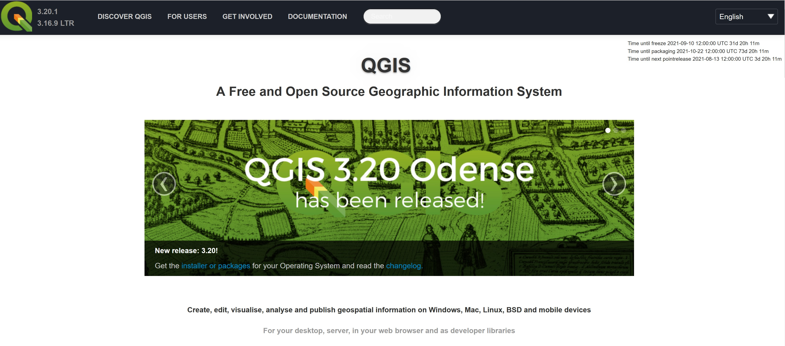

```{r setup, include=FALSE}
knitr::opts_chunk$set(echo = TRUE, eval=TRUE, message=FALSE, warning = FALSE)
```

## Download and Install QGIS

This section provides you with step-by-step guide on how to download and install QGIS in your window-based computer (i.e. desktop or laptop).  

### Download QGIS installer

- Launch the web browser.  

- In the address bar at the top of the window, enter http://qgis.org/ and press **Enter**.

The website should look something like this:



- Click on **Download Now** button.

Your screen should look similar to the figure below.

 


- Click on **QGIS Standalone Installer Version 3.20**.

{width=75%}

After a few seconds (depend on your network speed), a pop-up window appears.

{width=65%}

- Click on the **Save File** button.

When the file is downloaded, you are going to install QGIS into your computer.

### Install  QGIS

In this section, you will learn how to install QGIS into your computer.

- Find the QGIS installer on your computer, right-click and select **Run as administrator** from the context menu to launch the setup.

- Click on the **Yes** button when Windows prompt you with the dialog “Do you want to allow this app to make change to your device?”

After a few second, the Setup Wizard dialog window appears.

- Click on the **Next** button.

The next setup dialog window appears.

- Click on the **I Agree** button.

The Setup dialog window appears.

- Ensure that the Destination Folder is at **C:\Program Files\QGIS 3.20**. 
- Click on the **Next** button.

The Setup dialog window should look similar to the figure below.

- Click on the check box in front of the extra datasets that you would like to install.
- Click on the **Install** button.

QGIS will begin to install.  It may take a few minutes to install so be patient. 

When the QGIS Setup Winzard appears

- Click on **Finish** button.

Congratulations! You have installed QGIS successfully!

## Hello QGIS 

Now, you are ready to launch QGIS.

- At your window, double-click on   icon.

After a few seconds, QGIS window appears.

- On the QGIS Tips! Dialog window, click on the OK button.

Your screen should look similar to the figure below.

### Getting to know a GIS project file

A GIS project file provides a link between the GIS software and the geospatial datasets instead of stored data.  It also contains GIS operation configurations such as symbolisation used, data classification, map projection, the paths of each data and map design.  In this section, you will explore an existing QGIS’s project file called Hands-on01.qgs.    

- Start Window Explorer.
- Navigate to \SMT201\Hands-on_Ex01\ sub-folder.

You will find a file called Hands-On01 in the sub-folder. 

- Right-click on Hands-On01.
- Select Open with from the context menu.
- Use the Notepad to open the file.

The Notedpad window should look similar to the figure below. 

Notice that the QGIS project file is actually in XML format.  

- Close Notepad.

### Open an existing project file

In this section, you will learn how to open an existing QGIS project file. 

- From QGIS main menu, click on Project -> Open.

The Choose a QGIS project file to open dialog window appears.

- Navigate to \SMT201\Hands-on_Ex01\ sub-folder.
- Double-click on Hans-On01 file.

Your screen should look similar to the figure below.

## Exploring QGIS interfaces

The QGIS interface comprises six major components. They are: menu bar, toolbar, map legend, browser, status bar and map view. 
The Menu Bar provides access to various features and functions of QGIS using hierarchical menu.  The location of the menu and menu items is fixed, although if you activate certain plugins, they may add an additional menu to the bar.

The Toolbar replicates many of the features and functions in the Menu Bar, providing access to common features in a single click.  The location of the toolbar is not fixed; if you hover over the edge of the toolbar and hold down the left mouse button you can drag the toolbar wherever you like.

The Map Legend lists data layers that are linked with the current project.  

You can turn each of the data layer on and off by clicking on the checkbox in front of each data layer.

- From the Map Legend, click on the checkbox in front of CoastalOutline.

Notice that the Singapore boundary map on the Map View window disappears.  

- Click on the checkbox in front of CoastalOutline again.

Notice that the Singapore boundary map on the Map View window re-appears.

The browser, a new feature in QGIS 2.0, allows users to see their file system and all of the GIS data files and databases.  It also allows users to drag files from the file system into QGIS project.  

The Status Bar shows the current scale of the map view, the coordinates of the current position of the cursor and the coordinate system used by the project.  When a computation operation such as buffering is used, the progress meters will appear here to show the progress of the operations. 

Last but not least, the Map View window displays all the active layers in the project.

## Navigating the Map View
### Navigating around a GIS view 

In this section, you will learn how to navigate around the Map View.  First, you will work with the navigation tools.

- From the Toolbar, click on the Zoom In   tool.
- Hover the mouse to the centre of Singapore, click once.

Your screen should look similar to the figure below.

Notice that the map layer zooms into a new extent.

Now, you want to return to the previous extent.

- From the Zoom tools bar, click on the Zoom Last    tool.

Notice that the map view returns to the initial extant now.

Next, you will learn how to zoom into a specific location using the Zoom In tool.  For example, we would like to zoom into the mark area as shown in the figure below.  

- From the Zoom Tools bar, click on the Zoom In tool.
- Hover the mouse over the marked location as shown in the figure above.
- Press on the left button of the mouse, drag to form a rectangle around the marked location.

- Release the left button.

Your screen should look similar to the figure below.  Notice that the URA_PlanningArea layer appears now.

Next, you will return to the previous extent using alternative zooming tool.

- From the Zoom Tools bar, click on the Zoom to Layer   tool.

Notice that the map view returns to the previous state and the URA_PlanningArea layers are turned off again.

DIY
Try out the remaining navigation tools in the Zoom Tools bar.

### Map Navigation using changing the map scale

In this section, you will learn how to change the map view by changing the map scale.  

- From the Status bar (located below Map View), click on the drop-down list of Scale.
- Select 1:25,000.
- Use the Pan tool to move the map area so that it looks similar to the figure below.
- From the Scale of at the Status bar, click on the drop-down list again.
- Select 1:10000.

Your screen should look similar to the figure below.  Notice that more detail appears when the map scale increases.
 

## Exploring GIS data

In this section, you will learn how to interact with the features that appear in the Map View and retrieve their corresponding attribute information.

### Exploring GIS Layer

In this sub-section, you will learn how to explore the information of individual GIS layer.

- From the Map Legend window, right-click on Building layer.
- Select Properties from the context menu.

The Layer Properties of Building layer appears.  It provides the full metadata of Building layer, it symbolization configuration and the data fields.  

By default, QGIS will display the general information of the selected layer.  You can retrieve other information or configurations of the layer by clicking on the appropriate tab.

The key information available are as follows:

- Source shows the path of Building layer.
- Storage reveals the file type, i.e. ESRI Shapefile format.
- Geometry indicate the spatial object used to represent the real world feature.   
- CRS shows the georeferencing information of the active layer (i.e. SVY21/Singapore TM).
- Unit is the unit measurement of the active layer.


Let us examine other tab.

•	Click on Rendering tab.

You screen should look similar to the figure below.

Note that and the minimum map scale is 25000.  That explains why the building layer only appears when the map scale of Map View is less than or equal to 1:25000.

Next, you will explore the data fields of Building layer.

- Click on the Field tab.

Your screen should look similar to the figure below.

Notice that there are 12 fields in the corresponding attribute table of Building layer.  The Layer Properties window also shows the data type, length and precision of each field.     

You will explore the other tabs in the next hands-on.

- At the Layer Properties window, click on the cross button located at the upper right hand corner to close the window. 

### Working with Identify Features tool   
Using the Identify Features   tool to interact with a geographical feature and retrieve its corresponding attribute information is a two steps process.  First, you need to make the layer of the feature active.  Then, you will use the Identify Features tool to query the information.

In this section, you will learn how to query information of a selected Shopping feature (marks by a circle in the figure above).  

•	At the Map Legend window, click on the Shopping layer to make it active.  


•	Click on the Identify Features tool  .

•	At the Map View window, hovers the mouse over the shopping feature you are interested to query (the one marked in the figure above).

•	Click on the shopping feature.

Your screen should look similar to the figure below.

Notice that the selected shopping feature was highlighted (i.e. in red) and the Identify Results window appears.

DIY
Using the steps you had learned from this section, query a building feature, a road network feature and a URA planning area feature.

### Query Attribute Table

The ability to interactively select a geographic feature and query its associated attribute information is a very powerful feature of a GIS.  However, there are times that you would like to see the attributes of all the features in a GIS layer.  In this section, you will learn how to use QGIS’s Open Attribute Table function to display the attribute table of a GIS layer.   

•	At the Map Legend window, right-click on Building layer.

•	Select Open Attribute Table from the context menu.

The Attribute table window appears.

The table provide detail information of each geographical feature (i.e. building) such as building name, postal code, road name, block number, just to name a few of them.

DIY
Using the steps you had learned from this section, review the attribute table of Shopping and URA_PlanningArea layers. 

Whew! That was a lot to take in!  Take a deep breath and relax.  By now you should have a good understanding of the basic operations of QGIS. You can start playing with it and practice the techniques that you have learned.


```{r echo=FALSE, eval=FALSE}
library(pagedown)
pagedown::chrome_print("Hands-on_Ex01.html")
```

