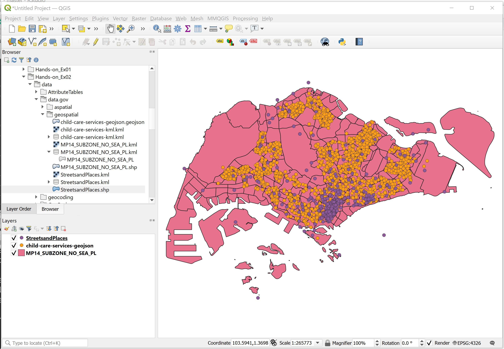
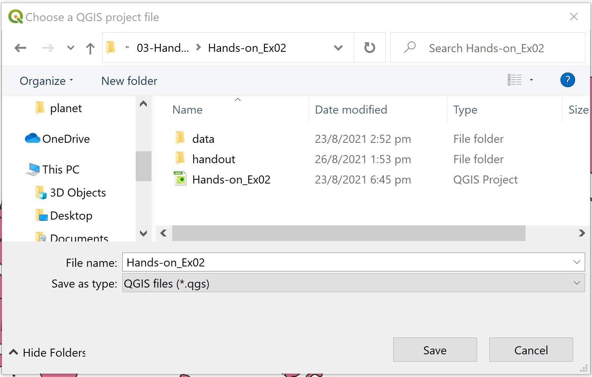
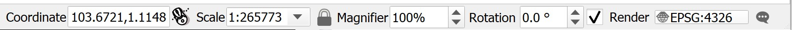
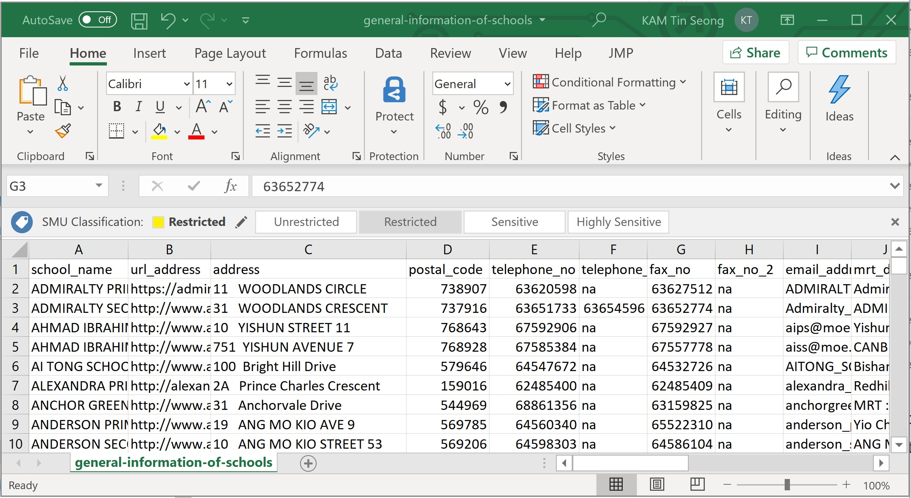
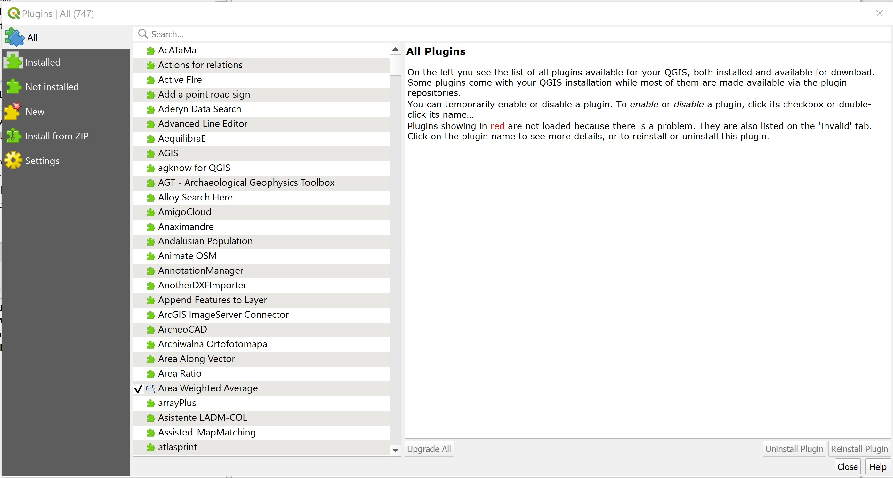

```{r setup, include=FALSE}
knitr::opts_chunk$set(echo = FALSE)
```

## 1.0	Introduction

A GIS is specially designed to manage geospatial data.  This hands-on exercise consists of five sections.  First, you will learn how to import geospatial data from different sources and file format into QGIS.  At the same time, you will also learn how to check their feature type, coordinate system and other related information.    You will also learn how to create a GIS data from an aspatial data by using QGIS.  Next, you will learn how to transform this newly created GIS layer into Singapore National projected coordinates systems (i.e. SVY21).  Lastly, you will also learn how to use the geocoding function of QGIS to create geospatially referenced data from a non-spatial data. 

### 1.1 Learning Outcome

By the end of this session, you will be able to:

- work with geospatial data from data.gov.sg 
- create geospatially-enabled data
- create GIS Layer from a text data with georeference information
- transform a GIS data onto a different projection system
- work with raster GIS data
•	work with internet geospatial services
•	work with geospatial database

## 2.0	Working with Geospatial Data from data.gov.sg

In this section, you will learn how to download geospatial data from data.gov.sg and import them into QGIS.   

### 2.1 Downloading geospatial data from data.gov.sg

First, you are required to download the following geospatial and aspatial data from [data.gov.sg](https://data.gov.sg/):

- Master Plan 2014 Subzone Boundary (No Sea),
- Child Care Services, 
- Street and Places, and
- School Directory and Information

### 2.2 Managing the imported data 

For any GIS project, it is important for us to practice good document management.  Assuming that the root directory of this project is called `Hands-on_Ex02`, 

- created a sub-folder call `data.gov`.  
- inside `data.gov`, create two new sub-folders.  Call them `geospatial` and `aspatial` respectively.
- place the downloaded Master Plan 2014 Subzone Boundary (No Sea), Child Care Services and Street and Places into the geospatial folder. 
    - unzipped their respective zipped files,
    - extract the unzipped files, and 
    - place them in `geospatial` folder. 
- place the downloaded School Directory and Information zipped file into aspatial sub-folder.
    - unzipped the file,
    - copy and paste `general-information-of-schools.csv` into `aspatial` sub-folder.  

The geospatial folder should look similar to the screenshot below.


Notice that besides the geospatial data files, I also include the metadata of the data into the folder.  This is because the metadata provide useful information of the data and it is important for us to keep them for future references. 

### 2.3	Examining the geospatial data

Before you add the GIS data into QGIS, you should spend some time to examine the files in `geospatial` folder.

Notice that the shapefile version of MP14_SUBZONE_NO_SEA_PL and StreetsandPlaces data sets are actually made up of multiples files that have the same names but with different extensions.  

Table below details the meaning of each file.

Source: https://en.wikipedia.org/wiki/Shapefile

Next, you should also check the projection of the shapefile.

- Right-click on the PRJ file of `MP14_SUBZONE_NO_SEA_PL`
- Select *Open with* -> *NotePad*.

Your NotePad should look similar to the figure below.


From the screenshot, it is clear that `MP14_SUBZONE_NO_SEA_PL` is in svy21 projected coordinate system.

- Close the NotePad.

Different from shapefile, the geojson and kml files are editing in xml format.  You can examine the content of these two files by using either Notepad or WordPad.

### 2.4 Adding geospatial data from data.gov into QGIS 

Now, we are ready to bring the geospatial data downloaded from data.giv.sg into QGIS.

- From Window Desktop, launch QGIS.

You will start a new QGIS project.

- From the menu bar, select **Project** -> **New**. 

Next, you are going to learn how to bring geospatial data sets into QGIS via the **Browser** panel.

- From the Browser panel, navigate to the path of Hands-on_Ex02\data\data.gov\geospatial as shown in the screenshot below.

{width=45%}

- Double-click on ``child-care-services-geojson.geojson``.

Notice that ``child-care-services-geojson.geojson`` is added in the **Layer** panel and display on the View window as shown below.


>DIY: Using the steps you had learned, bring in `MP14_SUBZONE_NO_SEA_PL.shp` and `StreetsandPlaces.shp` into QGIS. 

Your screen should look similar to the figure below.


 
Notice that `child-care-services-geojson` layers does not appear on Map View.  This is because it is covered by `MP14_SUBZONE_NO_SEA_PL` layer.  

- From the **Layer** panel, click on `MP14_SUBZONE_NO_SEA_PL` layer.
- Hold down the left mouse button, drag and place it below `child-care-services-geojson`.

Now you should see all the active layers appear on the View window as shown below.




>QGIS Tip: In order to avoid point and line feature layers being blocked away by polygon feature layer, it is always advisible to place the polygon feature layer at the botton of the layer order.

It is time to save the project.

- From the menu bar, click **Project** -> **Save** (Alternatively, from the icon bar, click on **Save Project** icon).
- At the **Choose a QGIS project file** dialog window, navigate to the root project folder, then provide a proper project name such as `Hands-on_Ex02`, remember to select *QGIS files (*.qgs)* from the **Save as type:** dropdown list. 

Your screen should look similar to the figure below.



- click on **Save** button.

Notice that the upper left corner of the top banner is labelled `Hands-on_Ex02` instead of `untitled` now.

## 3.0 Working with Projection

In this section, you will learn how to:

- assign appropriate coordinate system to the QGIS project.
- how to transform a GIS data set from one coordinate system to another coordinate system.

### 3.1 Assigning project coordinate system

If you refer to the lower left corner of the active QGIS project window, there is a high chance that the EPSG is not in **3414** which is the EPSG code of **svy21**.

If there is the case, you can use the step below to assign the correct projection system for your QGIS project.



- At the lower right corner of QGIS project banner, click on the list of **Render**.

Project Properties dialog window appears. 


- From **Predefined Coordinate Reference Systems**, click on **EPSG:3414** from the list.
- Click on **Apply** button to make the change.
- Click on **OK** button to close the window.

Notice that the projection has been updated to EPSG:3414 now.


Option: 

If this is the first time you use the **Projection Properties**, there is a high chance that the **Predefined Coordinate Reference Systems** is empty. 

In this case, 

- at **Filter**, type **3414**.  This will help to narrow down the search.

Before you move on to the next section, you should save the latest changes on the project file.

- From the icon bar, click on the **Save Project** icon.

### 3.2 Transforming coordinate system

In a GIS project, it is always a good practice to keep the geospatial data set(s) in a same projected coordinate system, using the national projected coordinate system such as svy21 of Singapore.

In this section, you will learn how to transform a geospatial data set from WGS84 Geographic Coordinate System to SVY21 Projected Coordinates System.  You will also learn how to save the output into a new shapefile for permanent storage purpose. For the purpose of this exercise, `child-care-services-geojson` layer will be used. 

First, let us verify if an appropriate projection system was used.

- From the **Layers** panel, right-click on `child-care-services-geojson` layer.
- Select **Properties**.

The Layer Properties dialog window of `child-care-services-geojson` layer appears.

 

- Click on **Source**.

Notice that `child-care-services-geojson` layer is in WGS geographic coordinates system and not in SVY21 projected coordinates system.

- Click on **OK** button to close the dialog window.

Next, we are going export the `child-care-services-geojson` layer into a new shapefile and at the same time transform the newly created shapefile into svy21 projected coordinates systems.

- From the **Layers** panel, right-click on `child-care-services-geojson` layer.
- Select **Export**  -> **Save Features As** from the context menu.

The **Save Vector Layer** dialog window appears.

- For **Format:**, select ESRI Shapefile from the drop-down list.
- For **Save as**, click on the *Browse* button.

The **Save Layer As** dialog window appear.

- Navigate to `\SMT201\Hands-On02\data\data.gov\geospatial\` sub-folder.
- For File Name, type `ChildcareServices`.


- Click on the **Save** button.

You will return to **Save Vector Layer as** dialog window.

Now, you are going to select the appropriate projected coordinate system.

- For **CRS**, click on the **Browse** button.

The Coordinate Reference System Selector dialog window appears.

- Click on SVY21/Singapore TM.
- Click on OK to update the selection.


Notice that the **CRS** is **EPSG:3414 - SVY21 / SINGAPORE TM** now.

Keep the rest of the default option check and you are ready to convert the geospatial data set into ESRI shapefile format and at the same time transform it into SVY21 projected coordinate system.

- Click on the OK button.

Notice that a new geospatial layer called `ChildcareServices` has been added on `Layers` panel and was plotted on the View window.

>DIY: Using the steps you had learned in earlier section, check the properties of of this newly created `ChildcareServices`  


You screen should look similar to the screensht above.

Notice that `ChildcareServices` layer is in ESRI Shapefile format and its Coordinate Reference System in SVY21 / SINGAPORE TM. 

- Click on OK button to close the dialog window.

>DIY: You can also remove `child-care-services-geojson` layer from Layers dialog window. 

## 4.0	Creating Geospatially-Enabled Data

By and large, business data such as polyclinics, schools and business establishments do not capture geospatial information such as x- and y- coordinates explicitly.  However, it is possible to create geospatially-enabled data from them by using the geocoding technique.  

Geocoding is the process of finding associated geographic coordinates (often expressed as latitude and longitude) from other geographic data, such as street addresses, zip codes or postal codes (http://en.wikipedia.org/wiki/Geocoding).

### 4.1 Data Prepation

In this section, you will learn how to create geospatially enable data by using `general-information-of-schools.csv` you downloaded from data.gov.sg. 

Note: In this section, we assume that `general-information-of-schools.csv` is stored in `\Hands-on_Ex02\data\data.gov\aspatial\` sub-folder and you have Microsoft Excel installed in your computer.
  
Let us review the content of `general-information-of-schools.csv` file.

- At File Explorer, navigate to the sub-folder where `general-information-of-schools.csv` is stored.
- Right-click on `general-information-of-schools.csv` file.
- From the context menu, select **Open with** -> **Excel**.

Your screen should look similar to the figure below.

  


Notice that `general-information-of-schools.csv` file consists of 31 fields.  However, we only need to retain `school_name`, `address` and `postal_code` field.

- Use appropriate Excel function to delete the unwanted fields.

Next, we will create two create two new fields.  They are: `country` and `city`. 

- Use appropriate Excel function to create two new fields.  Call them `country` and `city`.
- Fill in the cell below `country` and `city` fields with `Singapore`.

The final `general-information-of-schools.csv` should look similar to the screenshot below.


- Use the *Save as* function of Excel to save the tidied csv file into Hands-on_Ex02\data\data.gov\aspatial sub-folder.  Name the output file `schools.csv`. 

>Note: It is important to ensure that the output file is in csv file format.

### 4.2	Install the MMQGIS Plugin

Instead of using the geocoding API of SLA OneMap, in this section you will use the *Geocode Tools* of [**MMQGIS**](http://michaelminn.com/linux/mmqgis/) plugin developed by Michael Minn.

To install the **MMQGIS** plugin, you will need to load the QGIS plugin repository by following the steps below.

- From the menu bar, select **Plugins** –> **Manage and Install Plugins**.  

Plugins dialog window appears as shown below.



Notice that there is a long list of plugins available.  We can use the Search function to locate mmqgis plugin easily.

- At Search, type *mmqgis*.

Your screen should look similar to the figure below.

 


>**Friendly Advice:** It is a good practice to read the documentation of the plugin (i.e. More info: homepage) thoroughly before download or/and using any QGIS plugin.

- Click on **Install Plugin** button to run the installer.

After installing mmqgis plugin, remember to close the Plugin dialog window.
   
- Click on **Close** button.

### 4.3	Geocoding using MMQGIS Plugin

Now, you are ready geocode `schools` dataset.

- From the menu bar, select **MMQGIS** -> **Geocode** -> **Geocode CSV with Web Service**.

Web Service Geocode dialog window appears.

{width=50%} 


Geocode Tools of MMQGIS plugin imports addresses from a CSV file.  The input CSV file should be encoded in the UTF-8 character set. Although other 8-bit encodings (like Windoze ISO-8859-x) will work if only ASCII characters are present, non-ASCII characters may cause unpredictable behavior.

- From **Input CSV File (UTF-8)**, click on **Browse** button.

**Select a file** dialog window appears.

- Navigate to the path where `schools.csv` reside. 
- Click on `schools.csv`.
- Click on **Open** button.

Your screen should similar to the screenshot below.

{width=60%}

Notice that the **Address**, **City** and **Country** drop-down lists have been mapped to the corresponding field names in `schools.csv`.  This explains why the data preparation performed in previous step was important and necessary.  

**MMQGIS Geocode Tool** supports five geocoding services.  They are: Google, OpenStreetMap/Nomination, US Census Bureau, ESRI Server and NetToolKit.  Except OpenStreetMap/Nomination, the rest of the geocoding services required you to have an API key.

In this exercise, OpenStreetmap/Nominatim geocoding service will be used.

>Warning: To complete this section, you will need internet access to run the geocoding process.

- For *Web Service*, select **OpenStreetMap/Nominatim** from the drop-down list.

Geocode Tool will generate two output files. They are a point feature GIS data set along with a *Not Found CSV* file containing all rows that could not be geocoded (for whatever reason).  We need to tell Geocode Tool where to keep these two output files.

- Use File Explorer to create a new sub-folder called geocoding in \Hands-on_Ex02\data\ directory. 
- For **Output File Name**, click on **Browse** button.

**Create or select a file** dialog window appears.

- Navigate to the newly create *geocoding* sub-folder.
- For **File name**, type `geocoded_sch.shp`.
- Click on **Save** button.

You also need to provide the **Not Found List Output list** a place holder. 

- For **Not Found Output list**, click on **Browse** button.

**Create or select a file** dialog window appears.

- Navigate to the newly create *geocoding* sub-folder.
- For **File name**, type `not_found_sch.scv`.
- Click on **Save** button.  

The completed dialog window should look similar to the screenshot below.

{width=60%}


Now, you are ready to perform the geocoding function.

•	At the **Web Service Geocode** dialog window, click on **Apply** button.

When the geocoding function is completed, notice that a new shapefile layer will be added on QGIS map window.  At the same time, the progress bar will indicate numbers of records that have been geocoded successfully as shown below.

{width=60%}


 


Let us examine the layer properties of the newly created Polyclinic layer.

•	Hover your mouse over polyclinic layer, right-click and select Open Attribute Table from the context menu.

 


The Attribute table of polyclinic appears. 

 


Notice that all columns from the input CSV file are added as attributes in the output shapefile.  Two additional attributes are added to each shape to preserve exactly what the web service geocoded so that accuracy can be assessed.  addrtype is the Google <type> element or OSM class attribute and indicates what kind of address type this is (street, route, etc).  addrlocat is the Google <location_type> element or OSM type attribute and indicates the relationship of the coordinates to the addressed feature (rooftop, geometric center, interpolation, etc).

If the service returns more than one location for the address, only the first of the locations will be used for an output feature.


 

2.5	Working with Raster GIS data

Raster data such as those collected by remote sensing satellite or airplanes are one of the important data sources of a GIS project.  By and large, these data are stored in image file format such as TIF, GeoTIF, JPG and GeoJPG.  In this section, you will learn how to bring a raster data in GeoTIF file format into QGIS.  The raster data is called Chinatown.tif.  It is available in \SMT201\Hands-On02\data\RasterData subfolder.

•	Start Window Explorer.

•	Navigate to \SMT201\Hands-On02\data\RasterData subfolder.

You should see the following files in the sub-folders.

 

This is an example of images file in GeoTIF format.  The geographical information of the image file (i.e. Chinatown.TIF) is actually contained in the Chinatown.XML file.

•	Open Chinatown.XML using your NotePAD.


It should look similar to the figure below.

 

It provides details information of the image file including georeference system used, the geographical extent of the data, spectral resolution of the dataset and spatial resolution of the dataset.

Next, you will important Chinatown raster data into QGIS.

•	From the menu bar, select Layer -> Add layer -> Add Raster Layer.

 


The Open a GDAL Supported Raster Data Source window appears.

•	Navigate to \SMT201\Hands-On02\data\RasterData sub-folder and click on Chinatown.TIF.

The Data Source Manager|Raster dialog window appears.

 


•	Click on the button at the back of Raster Dataset(s).

The Open GDAL Supported Raster Dataset(s) dialog window appears.

 


•	Click on Chinatown.tif.

•	Click on the Open button. 


•	At the Data Source Manager|Raster dialog window, click on Add button.

Notice that a new raster layer called Chinatown has been added in the Layers pane.

 

Before we continue, let us close the dialog window of Data Source Manager|Raster.

•	At the Data Source Manager|Raster dialog window, click on Close button.


DIY
Use the steps you had learned, display the full extent of Chinatown raster layer.


2.6	Working with Internet Geospatial Services

One of the unique feathers of a modern GIS is its capability of consuming GIS data shared over the internet.  These data can be in the form of WMS, WMS or proprietary format such as Google map, Bing map and OpenStreetMap format.  In this section, you will learn how to consume an OpenStreetMap data using QGIS. 


DIY: Before you can use OpenStreetMap, let us display the Coastal Outline layer.  This is because we will use the extend of Coastal Outline as the reference to map OpenStreetMap onto QGIS.


Your screen should look similar to the figure below.

 


•	From the Browser pane, click on the pointer in front of XYZ Tiles.

 

•	Double click on OpenStreetMap icon.


Your screen should look similar to the figure below.

 


DIY
Use the skills you had learned from previous sections, 
1.	Re-organise the GIS layers so that you can see the polyclinics, and childcare centres are plotted on top of OpenStreetMap layer.
2.	navigate around the map areas and look for details.


For example,

 


The beauty of this capability is that it allows GIS users to use a varieties of internet map services in their analysis without having to download or/and stored these datasets locally.


