```{r setup, include=FALSE}
knitr::opts_chunk$set(echo = FALSE)
```

# 1.0	Introduction 

Urban land suitability analysis is the process and procedures used to identify places that meet the selection criteria of the stakeholder(s).  By and large, many different geographical factors will be taken into consideration in the process.  GIS with its capability of extracting, processing, managing, analyzing and presenting geographically referenced data.  GIS allows one to undertake a wide variety of logical and mathematical analysis and then display the results in either a map or tabular form. 


## 1.1	The Task

In this exercise, you are tasked to identify location suitable for building a national Communicable Disease Quarantine Centre.  The selected site must be located at Gombak planning subzone and it must meet the followings decision factors:

+ Economic factor: The selected site should avoid steep slope.  This is because construction at steep slope tends to involve a lot of cut-and-fill and will lend to relatively higher development cost.
+ Accessibility factor: The selected site should be close to existing roads i.e. service roads and tracks.  This is to ensure easy transportation of building materials during the construction stage.
+ Health risk factor: The selected site should be away from population i.e. housing areas and offices in order to avoid disease spreading to the nearby population.

## 1.2	The Data

Three major data sets will be used in this hands-on exercise.  They are:

+ Master Plan 2014 Subzone Boundary from URA.  This data can be downloaded from data.gov.sg. 
+ Roads and buildings data from OpenStreetMap (OSM) data sets.  These data can be downloaded from BBBike@Singapore. 
+	ASTER Global Digital Elevation Model (GDEM) dataset jointly prepared by NASA and METI, Japan.  This data can be downloaded from NASA’s EarthData Search site.    

The GDEM data set is already provided in the hands-on exercise data folder.  Both Master Plan 2014 and the OSM data sets, on the other hand, have to be downloaded from their respective sources provided above.  

# 2.0	Data Preparation

In this section, you will revise the steps used to extract GIS data within the study area.  You are encouraged to work out the steps first, then compare the steps used by you and the steps below.

## 2.1	Extracting study area

Master Plan 2014 Subzone Boundary from URA consists of polygon featuring all planning subzone data of Singapore.  Since the proposed site must be in Gombak planning subzone, we will extract the polygon feature of Gombak from this GIS data.

Many approaches can be used to extract Gombak planning subzone from the GIS data of Master Plan 2014 Subzone Boundary.  The example below uses Select Features by Expression operation of QGIS to perform the task.

>DIY: Using the steps you had learned in the previous hands-on exercise, import Master Plan 2014 Subzone Boundary into QGIS project.

Your screen should look similar to the figure below.


Note: The projection of the project should be in svy21.  If it is not, you should change the projection of the project by using the steps you had learned in previous hands-on exercise. 

### 2.1.1	Selecting features by expression

+	From the **Selection** menu bar, click on **Select Features by Expression**.

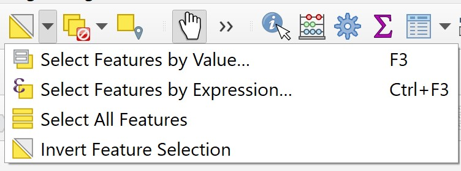{width=45%}
 
The Select by Expression dialog window appears.
 
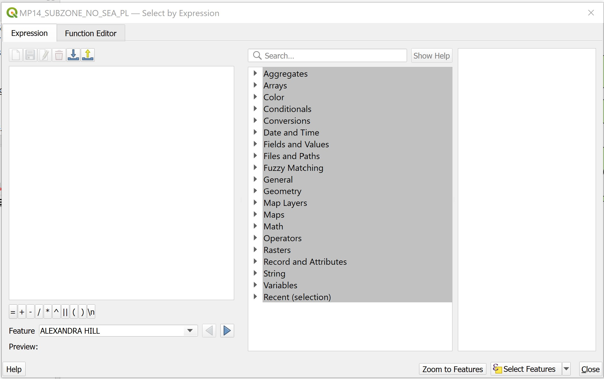 

+	Since we are going the select `Gombak` planning subzone, click on the **Field and Values** pane to look for the appropriate field. 
+	Double click on `SUBZONE_N`.

The **Select by Expression** dialog window should look similar to the screen below.  Notice that the `SUNZONE_N` field has been entered in the expression panel.

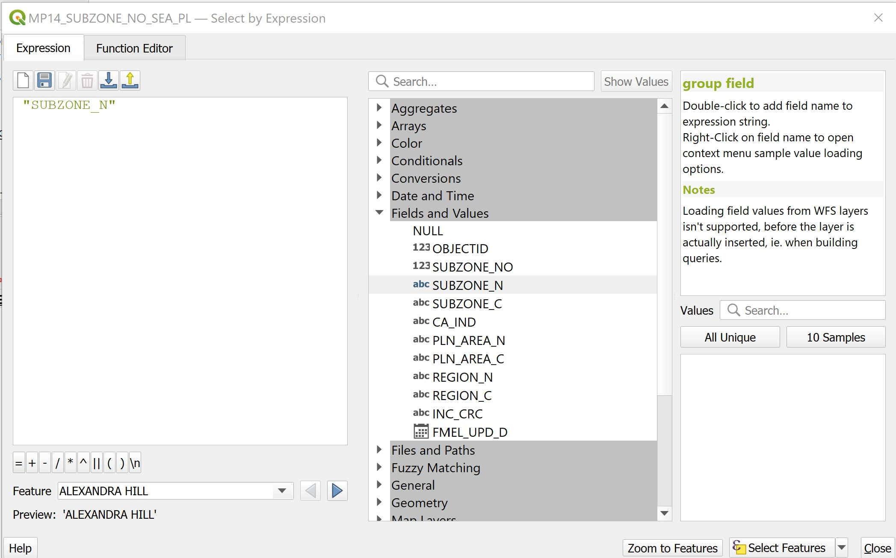

+	Click on the equal marker icon at the expression panel.

The expression panel should look similar to the figure below.

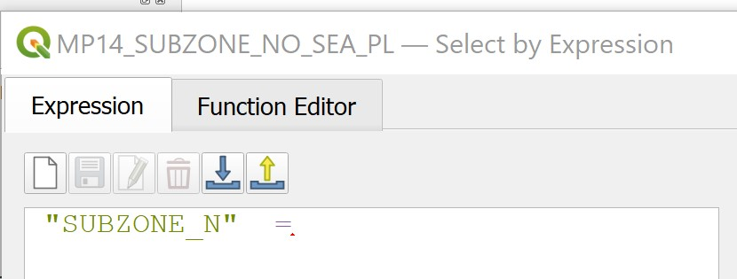{width=45%}
 
+	Click on **All Unique** button, then double-click on `GOMBAK`.

{width=25%}

The expression panel should look similar to the figure below. 

{width=45%}

+	Click on **Select Features** icon to execute the selection.
 
QGIS will indicate the number of feature(s) been selected.  

+	When it is done, click on the **Close** button.

The **Selection by Expression** dialog window closes.

Your screen should look similar to the figure below.


 
Notice that one polygon feature has been selected.

### 2.1.2	Saving the selected feature in Geopackage format

Next, we are going to save the selected polygon feature in a new GIS data in GeoPackage format.

>DIY: Using the steps you had learned in the previous hands-on exercise, save the selected Gombak polygon feature into a new GeoPackage call `LSA`.  Name the GIS layer `Gombak`.  

Your screen should look similar to the screenshot below.

{width=75%}
 
  
> DIY: The original planning subzone layer is no longer needed.  Using the steps you had learned in the previous hands-on exercise, remove Master Plan 2014 Subzone Boundary from the QGIS project.

## 2.2	Extracting vector data

In this section, you will learn how to extract the buildings and roads within the study area by using appropriate GIS operations.  Before you get started, however, you are required to import the necessary GIS data into the QGIS project.

>DIY: Using the steps you had learned in the previous hands-on exercise, import `buildings` and `roads` shapefiles of osm into QGIS project.

Your screen should look similar to the screenshot below.

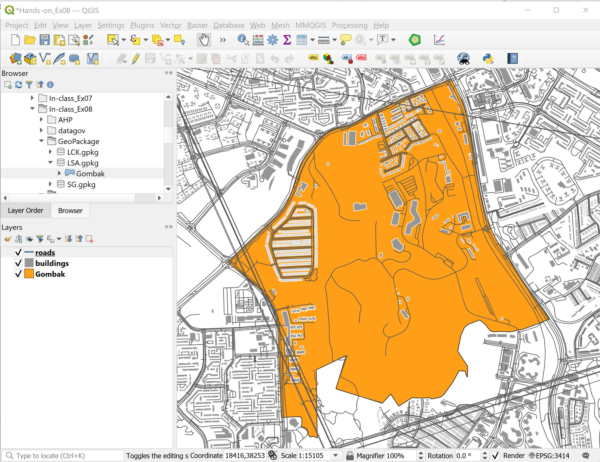

### 2.2.1	Working with Selection by Location function of QGIS

In this sub-section, you will learn how to extract buildings features fall within Gombak study area by using **Selection by Location** function of QGIS.

+	From the icon bar, click on **Select by Location** icon. 

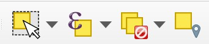{width=25%}
 
The Selection by Location dialog window appears.

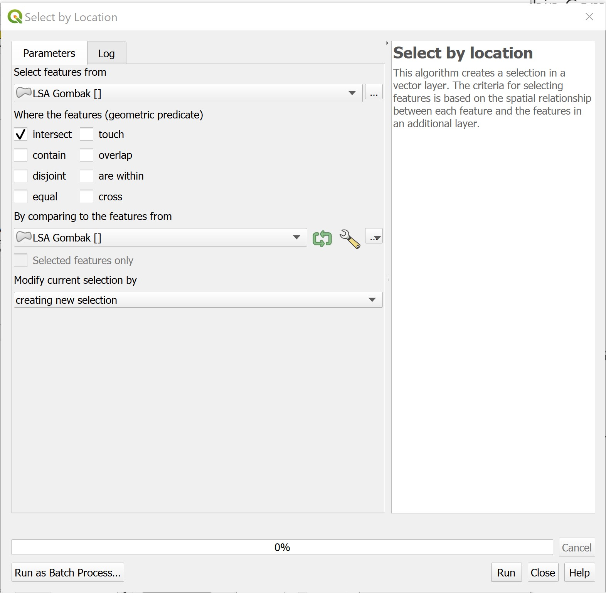{width=75%}
 
+	For **Select features from**, select the feature layer you want to select from i.e. `buildings` from the drop-down list.
+	For **By comparing to the feature from**, select the feature layer you want to use as reference i.e. `Gombak` from the drop-down list.
+	For **Where the features (geometric predicate)**, check the box in front of **intersect**.
+	For **Modify selection by**, select **creating new selection** from the drop-down list.

Your screen should look similar to the screenshot below.

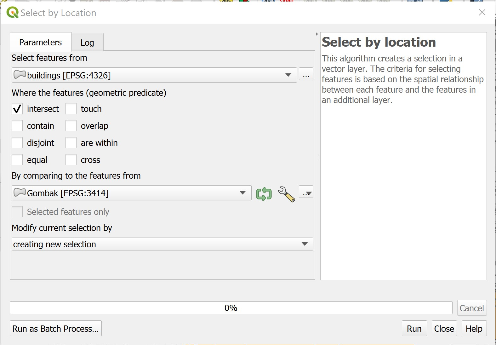

To run the operation,

+	Click on **Run** button.

To close the dialog window, 

+	Click on **Close** button

Notice that all buildings features fall within Gombak study area are selected (the lightlighted polygon features) as shown in the figure below.

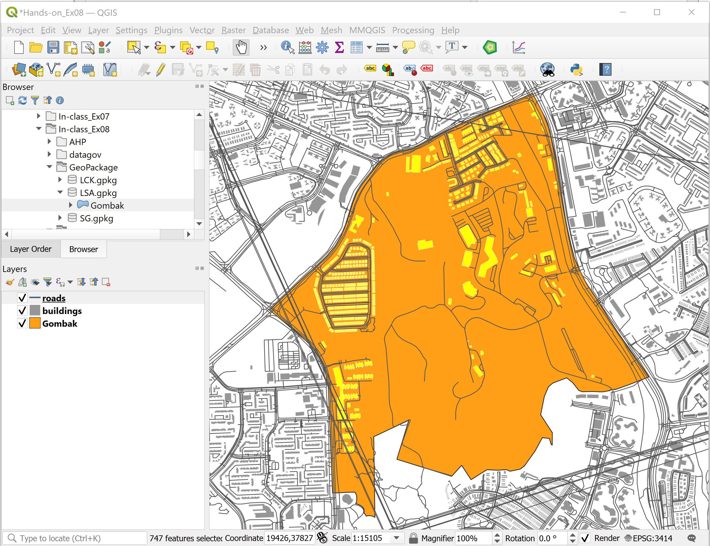

**Optional**

Before we end this section, you need to save the newly selected buildings layer into GeoPackage format.

>DIY: Using the steps you had learned in the previous hands-on exercise, save the extracted buildings layer in GeoPackage format.  Call the layer `Buildings`.  

### 2.2.2	Working with Clip operation

In this sub-section, you will learn how to extract buildings features fall within Gombak study area by using **Clip** operation of QGIS.

+ From the icon bar, click on **Deselect Features from the Current Active Layer**.  Note: This is only true if the selected layer is `buildings`.

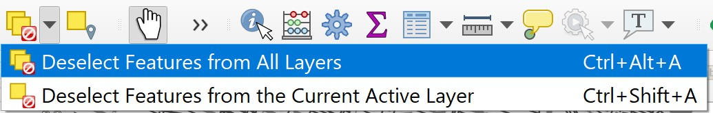{width=55%}

+	From the menu bar, select **Vector** -> **Geoprocessing Tools** -> **Clip**.
 
The **Clip** dialog window appears.
 
+	For **Input layer**, select the input layer that you want to clip i.e. `Buildings`.
+	For **Overlay layer**, select the layer that will be used as the reference i.e. `Gombak`.
+	Keep the **Clipped** option as default i.e. *Create temporary layer*.

The **Clipped** option is for you to specify how the output should be generated.  You can either save the output as a physical data layer or keep the output as temporary layer.  It is always a good practice to keep the output as a temporary layer so that we can examine the result.  After we have confirmed the result is correct, we can then save it into the database.

Your screen should look similar to the screenshot below.

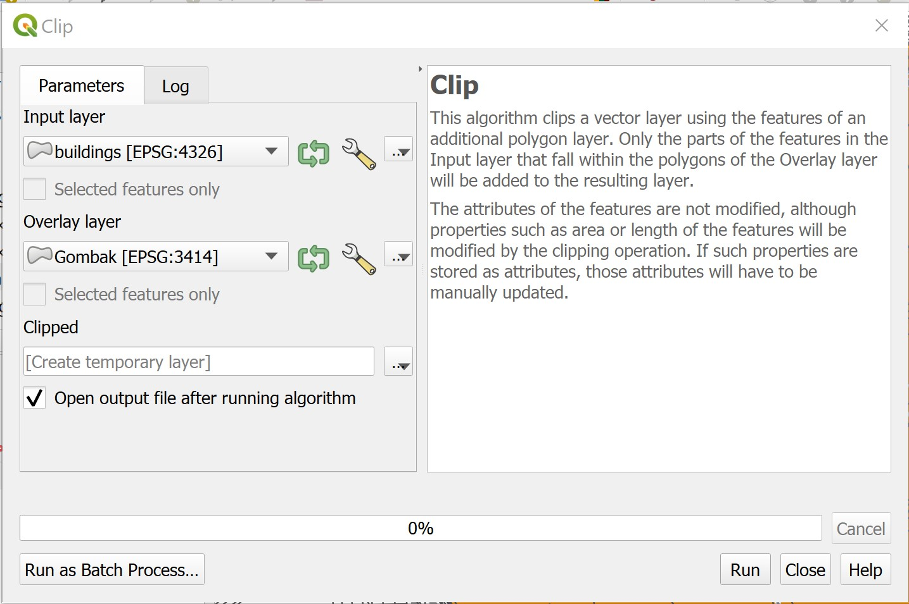{width=85%}

You are ready to run the operation now.  

+	Click on **Run** button.

When the geoprocessing is done, the dialog window will look similar to the screenshot below.

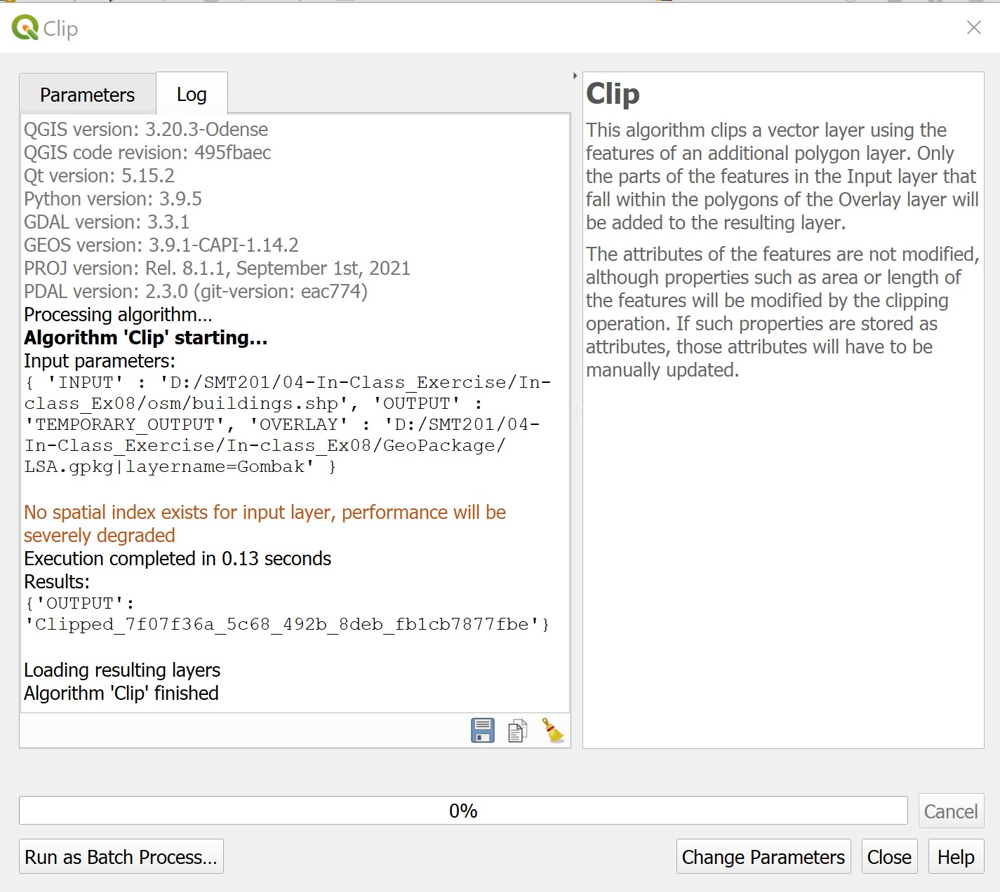
 
Do note that it is a good practice to read the details that appear on the dialog window.  This is particularly true when the operation failed.  The dialog window will display the possible causes of the failed operations.

+	Click on **Close** button.

The dialog window closes.

Notice that a temporary layer called `Clipped` is added into **Layers** panel and displayed as an active layer. 
 

### 2.2.3	Saving the output layer into GeoPackage format

Before we end this section, you need to save the newly extracted buildings layer into GeoPackage format.

>DIY: Using the steps you had learned in the previous hands-on exercise, save the extracted buildings layer in GeoPackage format.  Call the layer `Buildings`.  Next, remove the original buildings and temporary buildings layers from QGIS project.

### 2.2.4	Extracting roads layer 

>DIY: Using the steps you had learned in the previous hands-on exercise, extracting the roads features fall within Gombak planning subzone from the original OSM GIS data layers.  Compare which operations is more appropriate and explain why it is more appropriate.  Remember to save the extracted roads layer into GeoPackage and name it as `Roads`. 

Your screen should look similar to the screenshot below.

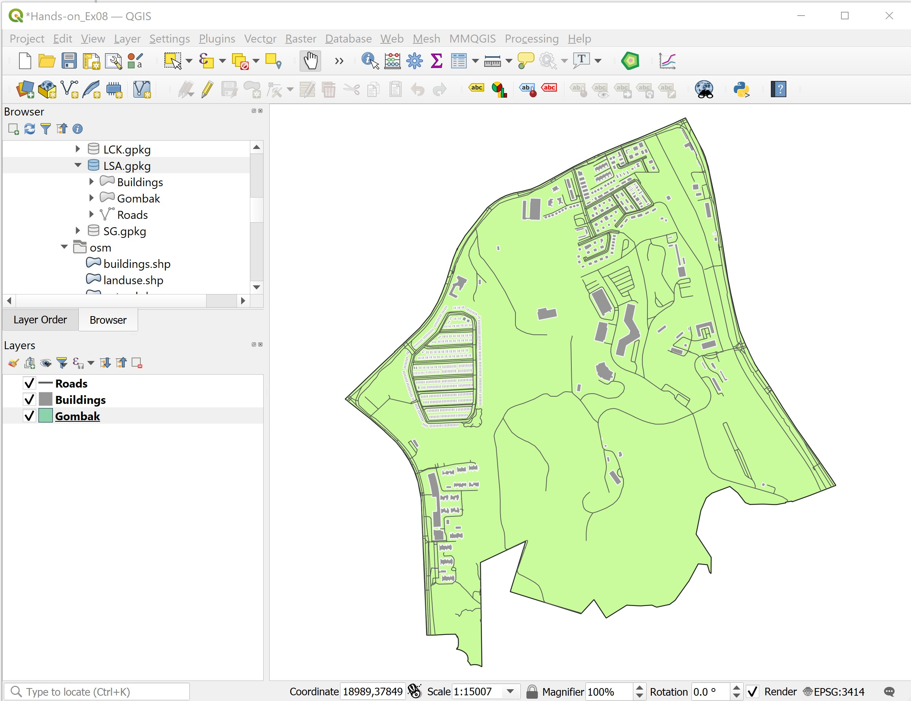

## 2.3	Extracting raster data 

In this section, you will learn how to extract the Digital Elevation Model (DEM) data fall within Gombak planning subzone by using appropriate raster-based GIS operations.  Before we get started, we will important the ASTER GDEM provided into QGIS project.

### 2.3.1	Importing raster GIS data layer

+	From **Browser** panel, navigate to raster sub-folder
+ Drag and drop `ASTER_GDEM_combined.tif` into **Layers** panel. 

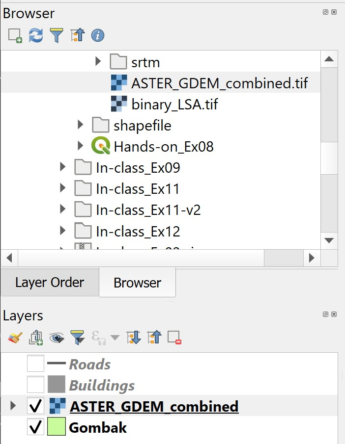{width=35%}

Your screen should look similar to the figure below.

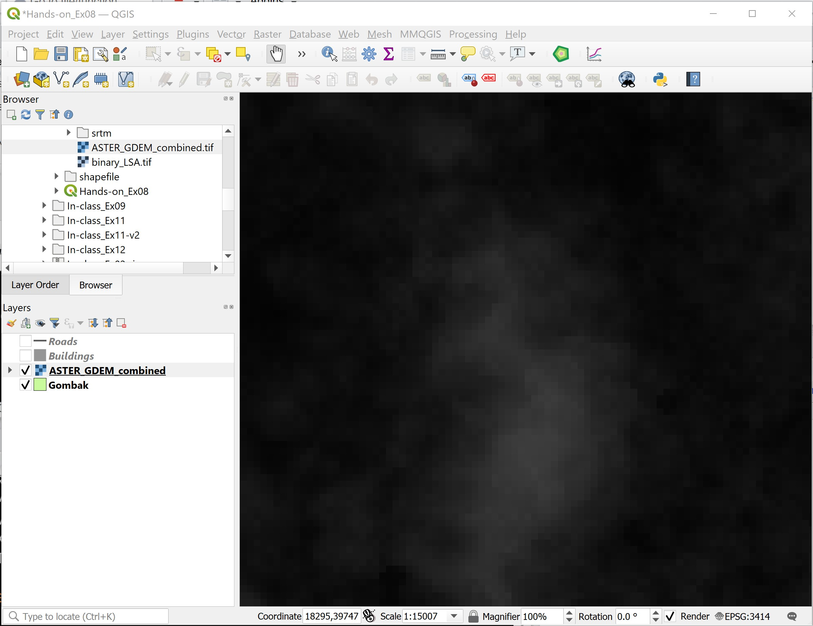

### 2.3.2	Working with raster clip operation

QGIS provides two operators to perform raster clipping, namely: **Clip Raster by Extent** and **Clip Raster by Layer**.  In this sub-section, **Clip Raster by Extent** function will be used.

+	From the menu bar, select **Raster** <- **Extraction** <- **Clip Raster by Extent**.

The Clip Raster by Extent dialog window appears. 
 
+	For **Input layer**, select *ASTER_GDEM_combined* from the drop-down list.
+	For **Clipping extent**, click on the icon at the end of the option then select **Calculate from Layer**.
+	Select `Gombak` from the drop-down list.

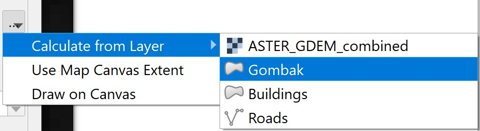{width=50%}

Your screen should look similar to the screenshot below.

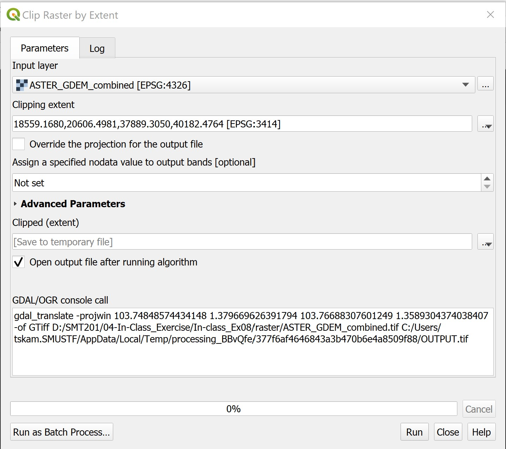{width=65%}

+	When you are ready, click on Run button. 
+	When the process completed, read the process log to ensure that there is no error. 
+	Click on Close button to close the dialog window.

Notice that a new raster layer called `Clipped (extend)` is added into **Layers** panel and displayed on the **View** as shown in the screenshot below. 

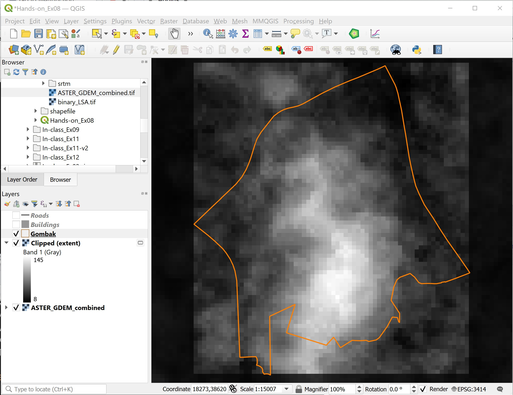

### 2.3.3	Saving the newly clipped raster layer into GeoPackage format

>DIY: Using the steps you had learned from previous hands-on, save the clipped layer of DEM into GeoPackage format and call it `DEM`.

>DIY: Using the steps you had learned in previous section, remove Clipped (extend) layer from QGIS project.  

# 3.0	Computing Factor Data

In this section, you will learn how to use raster GIS operation to derive analytical layers from the original geographic layers.

## 3.1	Computing proximity to roads

In this section, you will learn how to create a proximity to roads layer by using the *Proximity (Raster Distance)* operation of QGIS.  However, before we can perform the computation, we need to rasterise the roads layer.  This is because the **Proximity (Raster Distance)** requires the input GIS layer in raster format.

### 3.1.1	Creating attribute field for rasterising

Before we can rasterise the roads layer, we need to add a control attribute field in the roads layer.  

+	At the **Layers** panel, click on **Roads** layer to make it active.
+	From the icon bar, click on **Open Attribute Table** icon  .

The attribute table of roads layer appears.

+	From the menu bar of roads layer attribute table, click on **Open field calculator** icon.

The **Field Calculator** dialog window appears.

+	Keep **Create a new field** option checks. 
+	For **Output field** name, type `POI_CODE`.
+	At the **Expression** pane, type *1*.

Your screen should look similar to the figure below.

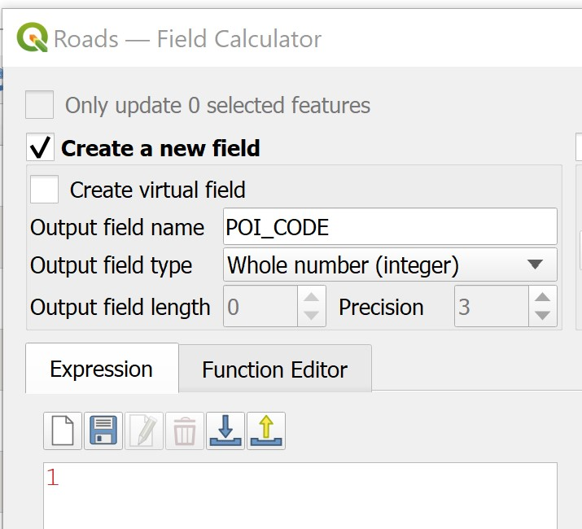{width=45%}

+	Click on **OK** button to run the function.

Notice that a new field called `POI_CODE` has been added into the attribute table of roads GIS layer.  Also note that all the records are indicated with `POI_CODE` values equals to *1*.


You are now ready to rasterise the roads layer.

>DIY: Before moving to the next section, remember to stop and save the editing.

### 3.1.2	Rasterising roads layer

+	From the menu bar, select **Raster** -> **Conversion** -> **Rasterise (Vector to Raster)**.

The **Raster (Vector to Raster)** dialog window appears. 

+	For **Input layer**, select `Roads` from the drop-down list.
+	For **Field to use for a burn-in value**, select `POI_CODE` from the drop-down list.
+	For **Output raster size units**, select *Georeferenced units*.
+	Keep both horizontal and vertical resolutions at 5 (meaning 5m by 5m resolution).
+	For **Output extent**, click on **Calculate from Layer**.
+	Select **DEM** from the drop-down list.

When you are ready, 

+	Click on **Run** button.

When the operation ended, the dialog window will display the operation log.

+	Read the output display to ensure that the process has completed without any error.

After confirming that there is no error.  You can close the dialog window.

+	Click on **Close** button.

Notice that a temporary layer called `Rasterized` has been added in QGIS project.


 

>DIY: Using the steps you have learned in previous section, save the temporary layer into GeoPackage format. Call the newly exported layer `raster_roads`. Next, remove the temporary layer from QGIS.

### 3.1.3	Working with Proximity function of QGIS  

Now, the **Proximity** operation of QGIS will be used to compute the proximity to roads layer.

+	For the menu bar, select **Raster** -> **Analysis** <- **Proximity (Raster Distance)**.

The Proximity (Raster Distance) dialog window appears.
 
+	For **Input layer**, select `raster_roads` from the drop-down list.
+	For **Distance units**, select **Georeferenced coordinates** from the drop-down list.
 +	For **Output data type**, select *Float32* from the drop-down list.

Your screen should look similar to the screenshot below.

{width=75%}
 
+	Click on **Run** button.

Your screen should look similar to the figure below.


A temporary layer called `Proximity map` is created and added in QGIS project.  The legend of Proximity map layer indicates that the furthest distance from the roads is 708 metres.

>DIY: Using the steps you had learned, save the newly computed proximity map into GeoPackage format with a resolution of 5m x 5m.  Call the layer `prox_roads`.  Next, remove the Proximity map layer from QGIS. 

## 3.2	Computing proximity to buildings

>DIY: Using the steps you had learned, create the proximity layer to buildings.  Save the output into GeoPackage format with 5m x 5m resolution. Called the output layer `prox_buildings`. 

The `prox_buildings` layer should look similar to the figure below.  The grid values indicate distance away from existing building in metres.

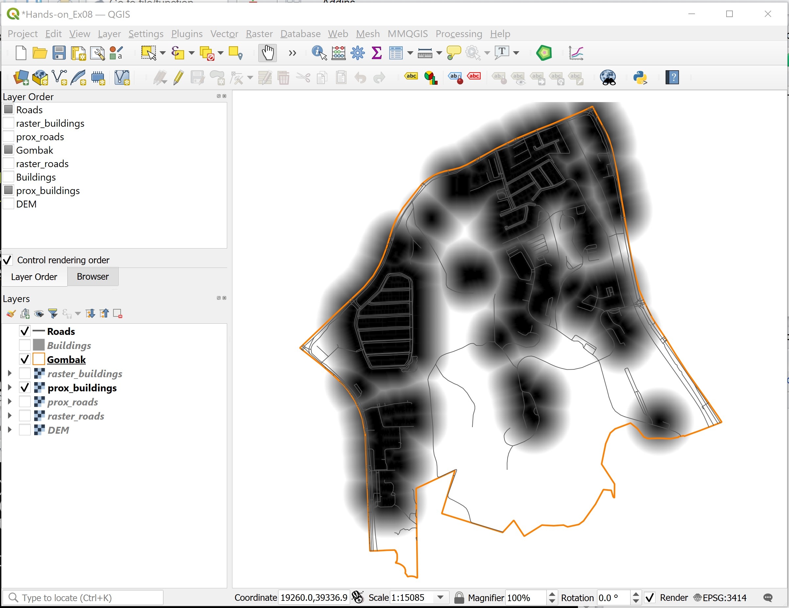

 
## 3.3	Computing slope

In this section, you will learn how to compute a slope layer from DEM layer by using the **Slope** operation of QGIS.

+	From the menu bar, select **Raster** -> **Analysis** -> **Slope**.

Slope dialog window appears.

+	For **Input layer**, select `DEM` from the drop-down list.
 
Keep the rest of the setting as default.

+	Click on **Run** button.

When the computation completed, a temporary layer called `Slope` will be added in QGIS project.


The legend of Slope layer shows that the minimum and maximum values of the slope values are 0 and 36.8795 degrees respectively.  The grids with darker grey indicate locations with relatively gentle slope.  On the other hand, the light grey grids indicate locations with steeper slope.

+	Click on **Close** button to close **Slope** function dialog window.

>DIY: Using the steps you had learned, save the newly computed `Slope` temporary layer into GeoPackage format.  Called the output layer `Slope`. 


# 4.0	Binary Model

A binary land suitability model is the simplest GIS modelling approach analogous to the manual procedures for map analysis popularized in the classic landscape planning book entitled **Design with Nature** by Ian L, Mcharg (1969). 

## 4.1	Deriving binary layers

Before we generate the land suitability map, we will first derive a preference layer for each factor layer under consideration.  These preference layers will be encoded in binary form whereby 1 denotes suitable and 0 denotes not suitable.

For this land suitability analysis, the followings have been suggested:

+	Economic factor:  < =15deg slope
+	Accessibility factor: <= 200m from roads. 
+	Health risk factor: >= 250m away from population i.e. housing areas and offices.

### 4.1.1	Deriving slop preference layer

To derive the preference layer for slope, the **Reclassify** operation of QGIS will be used.  In QGIS there are two sets of **Reclassify** operators.  One set is provided natively by QGIS under the Raster analysis family in Processing Toolbox.  The second set of Reclassify operators is from SAGA (http://www.saga-gis.org/en/index.html).  For the purpose of our analysis, the Reclassify by table function of QGIS will be used.

+	From the menu bar, click on *Processing* -> *Toolbox*.
 
By default, Processing Toolbox will appear on the right-hand side of the QGIS project window as shown in the screenshot below.

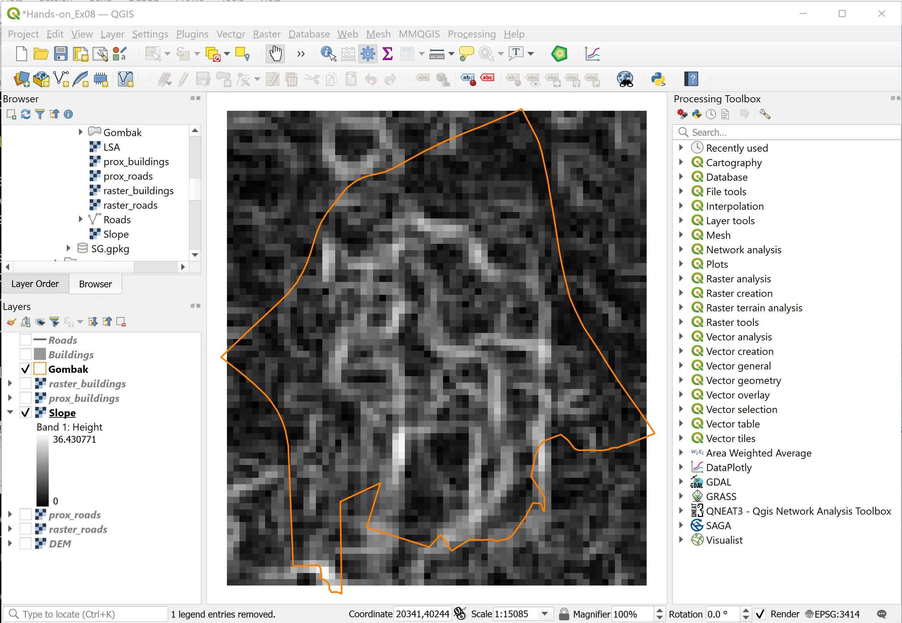
 
There are more than 600 hundred functions provided by QGIS processing toolbox.  The easier way to look for a function is by using the search function.  For example, by type the word reclassify in the search, Processing Toolbox lists the reclassify functions available as shown in the screenshot below.

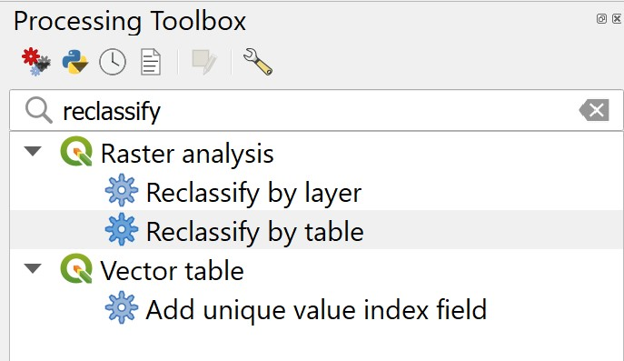{width=35%}
 
+	Double click on **Reclassify by Table** function.

The **Reclassify by Table** dialog window appears.
 
+	For **Raster layer**, select the target raster layer you want to process i.e. `Slope` from the drop-down list.
+	Click on the button at the end of **Reclassification table**.

The Fixed table dialog window appears.

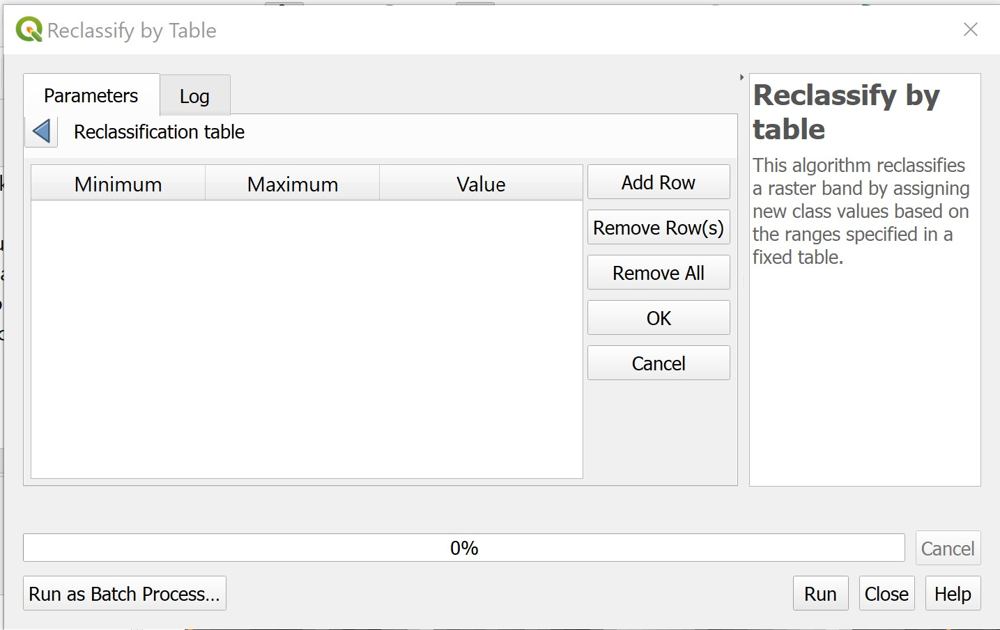{width=65%}

+	Click on the *Add Row* button.

Your screen should look similar to the screenshot below.
 
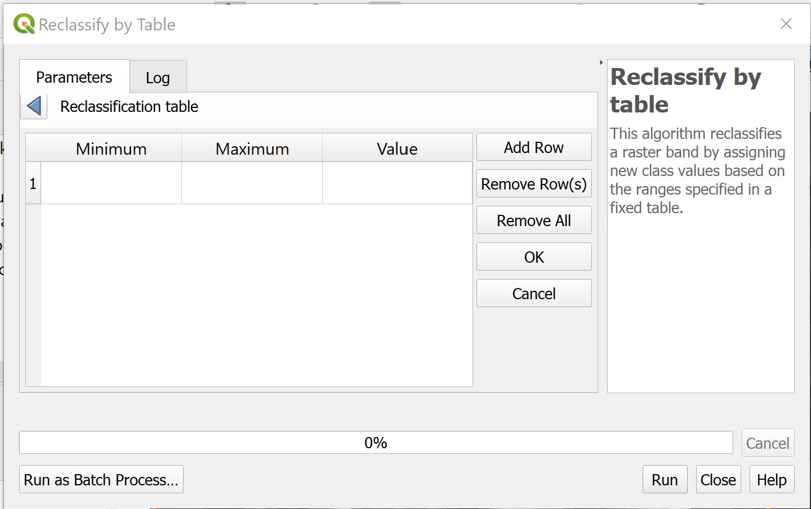{width=65%}

+	Type in the values as shown in the screenshoot below.

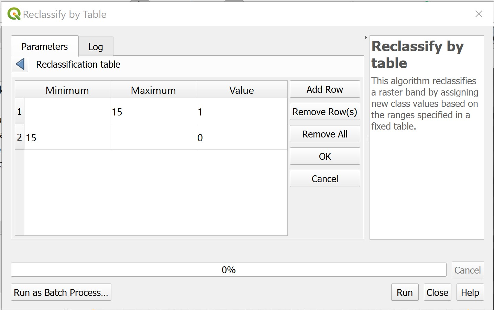{width=65%}
 
Basically, the value ranges above recode all cell values into either 0 or 1 by using 15 as the cut-off value.

+	Click on *OK* button to close the dialog window.
+	From the **Range boundaries**, select *min < value <= max* from the drop-down list.

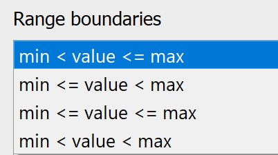{width=25%}
 
>**Caution:** Select the appropriate range defination in order the ensure the output values are mutually exclusive and truly reflect the cut-off value(s). 

+	For **Output data type**, select *Float32* from the drop-down list.

When you are ready, 

+	Click on **Run** button.

When to process completed, the processing log appears.

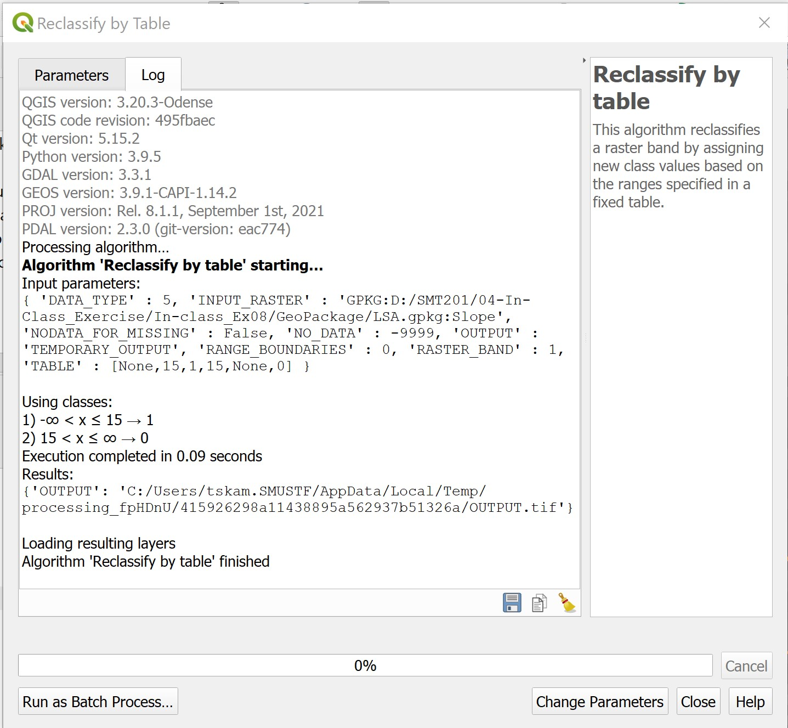
 
It is a best practice to read the report carefully, special attention should be given to the section of **Using classes**.

+	Click on **Close** button to close the dialog window.

A temporary layer called `Reclassified raster` will be added in QGIS project as shown in the screenshot below.


 
According to the legend, the black grids indicate locations with slope value greater than 15 degrees and white grids indicate locations with slope value less than or equal to 15 degrees.

>DIY: Using the steps you had learned in previous section, save the temporary output layer into GeoPackage format.  Call the data layer as `binary_slope`.

>DIY: Repeat the steps above to derive the preference layers for accessibility and health risk factors.  Save the temporary output layers into GeoPackage format and name the data layers as `binary_roads` and `binary_buildings` respectively.

The `binary_road` should look similar to the screenshot below.

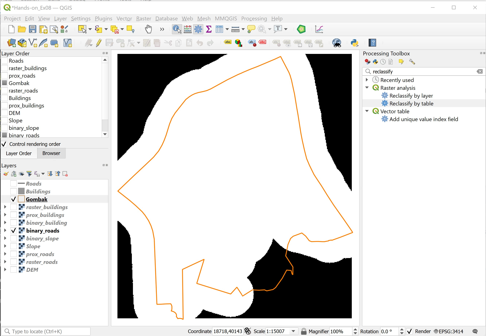


The `binary_road` should look similar to the screenshot below.


## 4.2	Computing composite binary suitability layer

Now, it is time for us to put the Humpty Dumpty together.  The task will be accomplished performed by map algebra operation of GIS.  Map algebra is a set-based algebra for manipulating geographic data, proposed by Dr. Dana Tomlin in the early 1980s. It is a set of primitive operations in a geographic information system (GIS) which allows two or more raster layers ("maps") of similar dimensions to produce a new raster layer (map) using algebraic operations such as addition, multiplication etc (https://en.wikipedia.org/wiki/Map_algebra).  In this section, you will perform map algebra computation by using Raster Calculator function of QGIS.

+	At the **Search** pane of **Geoprocessing Toolbox** panel, type *raster calculator*.

Your screen should look similar to the screenshot below.

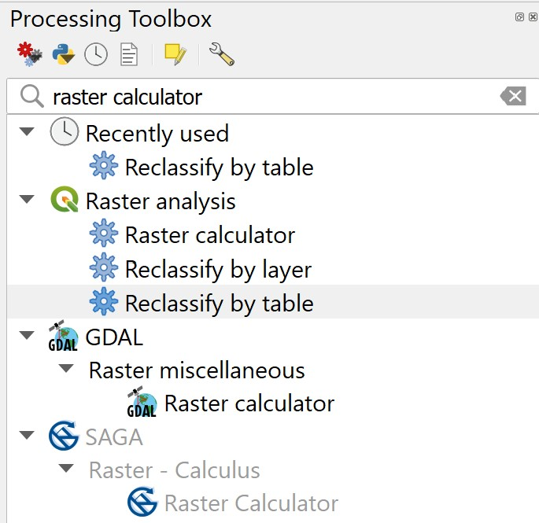{width=40%}
 
The search result shows that there are three raster calculator functions are available in QGIS.  For this task, the **Raster calculator of Raster analysis** will be used.

+	Double-click on **Raster calculator** of **Raster analysis**.

The dialog window of **Raster Calculator** appears.
 
+	At the **Layers** panel of **Raster Calculator** dialog window, double-click on `binary_buildings` layer.

Notice that the **Expression** pane of **Raster Calculator** dialog window will be updated as shown below.

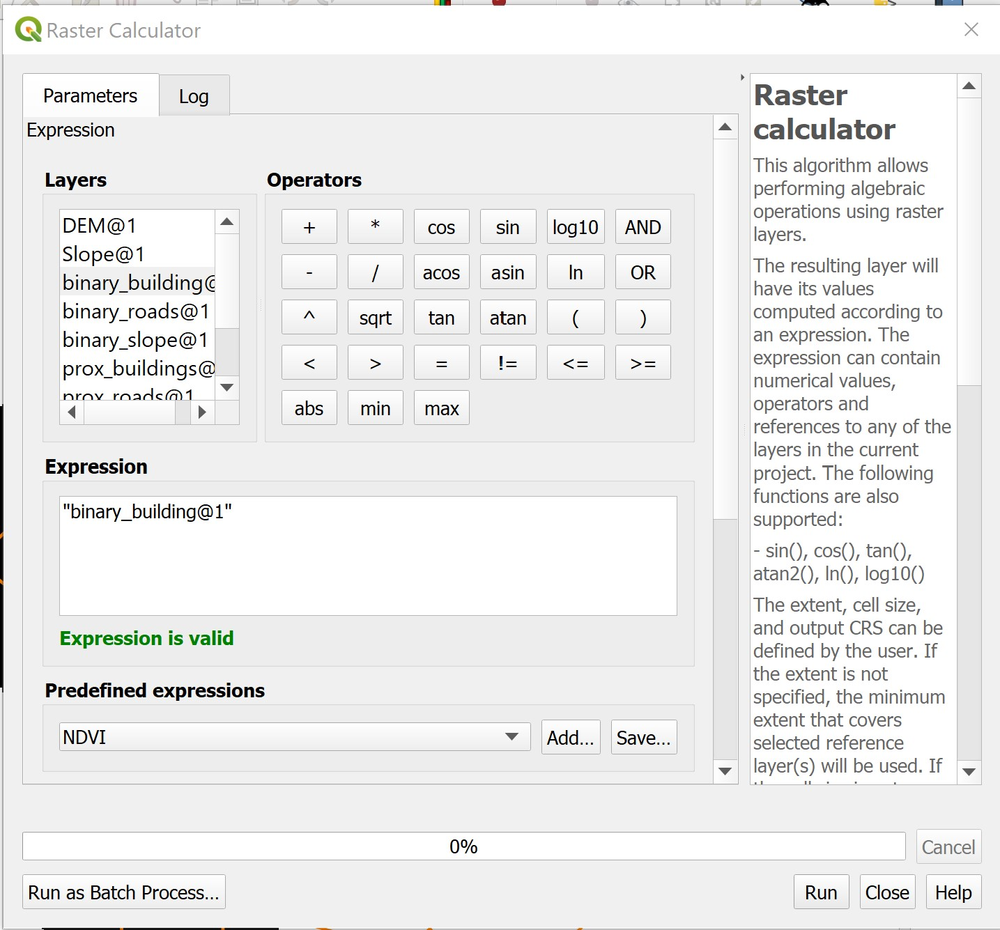{width=75%}
 
+	Next, click on the *multiplication* icon.
+	Next, double-click on `binary_roads` layer.
+	Next, click on the *multiplication* icon.
+	Next, double-click on `binary_slope` layer.  

The final expression should look similar to the screenshot below.

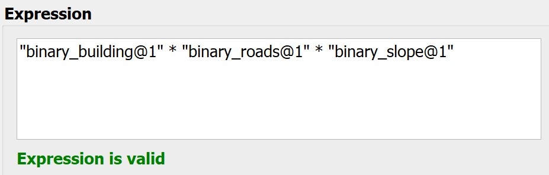{width=65%}
 
>My two cents worth: 
As a beginner, it is advisible not to type the syntax by hand in order to avoid unnecessary typo error.

Next, you need define the output layer format.  **Raster Calculator** provides two ways to define the output layer format.  

Firstly by using the **Reference layers(s) interface**.

+	Click on the icon located at the end of the interface.

The **Multiple selection** dialog window appears.
 
+	Click on the check-box in front of the raster layer(s) you want to use as the reference layer(s) i.e. `binary_buildings`.

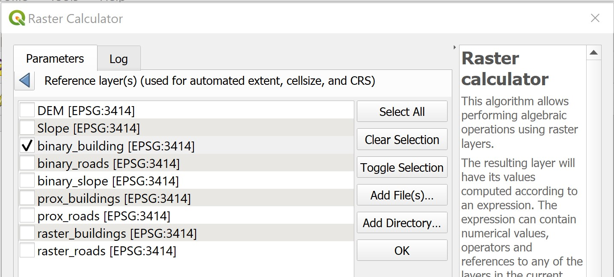{width=70%}

+	Click on **OK** button to close the dialog window. 

Alternatively, you can provide the output layer specification using the individual interfaces as shown in the screenshot below. 

{width=65%}

 
+	For **Output**, keep the default. 
+	Finally, click on **Run** button to run the operation.

When the processing completed, refer to the process log to ensure that there is no error.

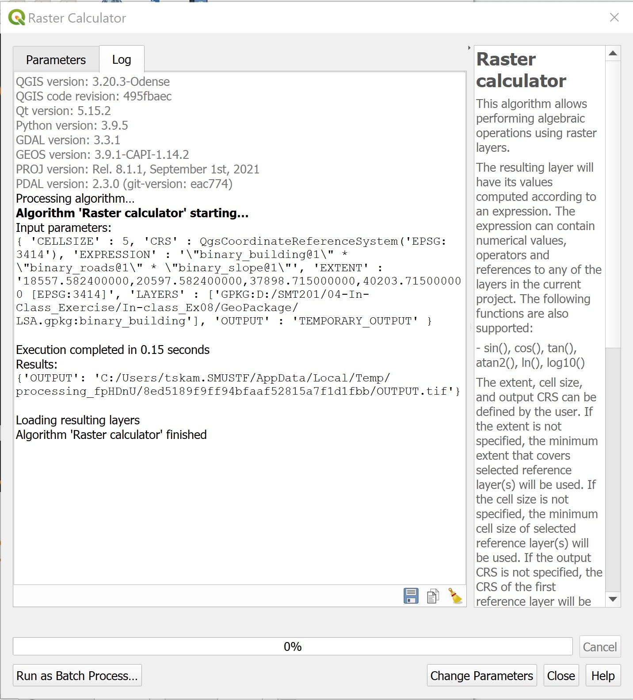

+	Click on **Close** button to close the **Raster Calculator** dialog window.

Notice that a temporary raster layer called `Output` is added in QGIS project.
 
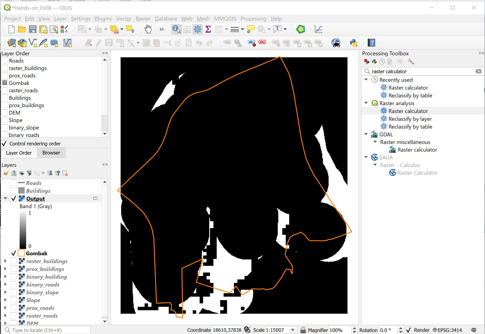


With reference to the Output raster layer, the white grids indicate location suitable for the proposed land development.  The black grids, on the other hand, indicate location not suitable for the proposed land developmnet.

>DIY: Using the steps you had learned in previous section, save `Output` layer in GeoPackage format.  Call the data layer `binary_model`.  Then, remove the temporary `Output` raster layer from QGIS project. 

```{r echo=FALSE, eval=FALSE}
library(pagedown)
pagedown::chrome_print("Hands-on_Ex08.html")
```
 


