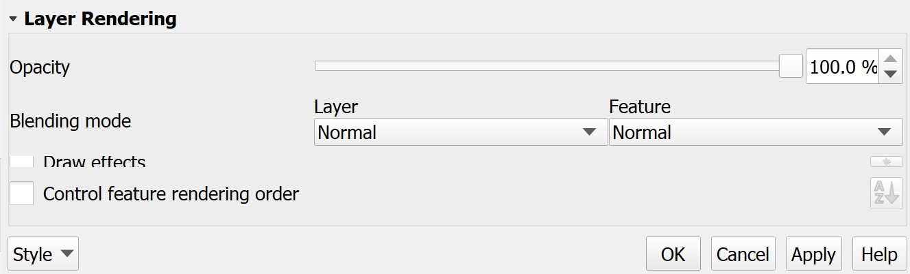
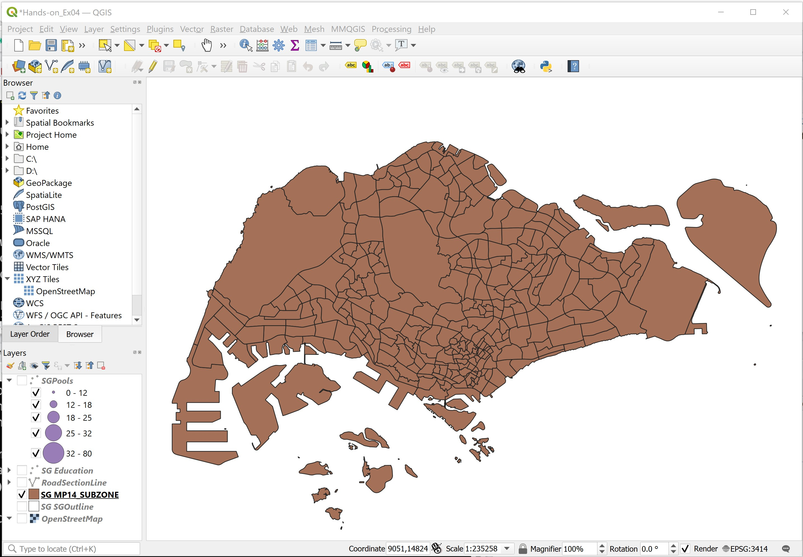
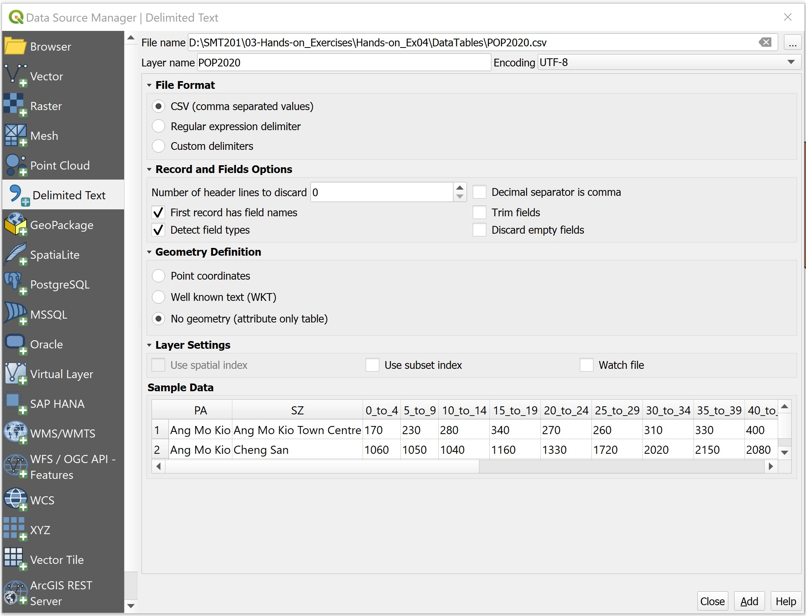
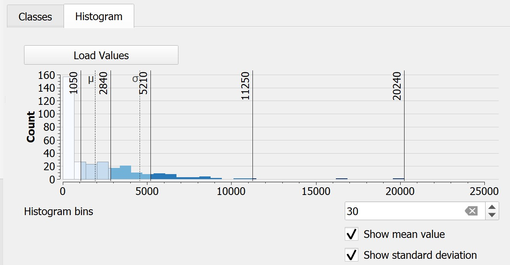

```{r setup, include=FALSE}
knitr::opts_chunk$set(echo = FALSE)
```

## 1.0 Introduction
   
In this exercise, you will learn how to prepare qualitative and quantitative thematic maps using QGIS.  You will also learn how to create a join table using the concept of georelational data model of GIS.

### 1.1 Learning Outcome

By the end of this session, you will be able to:

- prepare qualitative maps 
- create propoertional symbol map
- prepare choropleth map
- using 

## 2.0 Data

For the purpose of this hands-on exercise, three data sets are provided.  They are:

- `education` provides general information of public primary schools, secondary schools and junior colleges.  This data set was downloaded from Data.gov.sg and geocoded by using SLA OneMap Api.
- `sgpools` provides information of SG Pools outlets and stores information.
- `POP2020` provides population by age group as at June 2020.  It is downloaded from Department of Statistics (DOS), Singapore.  The data set provides multiple years population data but for the purpose of this exercise, only 2020 data were extracted.  

These three data sets are in csv file format.  They can be found in `DataTables` of Hand-on-Ex04 folder.

Besides the above three data sets, you are required to download the following geospatial from public web sites:

- `National Map Polygon` from Data.gov.sg
- `Master Plan 2014 Subzone Boundary (No Sea)` from Data.gov.sg
- `Road Section Line` from LTA Data Mall

### 2.2 Data Preparation

>DIY: Using the steps you learned from previous hands on exercise, convert the education and SGPools data sets in DataTables folder into geospatial data layer and store them into an integrated database called `SG`.  The geospatial database must be in **GeoPackage** format.      

>DIY: Using the steps you learned from previous hands-on exercise, convert the geospatial data sets downloaded from Data.gov.sg and LTA Data Mall into the newly created `SG` database.

## 3.0 Getting Started

>DIY: Launch QGIS.  Created a new project call `Hands-on_Ex04`.  Provide the project the correct referencing system.

>DIY: Using the steps you learn from previous hands-on exercies, import all the geospatial data in `SG` database into the newly created QGIS project. 

>DIY: Using the steps you learn from previous hands-on exercies, add OSM map layer into `Hands-on_Ex04` project. 

Your screen should look similar to the figure below.


## 4.0 Symbolising Qualitative GIS Data Layers

In this section, you will learn how to symbolise GIS data layers by using their corresponding qualitative data values.

### 4.1 Symbolising education GIS layer 

The `type_code` field of `Education` layer provides us the school type information.  In this section, you will learn how to use this field to symbolise `education` layer.

+ At **Layers** panel, click on `Education` layer to make it active.
+ Right-click on `Education` and select **Properties** from the context menu.

The **Layer Properties** dialog window appears.

+ Click on the **Symbology** tab.

Your screen should look similar to the screenshot below.


+ Select **Categorized** from the **Symbol drop-down** list.

{width=25%} 

+ For **Value**, select *mainlevel_code* from the drop-down list.

{width=40%}  

+ Click on the **Classify** button.

Your screen should look similar to the screenshot below.

{width=60%} 

Figure above shows that `Education` layer has been categorized into five categories. They are, Junior College, Centralised Institute, Mixed Levels, Primary and Secondary.

Next, you will learn how to symbolise them by using the svg vector symbol set.

+ Double-click on the marker in front of *JUNIOR COLLEGE*.

The **Symbol selector** dialog window appears.

{width=65%}

+ From **Marker**, click on **Simple marker**.

+ For **Symbol layer type**, select **SVG maker** from the drop-down list.
 
Scroll down the dialog window until you can see the SVG Browser as shown below.


 

+ From the **SVG Image**, scroll-down and click on {width=5%}.

>DIY: Change the size value and fill colour and observe the differences.

+ When you are done, click on the **OK** button.

You will return to **Layer Properties** dialog window.

>DIY: Using the step you had learned, change the symbols of the remaining four categories in *mainlevel_code* field.  

When you are done.

+ At the **Layer Properties** dialog window, click on **Apply** button to update the changes.
+ To close the **Layer Properties** dialog window, click on OK button.

Your screen should look similar to the figure below.

 

This map is popularly known as Point symbol map among the GIS and cartography communities.  Prior to GIS era, this kind of map took more than a month to prepare.  With GIS, it only needs less than 15 minutes to prepare.  The advantage of GIS-based poitn symbol map is that the map can be changed easily with very little effort.  GIS-based pointsymbol map is also highly interactive.  You can navigate around the digital map and zooming in to view the distribution in greater details.

>DIY: Use the steps you had learned from previous section, symbolise the 

>Challenge: 
Using the steps you learned in previous section, symbolise RoadSectionLine layer according to Expressway and Roads.

>Challenge:
Using the steps you learned in previous section, symbolise National Map Polygon layer to show the outlines only.

Your screen should look similar to the figure below.

 

## 5.0 Creating Proportional Symbol Map

**Proportional symbol** maps (also known as graduate symbol maps) are a class of maps that use the visual variable of size to represent differences in the magnitude of a discrete, abruptly changing phenomenon, e.g. counts of people.  Like choropleth maps, you can create classed or unclassed versions of these maps. The classed ones are known as **range-graded** or **graduated symbols**, and the unclassed are called **proportional symbols**, where the area of the symbols are proportional to the values of the attribute being mapped.  

In this section, you will learn how to create a proportional symbol map showing the numbers of win by Singapore Pools’ outlets.  

>DIY: Before we get started, let us switch off `Education`, `RoadSectionLine` and `SGOutline` layers.

Your screen should look similar to the figure below.


 
Before you start to prepare the proportional symbol map, you will take a look at the attribute table of `SGPools` layer.

+ At the **Layers** panel, right-click on `SGPools` layer.
+ Select **Open Attribute Table** from the context menu.

Your screen should look similar to the figure below.


 
You are going to use the values in the last filed (e.g *Gp1Gp2Winn*) to create a proportional symbol map.

+ Close the table by clicking on the cross icon located at the upper right corner of the table.

Next, you are going to change the size of the point symbol by mapping the values in *Gp1Gp2Winn* field.

+ At the **Layers** panel, right-click on **SGPools** layer.
+ Select **Properties** from the context menu.

The **Layer Properties** dialog window appears.

+ Click on the **Symbology** icon.

+ For **Value**, select *Gp1Gp2Winngs* from the dropdown liat.
+ For **Method**, select **Size** from the drop-down list.
+ For **Size** to, type *10*.
+ Click on **Classify** button.

Your screen should look similar to the figure below.


 
When you are ready, 

+ Click on Apply button to update the changes.

In order to view the changes, you need to close the dialog window.

+ Click on **OK** to close the **Layer Properties** dialog window.

Your screen should look similar to the figure below.


Notice that there are many proportional symbols were overlapping.  Now, you will learn how to use the layer transparent feature of QGIS to improve the visualisation.

>DIY: Using the step you learned in earlier section, open the **Layer Properties** of `SGPools`.

+ At the **Layer Properties** panel, look for **Layer rendering** sub-panel located at the bottom ot the dialog window.
+ Click on the little triangle in front of **Layer rendering** sub-panel.

The Layer rendering sub=panel extended as shown in the figure below.



+ For **Opacity**, type *80%*, alternatively, you can use slider to slide toward the left until it reaches 80%.

To update the changes,

+ Click on **Apply** button.

Lastly, 

+ Click on **OK** button to close the dialog window.

Your screen should look similar to the figure below. 

 


•	Feel free to explore other configurations.  When you are done, click on the OK button.  

## 6.0 Choropleth map using GIS

**Choropleth mapping** involves the symbolization of enumeration units, such as countries, provinces, states, counties or census units, using area patterns or graduated colors.  For example, a social scientist may need to use a choropleth map to portray the spatial distribution of aged population of Singapore by Master Plan 2014 Subzone Boundary.

The major concerns of choropleth mapping are the method of data classification, areal symbolization, and the overall map design.  General rules for choropleth mapping are as follows:

+ Use data that are assumed to be uniform throughout an enumeration unit.
+ Because enumeration units vary in size, do not map totals.  Use derived values, such as ratios, rates, proportions, or percentages.  
+ The best classing method depends on the data, the map reader and the purpose of the map. 
+ When classifying data, the full range of data must be included and class values should not overlap.  No more than six classes are recommended.
+ Class symbols (i.e. colors or patterns) must be easily distinguishable.

In this section of the hands-on exercise, you will learn how to use QGIS to prepare a choropleth map showing the distribution of population with age 65 and above in Singapore by URA’s Master Plan 2014 subzone.  You will also gain hands-on experience on the various data classification methods, symbolisation and map layout design techniques offered by QGIS.

### 6.1 Adding geoadministrative layer
  
>DIY: Using the steps you had learned from previous section, add `Master Plan 2014 Subzone Area Boundary (No Sea)` layer into QGIS.

Your screen should look similar to the figure below.

 


### 6.2	Adding an attribute table in QGIS project 

Now, you will add the POP2020.csv table into the QGIS project.  It is stored in `\Hands-on_EX04\DataTables` folder and is in csv format.

+ From the **Layers** toolbar, click **Add Layer** -> **Add Delimited Text Layer …**.

The **Data Source Manager|Delimited Text** dialog window appears.

 

+ At **File Name**, click on **Browse** button at the back.

The **Choose a Delimited Text File to Open** dialog window appears.

•	Navigate to \Hands-on_Ex04\DataTables sub folder.


+ Click on `POP2020`.  
+ Click on the Open button.

You will return to **Data Source Manager|Delimited Text** dialog window.

 

Notice that the dialog window is completed with many information and a preview table.

+ For **Geometry definition**, click on the radio button in front of **No geometry (attribute only table)**.
+ Click on **Add** button.

Notice that a new data layer called `POP2020` has been added in the **Layers** panel.

We will close **Data Source Manager|Delimited Text** dialog window.

+ Click on **OK** button.

Next, you will examine the structure of the data.

•	Right-click on `POP2020`, select **Open Attribute Table**.

The Attribute table dialog window appears.  

 

### 6.2	Creating relational join

Now you are ready to perform relational join between the MP14_SubZone GIS layer and the POP2020 attribute layer.  

In order to join the attribute table of a geospatial data and an aspatial attribute table, we need to identify the common key or popularly known as **unique identifier** between these two datasets.    

>DIY: Using the steps you had learned, open the attribute table of MP14_SubZone and POP2020.


With reference to the tables above, the *SZ* field of `POP2020` and *SUBZONE_N* field of MP14_SUBZONE can be used as the unique identifier filed.  However, if you examine the data carefully, there is a problem we should be noted, that is strings in SUBZONE_N are all uppercase.  On the other hand, strings in SZ field are made up of upper- and lowercases.

In view of this problem, we will create a new few to change strings in SZ into uppercase.  We will call the output field SUBZONE.

+ At the **POP2020 Feature Table**, click on **Open field calculator** icon {width=5%}

The **Field Calculator** dialog window appears.

+ For **Output field name**, type *SUBZONE*.
+ For **Output file type**, select *Text(string)* from the drop-down list.
+ At the Expression panel, type as shown below.

{width=75%}

>Best practice: This is always a good practice to check the preview to ensure that the result is inline to what you want.

+ Click on **OK** button when you are ready.

Notice that a new field called SUBZONE has been added into POP2020 data table the strings are all in uppercase.

{width=55%}

You are ready to join both tables now.

+ From the **Layers** panel, double-click on **MP14_SubZone** vector layer.

The **Layer Properties** dialog window appears.

•	From the **Tab** menu, click on the **Joins** tab.

Your screen should look similar to the figure below.

 

+ Click on Add new join icon {width=5%}

The **Add Vector Join** dialog window appears.

+ For **Join Layer**, select `POP2020` from the drop-down list.
+ For **Join field**, select *SUBZONE* from the drop-down list.
+ For **Target field**, select **SUBZONE_N** from the drop-down list.

{width=40%} 

+ Click on **OK** button to perform the relational join.

You will return to the **Layer Properties** dialog window.
 
Notice that a relational joined between `POP2020` attribute table and the attribute table of `MP14_SubZone` has been created.

+ At the **Layer Properties** dialog window, click on the OK button.

Strange, it seems that nothing had happen!

•	At the **Layers** panel, right click on `MP14_SubZone` layer and select **Open Attribute Table** from the context menu.

You will notice that the table now contains additional fields from POP2020 attribute layer.


 
Remember that this join is temporary.  It is not part of the attribute table of `MP14_SubZone` layer, but is just linked dynamically to the `POP2020` attribute layer.  If you want to permanently join the attributes, you must save it as a new layer.

### 6.3	Creating a choropleth map

In this section, you will learn how to create a choropleth map showing the distribution of population age 65 and above by URA’s Master Plan 2014 subzone area.  

First, you will create a new field called Age65+ and compute its value by using the calculator function of QGIS.

+ From **Layers** Panel, right-click on `MP14_SubZone`, select **Open Attribute Table** from the context menu.

The `MP14_SubZone` attribute table appears.

+ Click on **Open Field Calculator** icon {width=5%}.

The Field calculator dialog window appears.

+ Keep **Create a new field** box check.
+ For **Output filed name**, type *Age65+*.
+ For **Output field type**, select *Whole number (integer)* from the drop-down list.
+ At the **Expression** panel, build a formula as shown below.

{width=50%}

>Gentle reminder: Check the preview to ensure that the result is what you want.

To perfrom the computation, 

+ Click on the **OK** button.

Notice that a new field called Age65+ has been added into the attribute table of `MP14_SubZone` table.

  

Before you end this session, you need to save the results into the attribute table permanently.

+ From the icon bar, click on the Toggle editing mode icon {width=5%}.

The Stop Editing dialog appears.

{width=30%}

+ Click on **Save** button.
+ Close the attribute table of `MP14_SubZone` layer.

You are ready to prepare the choropleth now.

+ From the **Layers** panel, double-click on **MP14_SubZone** layer.

The **Layer Properties** dialog window appears.

+ Click on **Symbology** tab.
+ At **Symbol** selection drop-down list,  select **Graduated** from the drop-down list.
+ For **Value**, select *Age65+* from the drop-down list.
+ For **Classes**, keep it as *5*.
+ For **Color ramp**, choose *Blues* or any colour of your choice from the drop-down list.
+ For **Mode**, choose **Natural Breaks (Jenks)** from the drop-down list.
•	Click on **Classify** button.
 
Your screen should look similar to the figure below.
 
{width=65%}

You can review the statistical distribution of the classification in histogram.

+ Click on the **Histogram** tab.
+ Click on **Load values** button.

Your screen should look similar to the figure below.

{width=65%}

This feature is very useful for casual data analyst because the histogram helps us to understand the differences of each classification method.

+ Click back **Classes** tab.
+ Click on **Apply** button.
+ Click on the OK button.

Your screen should look similar to the figure below.

 

>Challenge:
Study the distribution reveals by the choropleth map.  Can you identify planning subzones with high concentration of population with age 65 and above?  Are these subzone tend to clusters together or randomly distributed?

>DIY:
Use the steps you had learned from previous sections, create a choropleth maps of percentage of population age 65 and above.  

>Challenge:
Compare the two choropleth maps prepared, what conclusion can you draw from the maps?


```{r echo=FALSE, eval=FALSE}
library(pagedown)
pagedown::chrome_print("Hands-on_Ex04.html")
```


