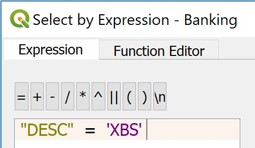
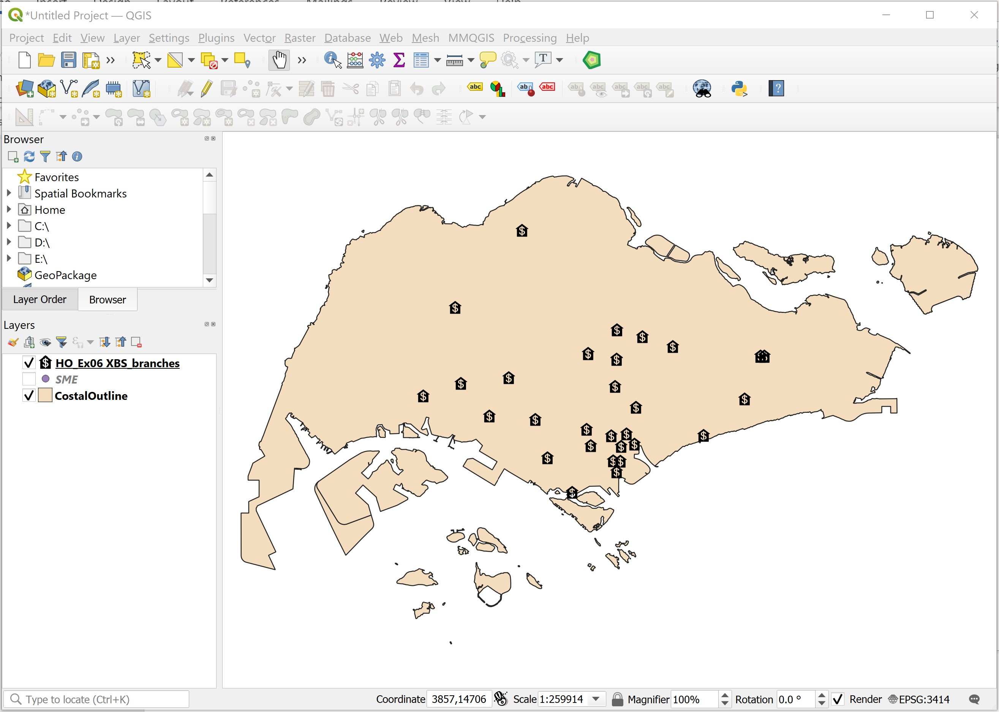
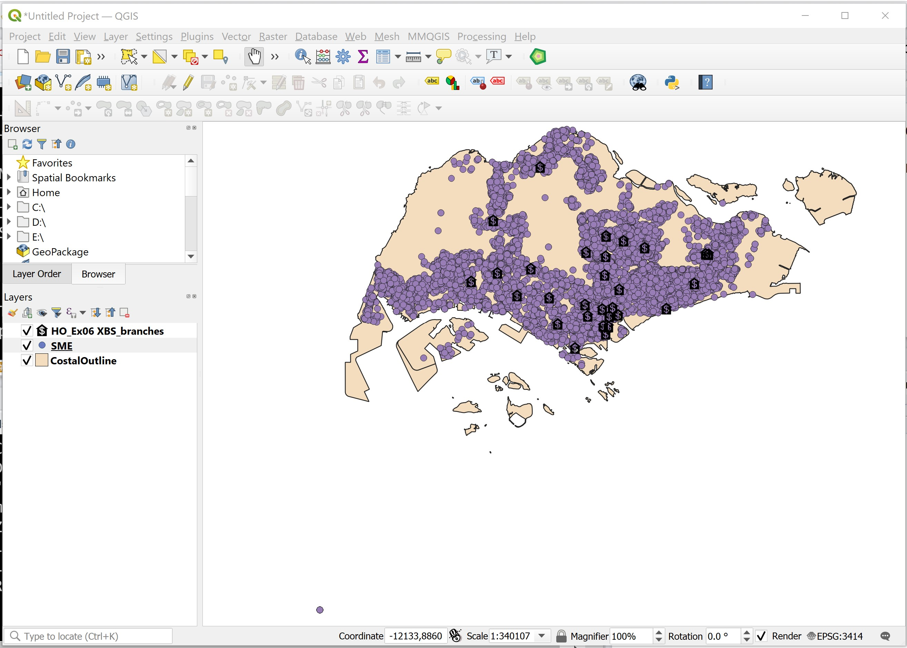
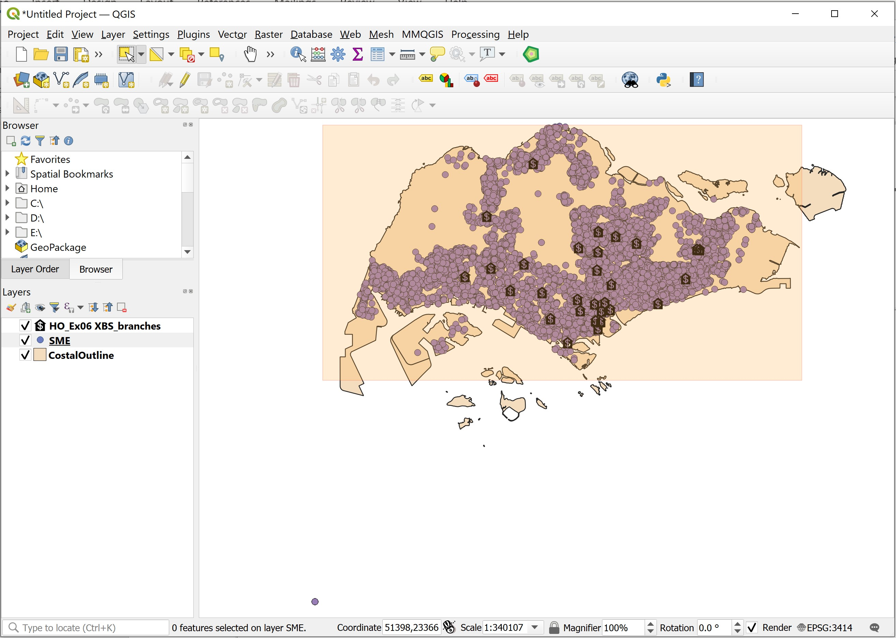
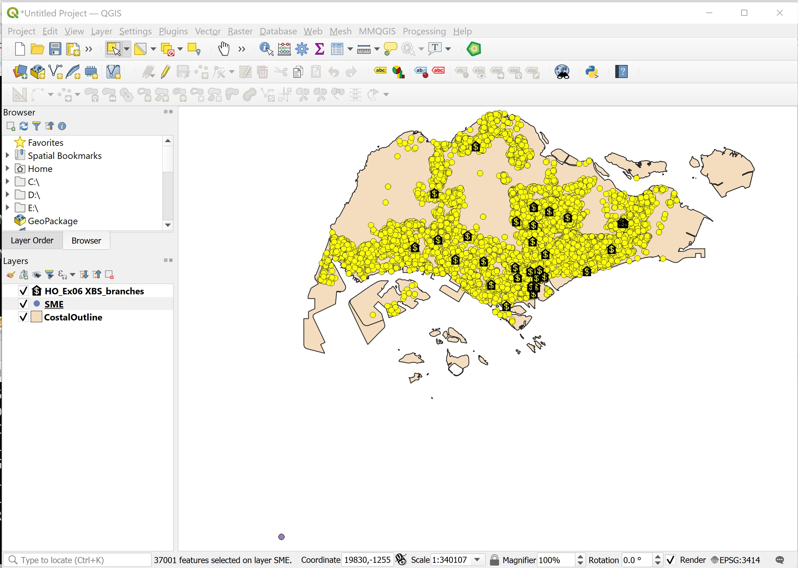
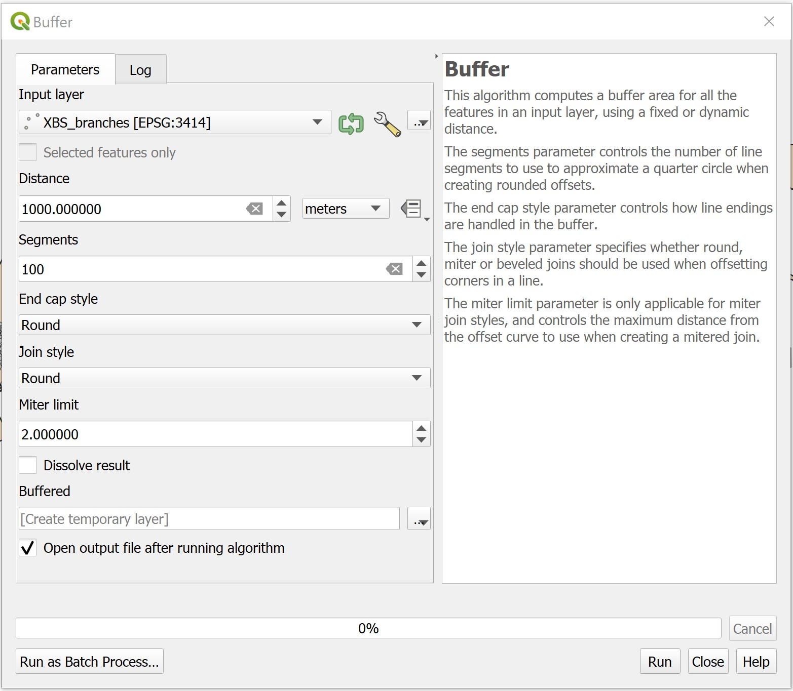
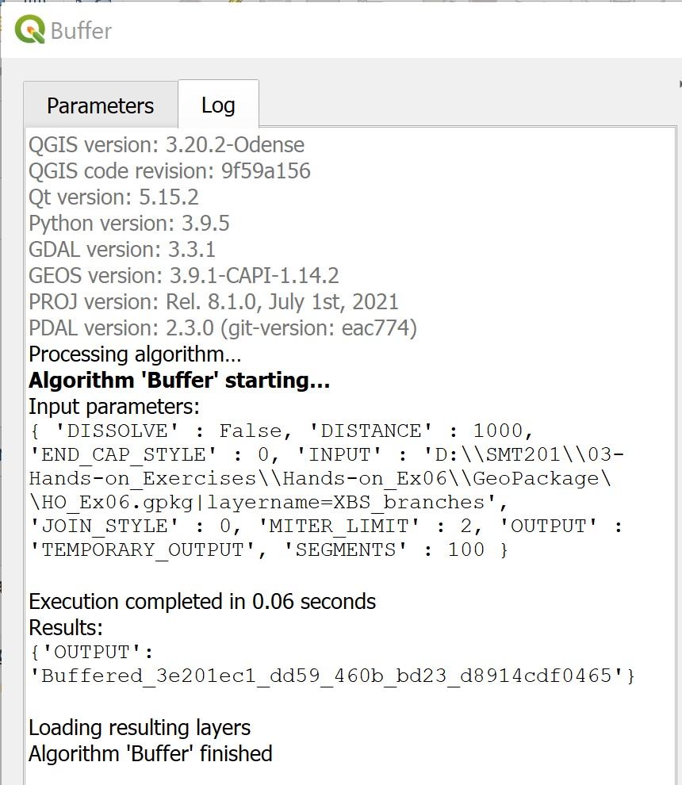
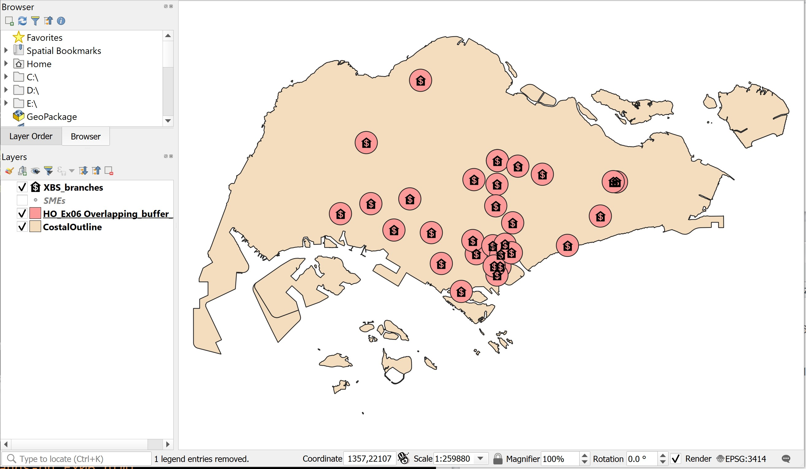
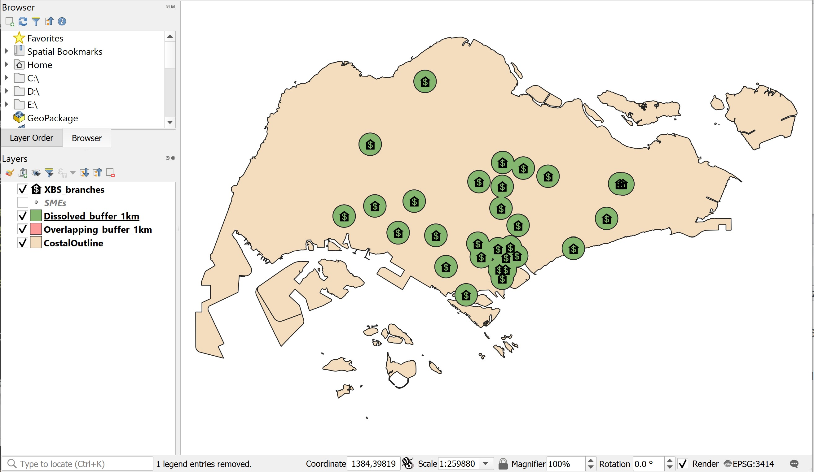
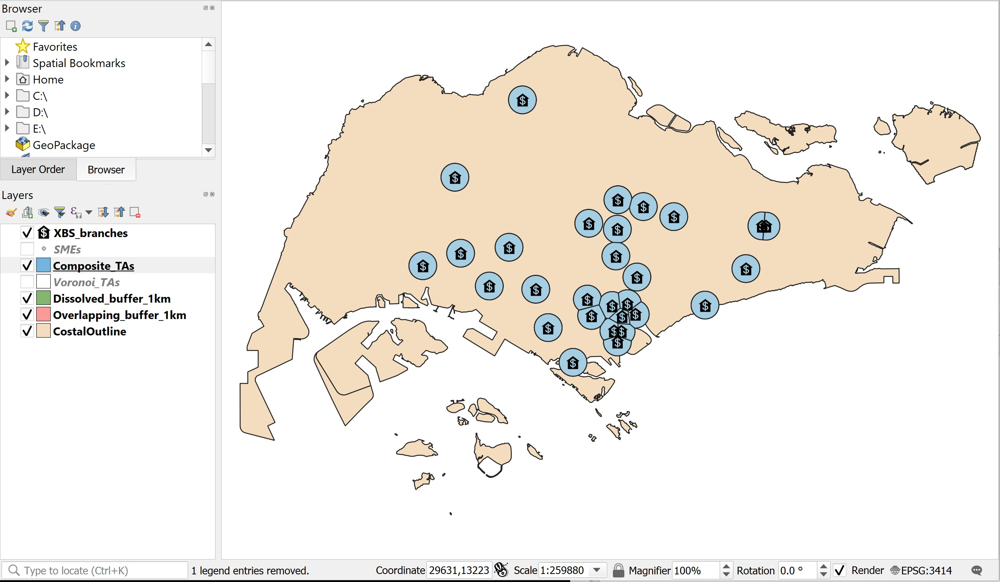

```{r setup, include=FALSE}
knitr::opts_chunk$set(echo = FALSE)
```

## 1.0	Introduction

A trade area is the geographic area from which a business draws its customers.  The size of a trade area depends on the variety of goods and services offered in the community and its proximity to competing retail markets.  In most cases, consumers are willing to travel further to purchase high order goods, such as automobiles, furniture, recreational vehicles, and specialty items than they are to purchase lower order goods, such as clothing, drugs, groceries and gasoline.

Trade area analysis is a methodology, process or technique that provides a basis for understanding, visualizing and quantifying the extent and characteristics of known or approximated trade areas.  It has been used by businesses to gain better understanding on the geographic extent and characteristics of business patronage, to assess business performance spatially, to perform competitive analysis, to evaluate market penetration and to identify market gap.  Prior to GIS age, trade area analysis was a very time-consuming process.  A simple trade area study for a retail operation can easily take more than six months or a year to complete.  Today, with appropriate and readily available GIS data and open source GIS such as QGIS, it is possible to complete a trade area analysis within a week. 

In this exercise, you will learn how to use the GIS analysis functions such as buffering, overlaying, voronoi diagram to delineate trade areas of a retail business.  You will also learn how to use appropriate GIS analyse and mapping techniques to analyse and visualize the potential customers of these trade areas. 

### 1.1	Setting the Scene
  
XBS is a well established local bank.  It has a total of 30 branches scatter around the country.  The bank is planning to launch a special low interest loan programme to help small- and medium-scale enterprises (SME) to improve the productivity of their workers.  Before the scheme is launched, Richard Lim, the Senior Vice President of XBS Retail Banking would like to find out the numbers of SMEs located within the trade areas of XBS branches.      
   
### 1.2	Framing the Problem and Collecting the Data

Three GIS data are available for this study.  They are:

+ Locations of Banking facilities and their associated information (i.e. Banking)
+ Location SME and their associated information (i.e. SME)
+ Outline map of Singapore (i.e. CoastalOutline)

These dataset can be found in the `Hands-on_Ex06.zip`.  You are required to download them and save into your local drive.  Throughout this hands-on exercise, we will assume that these GIS data and other derived GIS data are stored in the `\SMT201\Hands-on_Ex06` sub-folder of your local drive.  

## 2.0	Data Preparation

### 2.1.	Loading the GIS Data

Before you can start to perform any analysis, you need to load all the appropriate GIS data into QGIS.

>DIY:  Use the skills you learned from last lesson, launch QGIS and load all the GIS files in the SHPFiles sub-folder into QGIS. 

### 2.2	Using Attribute Query to Select a Subset from a Master layer

The Banking layer consists of locations of banking facilities such as ATM, AXM, SAM and branches for several banks.  We are only interested on bank branches belong to XBS.  In this section, you will learn how to extract a subset of dataset from a master dataset using GIS query function.

Before you can perform attribute query, you need to examine the Banking layer careful and to identify the appropriate field and object name (s) to query.

+ At **Browser** pane, right-click on `Banking`.
+ From the context menu, select **Open Attribute Table**.

The Attribute Table window appears.

 

Notice that a total of 2908 rows and each row represents a geospatial point object, in this case a particular banking facility.  For example, the first record represents a SAM machine.

If you scroll downwards, you will find that under the *DESC* field there are a collection of records with a description of *XBS*.  This is actually the *XBS* branches.  

Next, you will extract all the *XBS* branches using the query function of QGIS.    

+ At the Attribute Table window click on Select feature using an expression icon.

{width=50%} 


The **Selection by expression** dialog window appears.

{width=70%}
 
+ At the upper left corner of the window, click on the **Expression** tab.
+ For **Search**, click on **Fields and Values**.
+ Scroll downwards until *DESC* field appears.
+ Double click on *DESC* field.

Notice that the syntax “DESC” has been entered on the Expression pane.

{width=40%}


Now, you are going to enter the expression.

+ From the **Expression** pane, click on **=** icon.

Next, you are going complete the query statement by providing the field value. 

+ At the **Values** pane, click on the all unique button.

Your screen should look similar to the figure below.

{width=30%} 


+ Double-click on *XBS*.

The query statement in the Expression pane should look similar to the figure below.
 
{width=25%} 

Next, you will execute the query.

+ Click on **Select Features** button.
+ Click on **Close** button.

You will return to **Attribute Table** window.  

If you scroll downwards now, you will notice that all records with XBS in DESC field are highlighted as shown in the figure below.  This shows that banking facilities which are XBS branches have been selected. 


Now, you are going to save these selected records including their corresponding spatial objects into a new GIS data file.  This GIS data will be stored in **GeoPackage** format.

>Use the steps you had learned from previous hands-on exercise, save the output in Geopackage format.  Name the newly created GIS layer `XBS_branches`.  Symbolising the `XBS_branches` using appropriate maker.  Lastly, remove `Banking` GIS layer from the **Browser** pane because you no longer need it anymore.    

Your screen should look similar to the screenshot below after the customization.

 

### 2.3	Using Spatial Query to Select a Subset from a Master Layer

It is not unusual that the original dataset provided for an analysis are full of dirty data.  It is important for an analyst to review the datasets carefully and to exclude these data from the analysis.  In this section, you will learn how to use the Spatial Query function of QGIS to interactive select several dirty data and then delete them from the `SME` GIS data layer.

Let us examine the spatial extend of the `SME` layer.

+ At **Browser** panel, right-click on `SME`.
+ Select **Zoom to Layer(s)** from the context menu.

Notice that there are a collection of points located at the lower left of the Map View window.  Obviously, this is not logical because all the points representing the locations of the SMEs should fall within the boundary Singapore island.   



This problem happens mainly because some SMEs were not geocoded properly. 

Next, you will learn how to use the spatial selection function of QGIS to select all the SMEs fall within the national boundary and save them in a new GIS data file.  Again, keep this data in GeoPackage format.

+ From the icon bar, click on the drop-down list next to Selection icon.

{width=35%}

+ Select **Select Feature(s)** from the drop-down list.
+ At **Browser** panel, click on SME to make sure that it is the active layer.
+ Click and drape to form a rectangle to cover all the points fall within Singapore island.

Your screen should look similar to the screenshot below.

 

+ Next, release the mouse.

Notice that all the selected points will be highlighted.

 

>DIY: Use the steps you had learned from previous section, save the output in GeoPackage format.  Name the newly created GIS layer `SMEs`.  Symbolising the `SMEs` using appropriate maker.  Lastly, remove `SME` layer from the Browser panel because you no longer need it anymore.

Your screen should look similar to the screenshot below.

 

## 3.0	Trade Area Delineation	

### 3.1	Delineating Ring Trade Areas using Buffering Tool

The buffer zone method is one of the quickest and simplest procedures for delineating a catchment area, representing the area by means of one or more concentric circles with the location at their centre (core, close and outer area, see Fig. 1).

{width=40%} 


In this method, each zone is determined by the radius of the buffer zone measured ‘as the crow flies’.  Traditionally, delineating trade areas for a collection retail outlets such as bank branches can be rather time-consuming.  With GIS, trade areas can be delineated using the buffering tool of QGIS.     

In this section, you are going to create a 1km buffer around the XBS bank branches.

+ From the menu bar, select **Vector** -> **Geoprocessing Tools** -> **Buffer..** .

The **Buffer** dialog window appears.

+ For **Input layer**, select `XBS_branches` from the drop-down list.
+ For **Distance**, type *1000*. (Do you know why?)
+ For **Segments**, type *100*. (Do you know why?)

Keep the rest of setting as default.

Your screen should look similar to the screenshot below.



Next, you will run the buffering process.

+ Click on **Run** button.

When the geoprocessing process completed, the Buffer dialog window will be updated with the geoprocessing log as shown in the screenshot below.

{width=50%} 

>Good Practice: Always read the output log carefully before moving to the next step.

Since the buffering process is completed without any error, you can close the Buffer dialog window now.

•	From **Buffer** dialog window, click on **Close** button.

Notice that a new GIS layer called `Buffered` has been added into the Browser panel.

By default, the output is stored in the memory as shown in the screenshot below.

 

In order to avoid losing the analysis result, it is wiser for us to save buffering output in local drive.

>DIY: Using the steps you had learned in previous hands-on exercise, save the output buffering layer into GeoPackage format.  Name the newly create layer `Overlapping_buffer_1km`.  Also, don't forget to remove the temporary output layer!
 
Your screen should look similar to the screenshot below. 
  


A close examination of the screenshot above, we will notice that there are several overlapping buffers especially at the down-town area.

Next, you will delineate dissolved buffers to overcome the overlapping buffers problem.

>DIY: Repeat the steps above to delineate a new set of trade areas using the buffering tool.  Use the configurations similar to the steps above except check the **Dissolve results**.  Name the output GeoPackage layer as `Dissolved_buffer_1km`.  Also, don't forget to remove the temporary output layer!  

Your result should look similar to the screenshot below.

 

### 3.2	Delineating Trade Areas using Voronoi Tool

Voronoi polygons, also known as [Thiessen polygons](http://h2g2.com/dna/h2g2/A901937), represent areas of influence around a set of focal points (or retail outlets as in this study).  They can be generated based on a set of points as centroid for the polygons.  Voronoi polygons have been so constructed that each polygon contains exactly one of the outlets and that any location with a Voronoi polygon is closer to that point outlet (centroid) than to any other point outlets.

This polygon structure is constructed by using the perpendicular bisectors between neighbouring points (in this case, retail outlets) as the boundaries of the resulting Voronoi polygons.  

{width=50%} 

+ From the menu bar, select **Vector** -> **Geometric Tools** -> **Voronoi Polygon**.

**Voronoi Polygons** dialog window appears.

+ For **Input layer**, select `XBS_branches` from the drop-down list.
+ For **Buffer region**, type 100. (Do you know why?)

Your screen should look similar to the screenshot below.

{width=50%}

Next, you will run the geoprocess.

+ At **Voronoi Polygons** dialog window, click on **Run** button.

When the voronoi polygon computation process completed, you screen should look similar to the screenshot below.

 

You can close Voronoi Polygons dialog window now.

+ From **Voronoi Polygons** dialog window, click on **Close** button.

>DIY: Using the steps you had learned from previous section, save the output as GeoPackage layer. Name the output file `Voronoi_TAs`.  Remember to remove the temporary layer from Browser pane.

Your screen should look similar to the screenshot below.


## 4.0	Overlying Analysis

In this section, you will learn how to create a composite catchment area drawing by using topological overlay function.  You will use the Dissolved buffer for bank branch drawing as the input drawing and Voronoi area for bank branch as the overlay drawing.  The topology overlay operator used will be **Intersect**.

### 4.1	Creating a composite catchment areas

+ From the main menu, select **Vector** -> **Geoprocessing Tools** -> **Intersection**.

The Intersection dialog window appears.

+ For **Input layer**, select `Voronoi_TAs` from the drop-down list.
+ For **Intersection** layer, select `Dissolved_buffer_1km` from the drop-down list.

Your screen should look similar to the screenshot below.


+ Click on **Run** to perform the overlaying process.

After the **Intersection** computation completed, close the dialog window.

+ From the **Intersection** dialog window, click on **Close** button.

>DIY: Using the steps you had learned from previous section, save the newly computed layer as Geopackage layer.  Name the output GIS layer as `Composite_TAs`.

Your screen should look similar to the screenshot below.

 


### 4.2	Selecting SMEs within the Composite Trade Areas

Now you are going to select SMEs fall within the composite catchment areas of XBS bank branches.

+ From the menu bar, select **Vector** -> **Analysis Tools** -> *Count Points in Polygon*.

**Count Points in Polygon** dialog window appears.

+ For **Polygons**, select *Composite_TAs* from the drop-down list.
+ For **Points**, select **SMEs** from the drop-down list.
+ For **Count field name**, you can either provide your own name or keep the default.

Your screen should look similar to the screenshot below.


Wne you are ready to run the process,

+ Click on **Run** button.

When the computation completed, the Log report appears.

Notice that a new temporary GIS layer called COUNT has beenn added on the Browser panel.  

+ Click on **Close** button to close the dialog window.

>DIY: Using the steps you had learned from previous section, save the output as GeoPackage layer. Name the output file `Composite_TAs_SMEs`.  Remember to remove the temporary layer from Browser panel.

If you compare `Composite_TAs` and `Composite_TAs_SMEs` layers visually, both of them look very similar.  However, if you compare their attribute tables you will notice that a new column called NUMPOINTS has been added in the attribute table of `Composite_TAs_SMEs`.  

 

The *NUMPOINTS* field is populated with numbers.  Actually, these numbers represent total number of SMEs fall within the trade areas.

## 5.0	Preparing a Choropleth map

Choropleth mapping involves the symbolization of enumeration units, such as countries, provinces, states, counties or census units, using area patterns or graduated colors.  For example, a crime analyst may need to use a choropleth map to portray the spatial patterns of household income distribution of Singapore by DGP (Development Guide Plan) Subzone.

The major concerns of choropleth mapping are the method of data classification, areal symbolization, and the overall map design.  General rules for choropleth mapping are as follows:

+ Use data that are assumed to be uniform throughout an enumeration unit.
+ Because enumeration units vary in size, do not map totals.  Use derived values, such as ratios, rates, proportions, or percentages.  
+ The best classing method depends on the data, the map reader and the purpose of the map. 
+ When classifying data, the full range of data must be included and class values should not overlap.  No more than six classes are recommended.
+ Class symbols (i.e. colors or patterns) must be easily distinguishable.

>DIY: Use the steps you had learned from previous lesson, prepare a choropleth map showing the number of SMEs fall within the trade areas of XBS branches.

Your screen should look similar to the screenshot below.


 


```{r echo=FALSE, eval=FALSE}
library(pagedown)
pagedown::chrome_print("Hands-on_Ex06.html")
```
