```{r setup, include=FALSE}
knitr::opts_chunk$set(echo = FALSE)
```

# 1.0	Introduction 

The true power of a GIS is its analytical capability.  GIS analysis functions, however, are generic and are not specifically designed for business intelligence applications.  This is particularly true when the analysis involved massive and large data.  To meet the analytical requirements and analysis efficiency of market researchers and business analysts, we need to combine appropriate GIS functions and analysis for modelling the business processes. 

This hands-on exercise consists of two major sections.  First, you will learn the basic concept of accessibility from geospatial perspective. You will also learn how to use appropriate raster GIS analyse function and mapping techniques to analyse and visualize accessibility maps. 

## 1.1	Data Preparation
  
Two GIS data are available for the analysis.  They are:

+ Location of primary, secondary, mixed and JC (i.e. Education).
+ Outline map of Singapore (i.e. CoastalOutline).  

### 1.1.1	Add the GIS data into QGIS Project

Before you can start to perform any analysis, you need to start a new QGIS project.  

>DIY: Using the steps you had learned from last lesson, add the Education and CoastalOutline into the newly created QGIS project. 

### 1.1.2	Using attribute query to select a subset from a master layer

The Education layer consists of locations of education institutions such as primary schools, secondary school, mixed and JC.  We are only interested on education institutions that belong to primary and secondary schools.

>DIY: Using the steps you had learned from last lesson, extract and save the primary and secondary schools in two separate GIS vector layers.    

Your screen should look similar to the figure below.

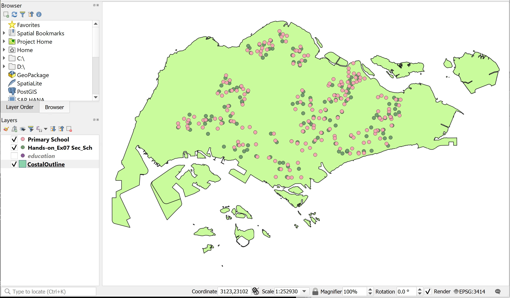 

# 2.0	Raster Data Modelling

In this exercise, you will learn how to model raster data.  The exercise focusses on how to rasterise a vector GIS data layer using QGIS geoprocessing functions.   

## 2.1	Editing attribute data

In this section, you will create a new field in the attribute table of a vector GIS data and update values of the newly created field.  You will name the field as POI_CODE.  The data type of this data field is integer.
  
+ At **Browser** panel, right-click on the `Primary Schools` layer.
+ Select **Open Attribute Table** from the context menu.

The Attribute table dialog window of Primary Schools appears.
   
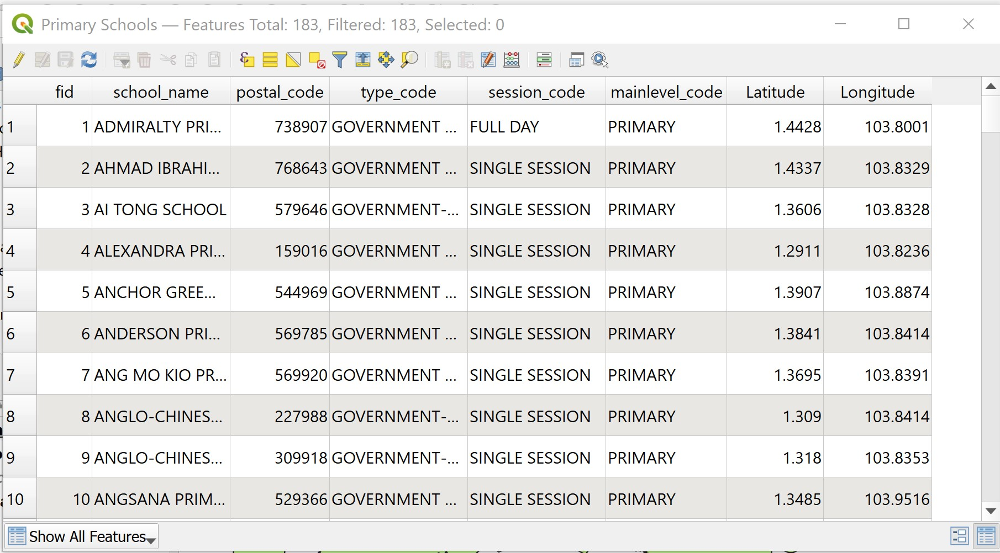

+ From the icon bar of the Attribute table window, click on the **Open field calculator** icon.

The Field calculator dialog window appears.

+ For **Output file** name, type *POI_CODE*.
+ For **Output filed** type, select **Whole number (integer)** from the drop-down list.
+ For **Output field**, change to *3*. 
+ At the **Expression** pane, type *1*.

The Field calculator dialog window should look similar to the figure below now.

{width=45%}
 
•	Click on the **OK** button.

Notice that a new field called POI_CODE has been added into the Attribute table of Primary School.  Also notice that the POI_CODE values are 1s.  


You will end the editing process now.

+ At the icon menu of Attribute table window, click on the **Toggle editing** mode icon.

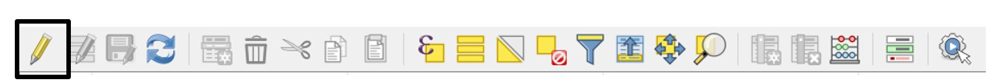 

The Stop editing dialog window appears.

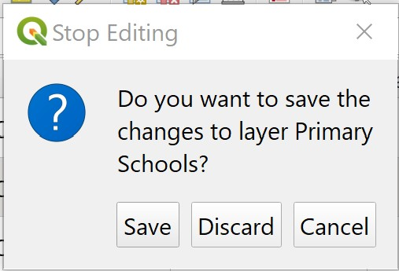{width=30%} 

•	Click on the **Save** button.

Now, you will close the Attribute table window of Primary Schools layer.

+ At the Attribute table of Primary Schools, click on the **Close** button.

## 2.2	Rasterising a vector GIS data layer

In QGIS, several functions can be used to rasterise a vector GIS layer into a raster GIS layer such as Rasterize function of GDAL and the Shape to Grid function of SAGA.  In this section, you will learn how to rasterise the primary school vector GIS layer into a raster GIS layer using the Shapes to grid function of SAGA because we found that it is more effective. 

+ From the menu bar of QGIS, select **Processing** -> **Toolbox**.

The Processing Toolbox pane appears at the right hand side of the Map View window 

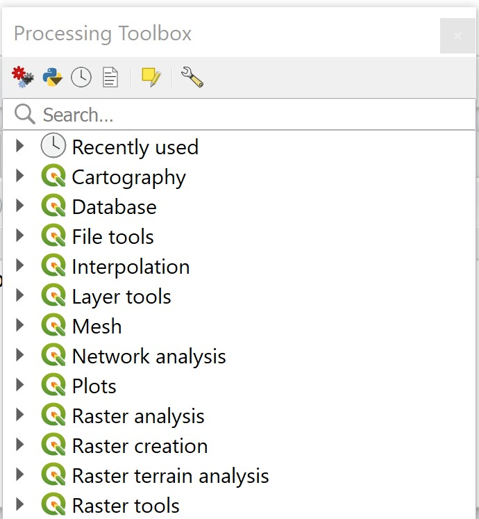{width=45%} 


+ From the Geoprocessing Toolbox, click on **GDAL**  -> **Vector conversion**  -> **Rasterize (vector to raster)**.

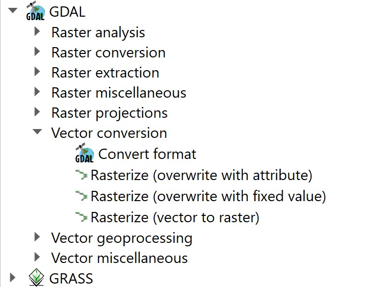{width=50%}

The **Rasterize (Vactor to raster)** dialog window appears.

+ For **Input layer**, select `Primary School` from the drop-down list.
+ For **Field to use for a burn-in value** [optional], select `POI_CODE` from the drop-down list.
+ For **Output raster size unit**, select **Georeferenced units** from the dropdown list.
+ For **Width/Horizontal resolution**, type *50*.
+ For **Height/Vertical resolution**, type *50*.
+ For **Output extent**, select **Calculate from layer** -> **CostalOutline** from the drop-down list.

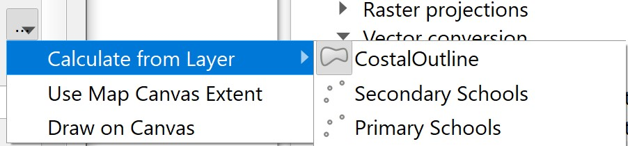{width=45%}

Your screen should look similar to the figure below.

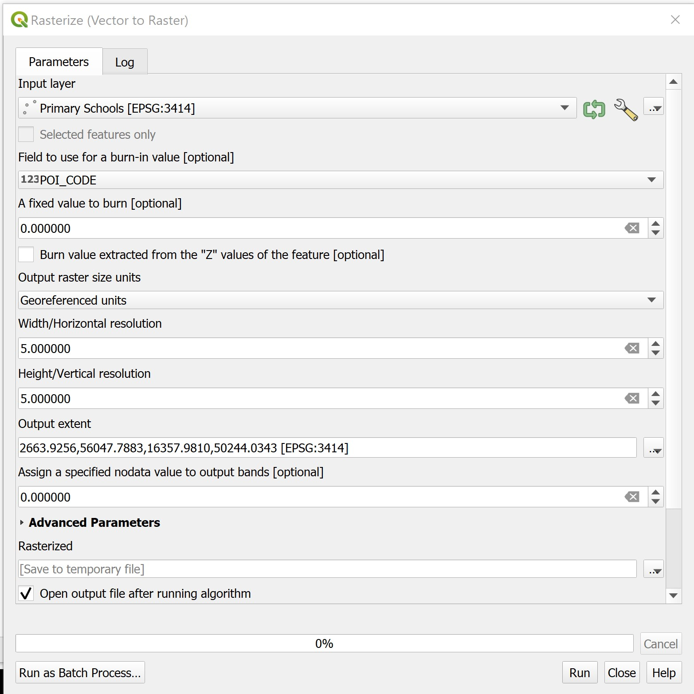{width=80%} 

+ Click on the **Run** button.

After a few seconds, a new raster layer called the Grid will be added onto the Browser panel.

{width=35%}
 
+ From **Rasterize** dialog window, click on **Close** button to close the dialog window.

Let us take a good look at this newly created raster layer.  According to the legend, the primary school cells will be coded as 1 and the remaining grid cells will be coded as no data.

  
> DIY: Use the Identify tool of QGIS to validate if the data layer has been coded correctly.


>Quiz: What is the value of the dark cell in Grid layer: ___________________

>Quiz: What is the value of the white cell in Grid layer: __________________

>DIY: Using the step you learned from previous exercise, save the output raster into GeoPackage format.  Call the layer `PriSch_ras`.


# 3.0	Accessibility Modelling using Raster-based GIS Analysis

In this section, you will learn the basic concept of accessibility from geospatial perspective. You will also learn how to use appropriate raster GIS analyse function and mapping techniques to analyse and visualize accessibility maps.

## 3.1	Creating proximity layer using raster GIS analysis

In this section, you will learn how to perform proximity analysis and derived distance layer using raster GIS analysis function.  You will use the raster version of the primary school layer as the target layer in the analysis instead of the vector version of the primary schools layer (Do you know why?)

You will perform the task using the rasterize function of Geospatial Data Abstraction Library (GDAL), a library for reading and writing raster geospatial data formats, and is released under the permissive X/MIT style free software license by the Open Source Geospatial Foundation.  As a library, it presents a single abstract data model to the calling application for all supported formats.  It may also be built with a variety of useful command-line utilities for data translation and processing (http://en.wikipedia.org/wiki/GDAL). 

+ From the **Processing Toolbox** panel, navigate to **GDAL Analysis** -> **Proximity (raster distance)**.

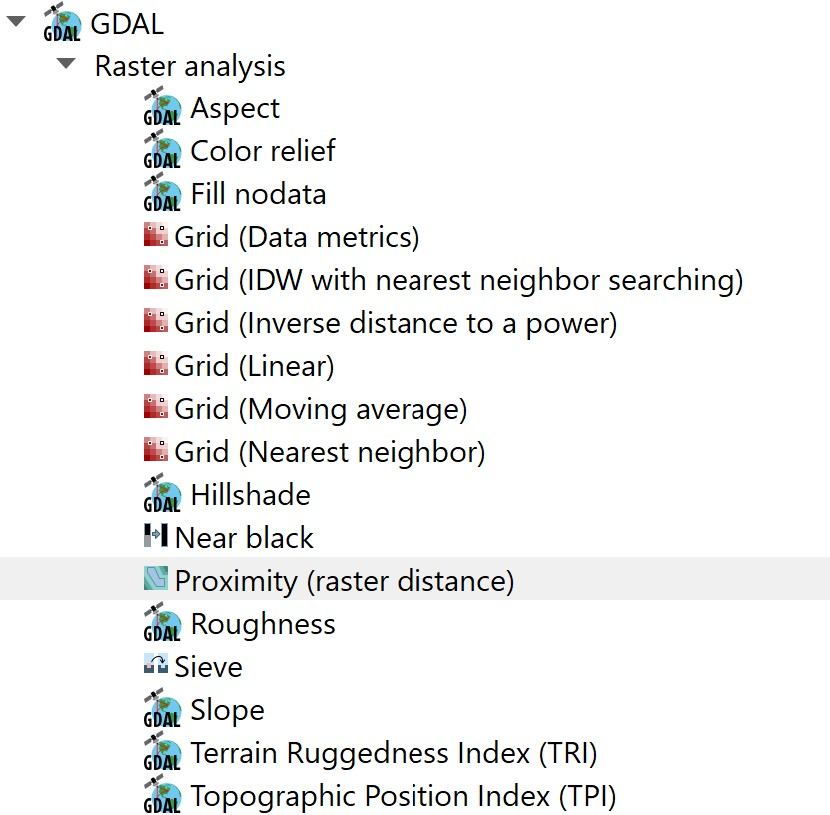{width=50%} 

+ Double-click on **Proximity (raster distance)**.

The Proximity (raster distance) dialog window appears.

+ For **Input layer**, select Rasterize from the drop-down list.
+ For **A list of pixel values in ……**, type *1*.

>Quiz: Explain why value 1 is used? 

+ For **Distance units**, select **Georeferenced coordinates** from the drop-down list.
+ For the other three options, keep as default (e.g. -1).
+ For **Proximity Map**, select *Save to a temporary* file from the context menu.

The **Proximity (raster distance)** dialog window should look similar to the figure below.

  

You are ready to run the function.

+ Click on the **Run** button.

After a few seconds a new layer called Proximity Map will be added into the **Browse** panel and display as a raster layer on the **Display** window.

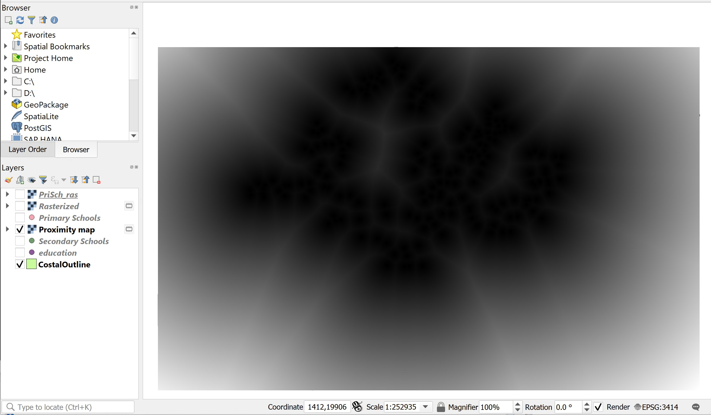

Before we continue, let us close **Proximity** dialog window.

+ From the **Proximity** dialog window, click on **Close** button.

Let us explore the **Proximity Map** layer.

+ Display the Primary School layer.

Your screen should look similar to the figure below.

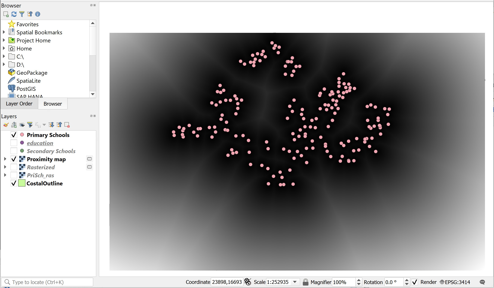 

+ Zoom into a `Primary School` layer.

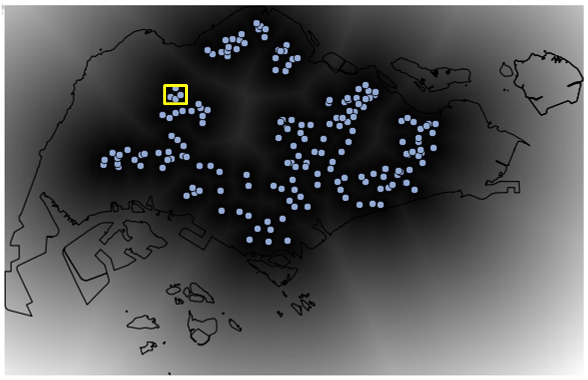 

Your screen should look similar to the figure below.

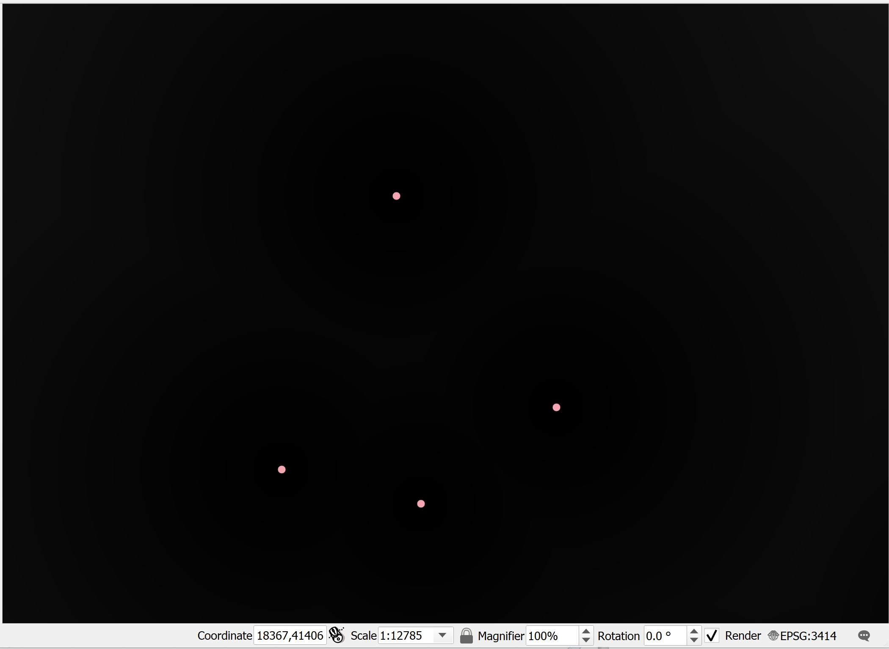

In order to visualise the grid values properly, we need to stretch the cell values.

+ From the Layer panel, right-click on Stretch Using Current Extent.

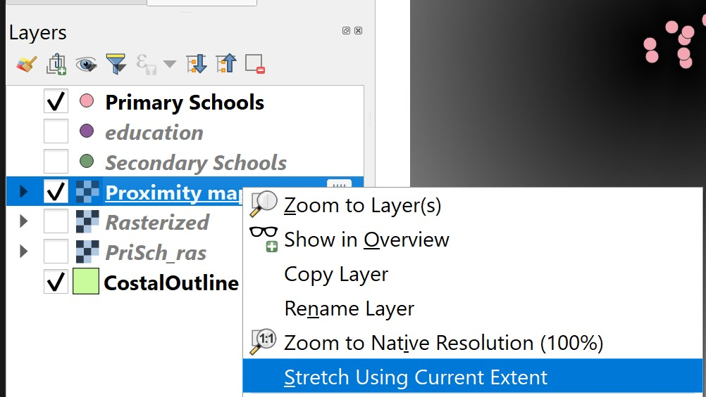{width=50%} 


Now, a clear grid layer appears on the Map View window.

 

Now, you will examine the value of the grid.

+ Make sure that `Proximity Map` layer is active.
+ Hover the mouse over the primary school point.
+ Click on the grid.

The Identify Results dialog window shows that the value of the selected grid is 0.

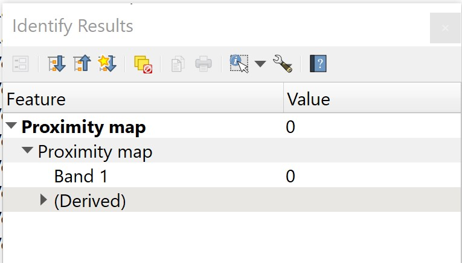{width=50%}
 

Next, you will examine the value of the grid immediately next to the primary school.

+ Hover the mouse over the grid next to the primary school point.
+ Click on the grid.

The Identify Results window reveals that the value of the selected grid is 50.

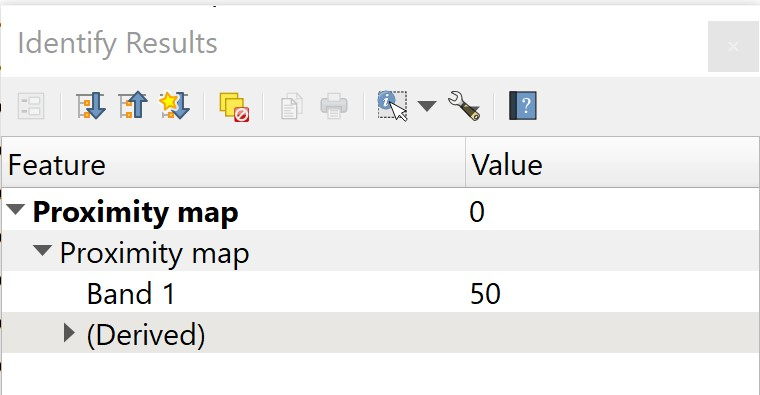{width=45%}
 
>DIY: Using the skills you had learned from previous section, save the Proximity Map into Geopackage format.  


```{r echo=FALSE, eval=FALSE}
library(pagedown)
pagedown::chrome_print("Hands-on_Ex07.html")
```


