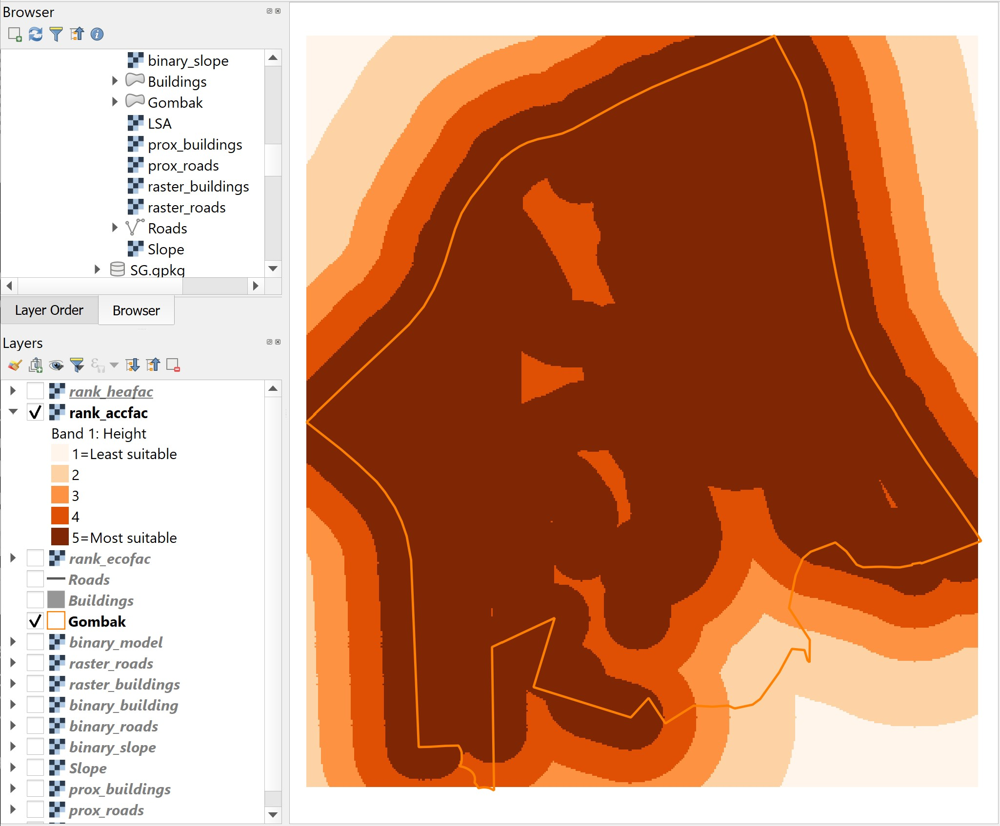
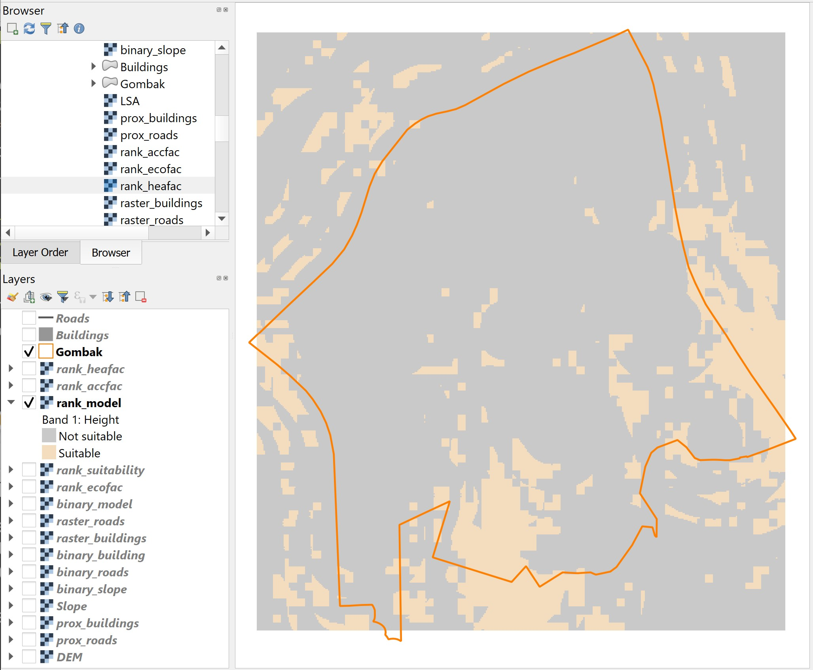
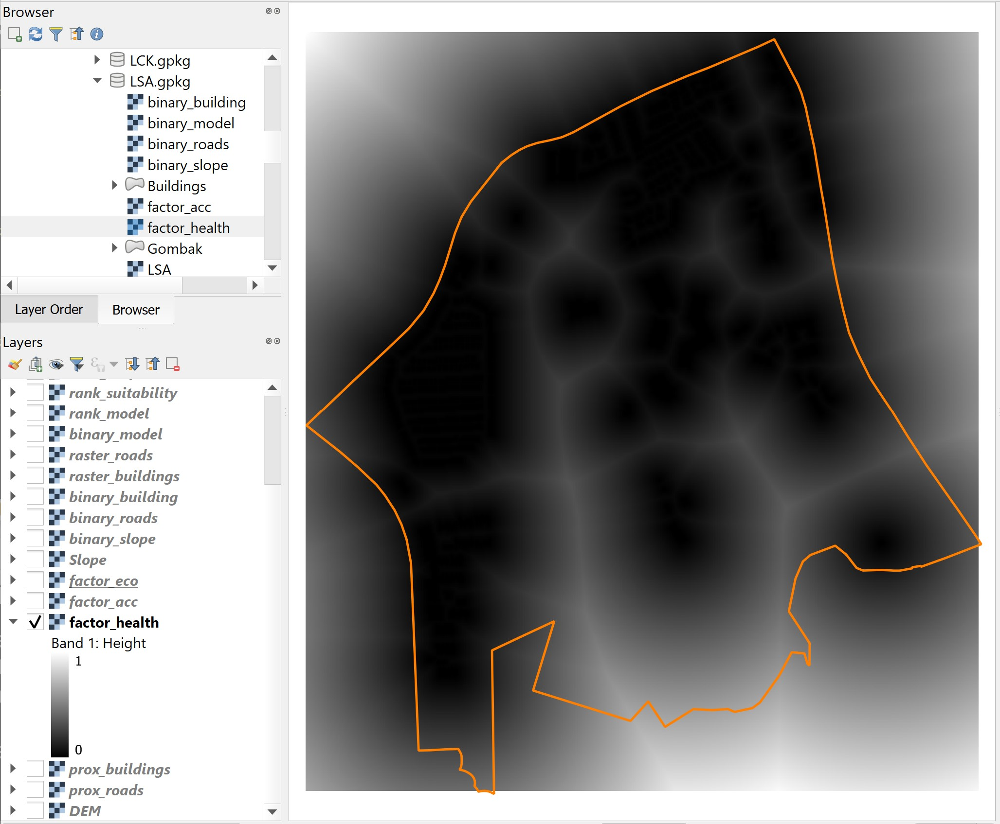

```{r setup, include=FALSE}
knitr::opts_chunk$set(echo = FALSE)
```

# 1.0	Introduction 

This hands-on exercise is a continuation of Hands-on Exercise 8.  In this hands-on exercise, you will learn how to perform urban land suitability analysis by using ranking method and Multiple‐Criteria Decision Analysis (MCDA) approach. 


# 2.0	Ranking Model

The ranking modelling is the second most popular method used in GIS-based land suitability analysis.  This method comprises of two major steps, they are:

+	Deriving preference data layers by scoring the input data layers with ordinal scales of choices i.e. 3-scale (3-suitable, 2-average, 1-not suitable), 5-scale (5-very suitable, 4-suitable, 3-average, 2-not suitable, 1-very not suitable)
+	Combining preference data layers by using map algebra operations. 

## 2.1	Deriving ranked scores

In this section, you will learn how to derive the preference layers from the three factor layers by using the following criteria:

+	Economic factor:  <=5^o^ slope = 5, 5^o^-10^o^ = 4, 10^o^-20^o^ = 3, 20^o^-30^o^ = 2, >30^o^ = 1.
+	Accessibility factor: <=100m = 5, 100-200m = 4, 200-300m = 3, 300-500m = 2, >500m = 1 from roads. 
+	Health risk factor: <=100m = 1, 100-200m = 2, 200-300m = 3, 300-500m = 4, >500m = 5 away from population i.e. housing areas and offices.

### 2.1.1	Deriving economic factor preference layer

In order to derive the economic factor preference layer from the slope layer, the reclassifying operation of raster GIS will be used.  In QGIS, raster reclassifying can be performed by using Reclassify by Table function. 

+	From **Processing Toolbox**, search for **Reclassify by Table**, double-click on it.

{width=55%}

The dialog window of Reclassify by Table appears.
 
+	For **Raster Layer**, select `slope` from the drop-down list.
+	For **Reclassification table**, click on the icon.

The dialog window of **Fixed table** appears.
 
+	Enter the value similar to the screenshot below.
 
{width=65%}
 
 
Reminder: Click on **Add Row** button when you want to add a new row.

+	Click on **OK** button when you have completed the entry.

You will back to the dialog window of **Reclassify by Table**.

+	For **Range boundaries**, select the option similar to the screenshot below.

{width=65%}
 
+	For **Output data type**, select *Float32* from the drop-down list.
+	Lastly, click on **Run** button to run the process.

Note: Pay attention to the Using classes section of the report log.  This is the actual reclassification scheme defined using Fixed table and Range boundaries functions of Reclassify by Table of QGIS.  

{width=75%}

+	When you are done with reviewing the report log, click on **Close** button to close the dialog window of Reclassify by Table.

Notice that a new temporary raster layer will be added on the view window of QGIS as shown in the screenshot below.


 
>DIY: Using the steps you had learned in the earlier section, save the temporary raster layer into Geopackage format.  Name the data layer as `rank_ecofac`.  Then, remove the temporary raster layer from QGIS.  

>DIY: Using the steps you had learned in earlier sections, derive the rank scores layers for accessibility and health risk factors respectively.  Save the temporary raster layer into Geopackage format.  Name the data layers as `rank_accfac` and `rank_heafac`.  Then, remove the temporary raster layers from QGIS.  

Screenshot below shows the rank-scores layer of economic factor (i.e. `rank_ecofac`). 
 


With reference to the legend, the darkest orange grids are locations rank the best in terms of economic factor because, by-and-large, they are the locations relatively flat (i.e. <=5^o^).  The lightest orange grids, on-the-other hand, are location rank the least preferred locations in terms of economic factor because they are locations with relatively steep slopes (i.e. >30^o^).
 
Screenshot below shows the rank-scores layer of health risk factor. 
 
With reference to the legend, the darkest orange grids are locations rank the best in terms of health risk factor because they are the furthest away from existing buildings.  The lightest orange grids, on-the-other hand, are location rank the least preferred locations in terms of health risk because they are closest to the existing buildings.


Screenshot below shows the rank-scores layer of accessibility factor. 

 

With reference to the legend, the darkest orange grids are locations rank the best in terms of accessibility because they are the nearest from existing roads.  The lightest orange grids, on-the-other hand, are location rank the least preferred locations in terms of accessibility consideration because they are furthest away from existing roads.

## 2.2	Computing composite rank scores suitability layer 

Now, it is time for us to put the Humpty Dumpty together.  The task will be performed by using **Raster Calculator** of QGIS.  However, different from computing composite binary suitability layer, this time the additive operation will be used. 

>DIY: Using the steps you had learned from previous hands-on exercise, launch **Raster Calculator** from **Raster Analysis**.

The dialog window of **Raster calculator** appears.

>DIY: Using the steps you had learned in previous hands-on exercise, build a map algebra equation similar to the screenshot below.

{width=65%}

>DIY: Using the steps you had learned in previous hands-on exercise, complete the Reference layer(s) inputs. 

+	When you are ready to run the process, click on **Run** button.

>Suggestion: When the processing completed, refer to the process log to ensure that there is no computational error.

When you have read the processing log, 

+	Click on **Close** button to close the dialog window of Raster calculator.

Notice that a new temporary layer called `Output` has been added on the map view window of QGIS as shown in the screenshot below.
 
The legend of Output layer indicates that the minimum composite score value is 7 and the maximum score value is 15.


>DIY: Using the steps you had learned in previous section, save Output in Geopackage format.  Name the newly created data layer as `rank_suitability`.

According to the recommendation of a senior planner, the selected site should have at least a composite scores of *12* (i.e. at least 4 and above for each factor).  We will take his advise to prepare the final suitability site layer.

>DIY: Using the steps you had learned from previous section, reclass `rank_suitability`.  Save the output into GeoPackage format and name the layer as `rank_model`.

The `rank_model` should look similar to the screenshot below.




# 3.0	Raster-based GIS Multiple‐Criteria Decision Analysis (GIS-MCDA)

Integrating Analytical Hierarchical Process (AHP) and raster-based GIS modelling is one of the advanced and popular approach in land suitability analysis.  The advantage of this approach is it provides information and tools to aid in understanding the inherent tradeoffs bewteen the decision criteria.  It also requires mechanisms for incorporating and documenting the value judgements of interest groups and decision makers.

In this section, you will learn how to perform GIS-MCDA using 

## 3.1	Standardising the factor scores 

Because of the difference scales upon which criteria are measured, it is necessary that factors be standardized before combination using the formulas below:

{width=60%}

>DIY: Using the steps you had learned from previous sections, derive the factor scores layers for prox_buildings, prox_roads and Slope layers.  Name the output layers factor_health, factor_acc and factor_eco respectively.

Your results should look similar to the figures below.

### 3.1.1 factor_health



Notice that locations further away from existing buildings will have factor scores closer to 1.  On the other hand, locations closer to existing buildings will have factor scores closer to 0. 

### 3.1.2 factor_acc


Notice that locations further away from existing roads will have factor scores closer to 0.  On the other hand, locations closer to existing roads will have factor scores closer to 1.

### 3.1.3 factor_eco


Notice that locations with gentle slope will have factor scores closer to 1.  On the other hand, locations with steep slope will have factor scores closer to 0.


## 3.2	Performing AHP Analysis

Although SAGA provides Analytical Hierarchical Process function.  But the function does not provide detail report. In view of this, students are encouraged to use Excel-based AHP library such as the [AHP Template](https://www.scbuk.com/ahp.html) provided by SCB Associates.

>DIY: Use the link provided above, download the AHP template.  Run the Excel template and perform AHP analysis by following the instruction provided.

Your AHP will look similar to the figure below.

{width=80%}

With the AHP scores as shown below.

{width=75%}

From the above results, health risk factor poses the most critical factor and economic factor being the least weighted factor in determining the suitable location for CDQC.

The consistency check of 3% is below 10% and the inconsistency is acceptable.

## 3.3	Computing the Suitability Layer

Now, you will compute the Land Suitability Layer by using the factor scores derived above.

>DIY: Using the steps you had learned from previous sections, compute the land suitability layer by using **Raster Calculator** of QGIS. Save the output layer into GeoPackage format and name the layer `AHP_suitability`.

The AHP-suitability layer should look similar to the screenshot below.


Notice that locations (grids) with values closer to 1 are more suitable than locations with values closer to 0.

# 4.0 Identifying Suitable Sites

According to the recommendation of a senior planner, the selected site should have at least a composite factor scores of *0.5*.  We will take his advise to prepare the final suitability site layer.

>DIY: Using the steps you had learned from previous section, reclass `factor_suitability`.  Save the output into GeoPackage format and name the layer as `MCDA_model`.

The `MCDA_model` should look similar to the screenshot below.


## 4.1 Vectorise suitable sites

Next, we will convert the suitable site identified above from raster into vector.  The process is called vectorisation.  

+ From the menu bar, select **Raster** -> **Conversion** -> **Polygonize(Raster to Vector)**

The **Polygonize (Raster to Vector)** dialog window appears.

+ For Input Layer, select `AHP_suitability` fro mthe drop-down list.
+ For Name of the field to create, type *Sites*.
+ Keep the checkbox in front of **Use 8-connectedness** uncheck.


{width=35%}

+ When you are ready, click on **Run** button.

When the computation completed, a new temporary layer called Vectorized will be added on the Layers panel and display on the view window.

>DIY: Use the steps your had learned in previous sections, delete away all the non suitable sites.  Save the final layer into GeoPackage format.  Call the newly created layer `Potential_sites`.

Your screen should look similar to the screenshot below.


```{r echo=FALSE, eval=FALSE}
library(pagedown)
pagedown::chrome_print("Hands-on_Ex09.html")
```
