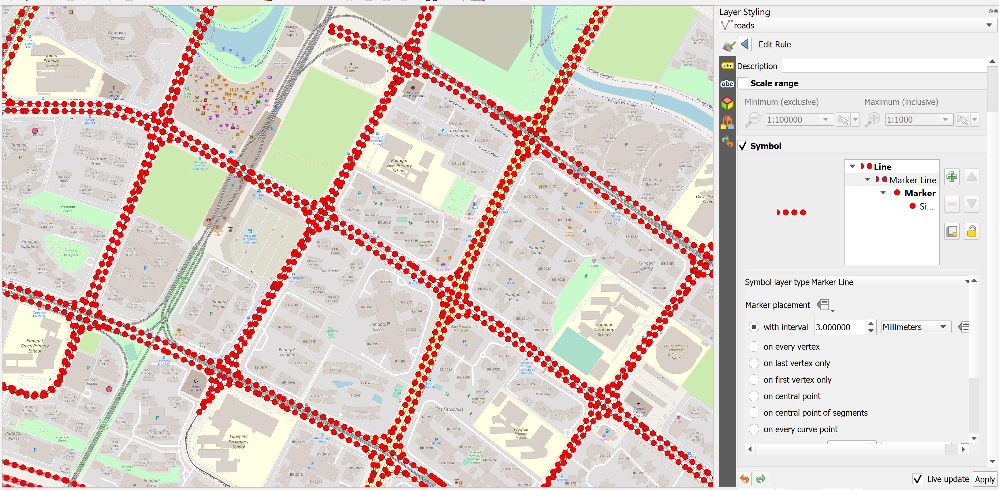

```{r setup, include=FALSE}
knitr::opts_chunk$set(echo = FALSE)
```

# 1.0	Introduction 

**Accessibility** is the measure of the capacity of a location to be reached from, or to be reached by, different locations. It is a key element in urban planning and management since it is a direct expression of mobility either in terms of people, freight, or information within a city or between cities.

Well-developed and efficient urban transport systems offer high accessibility levels, while less-developed ones have lower levels of accessibility. Thus, accessibility is linked with an array of economic and social opportunities.

All locations are not equal because some are more accessible than others, which implies **inequalities**.  Thus, accessibility is a proxy for **spatial inequalities**.

In this hands-on exercise, you will gain hands-on experience on using both build in and plug-in network analysis functions of QGIS to derive accessibility indexes.  By the end of this hands-on exercise, you will be able to:

+ derive hexagon layer, 
+ extract, clean and process network data from roads layer of OSM data,
+ performing shortest path analysis using QGIS build in network analysis tools, and
+ performing network accessibility by using network analysis tools of QNEAT plug-in.

## Setting the scene

## 1.1	The Task

In this hands-on exercise, you are tasked to derive an accessibility to eldercare centre map of Singapore.

## 1.2	The Data

Three major data sets will be used in this hands-on exercise.  They are:

+ Master Plan 2014 Subzone Boundary from URA.  This data can be downloaded from data.gov.sg.
+ Eldercare services from Ministry of Social and Family Development.  This data can be downloaded from data.gov.sg. 
+ Roads data from OpenStreetMap (OSM) data sets.  OSM data sets can be downloaded from Geofabrik's free download [server](https://download.geofabrik.de/). 

**Note:** I recommend this download site instead of [bbbike](https://www.bbbike.org/) because I found out that the quality of the data provided by Geofabrik is better than bbbike. 
  
# 2.0 Data Preparation

## 2.1 Start a new QGIS Project

>DIY: Using the steps you had learned in previous hands-on exercise, start a new QGIS project.  Save the project and give it a name (i.e. Hands-on_Ex10).  

**Reminder:** Ensure that svy21 projection system is used.

## 2.2 Preparing base layer for the study area

>DIY: Download Master Plan 2014 Subzone Boundary from data.gov.sg and import it into QGIS.  Then, save the GIS layer into GeoPackage format.  Name the output layer as `mpsz2014`.

## 2.2 Preparing eldercare layer

>DIY: Download eldercare services data from data.gov.sg and import it into QGIS (Ideally, the shapefile version should be used).  Then, save the GIS layer into GeoPackage format.  Name the output layer as `eldercare`.  

## 2.3 Extracting and preparing road network layer

### 2.3.1 Selecting all road network with the study area

>DIY: Using appropriate QGIS function(s) you had learned from previous hands-on exercise, clip the road network with Singapore mainland (excluding outer insland, Pulau Tekong and Pulau Ubi).  Save the GIS layer into GeoPackage format.  Call the layer `all_roads`.

### 2.3.2 Extracting motor vehicle road netowrk

>DIY: Using appropriate QGIS function(s) you had learned from previous hands-on Exercise, extract motor vechicle road network (i.e. motorway, motorway_link, primary, primary_link, secondary, secondary_link, tertiary, tertiary_link, residential, trunk and trunk_link) from the all_roads layer.  Save the GIS layer into GeoPackage format.  Name the layer `roads`.

**Be warn:** The original data is in **wgs84**.  For the purpose of network analysis, all network should be in projected coordinates system.

**Reminder:** Remove all the source data from QGIS project before continue to the next section.

# 3.0 Analytical Hexagon

In GIS analysis, regularly shaped grids is used for many reasons such as normalizing geography for mapping or to mitigate the issues of using irregularly shaped polygons created arbitrarily (such as county boundaries or block groups that have been created from a political process). Regularly shaped grids can only be comprised of equilateral triangles, squares, or hexagons, as these three polygon shapes are the only three that can tessellate (repeating the same shape over and over again, edge to edge, to cover an area without gaps or overlaps) to create an evenly spaced grid.


Though the square (fishnet) grid is the predominantly used shape type in GIS analysis and thematic mapping, there are ways in which hexagons may be better suited for your analysis based on the nature of your question.

Hexagons reduce sampling bias due to edge effects of the grid shape, this is related to the low perimeter-to-area ratio of the shape of the hexagon. A circle has the lowest ratio but cannot tessellate to form a continuous grid. Hexagons are the most circular-shaped polygon that can tessellate to form an evenly spaced grid.

{width=55%}

## 3.1 Creating hexagon layer

Now, we are going to create a hexagon layer by using `mpsz` layer as the based.  The hexagon distance is 250m.

+ From the menu bar, select **Vector** -> **Research Tools** -> **Create Grids**.

**Create Grids** dialog window appears.

+ For **Grid type:** select *Hexagon (Polygon)* from the drop down list.

{width=35%}

+ For **Grid extend:**, select *Calculate from Layer* -> `mpsz`

{width=55%}

+ For **Horizontal spacing**, type *500*.
+ For **Vertical spacing**, type *500*.

>Question: Do you know why 500 is used?

+ For **Grid CRS**, make sure that *EPSG 3414* is used.

When you are ready to run the process,

+ Click on **Run** button.

**Reminder:** Read the Log before closing the dialog window.

+ Click on **Close** button.

Notice that a new temporary layer called `Grid` is added on the Layer pane and display on Map window.


### 3.1.2 Editing the hexagon layer

>DIY: Using appropriate QGIS functions, edit the temporary `Grid` layer until it looks similar to the screenshot below.


### 3.1.3 Saving the hexagon layer

>DIY: Using the steps you had learned in previous hands-on exercise, save the edited `Grid` layer into GeoPackage format.  Give the layer a name (i.e. `hexagon`)

Before you move on to the next section, remember to remove the temporary `Grid` layer.

## 3.2 Computing hexagon centroid

In general, network analysis required the demand in a point feature.  Hexagon, on the other hand, is a polygon feature.  In order to meet the analysis need, we will compute the centroids of the hexagons.   

+ From the menu bar, select **Vector** -> **Geometry Tools** -> **Centroids**.

**Centroids** dialog window appears.

+ For **Input layer**, select *hexagon* from the drop-down list.

When you are ready to run the process,

+ Click on **Run** button.

**Reminder:** Read the log before closing.

+ Click on **Close** button.

Notice that a new temporary layer called Centroid is added onto Layers panel and display on Map view.


### 3.2.1 Saving the centroid layer

>DIY: Using the steps you had learned in previous hands-on exercise, save the temporary `Centroids` layer into GepPackage format.  Name the newly created layer `hex_centroid`.

Before you move on to the next section, remember to remove the temporary `Centroids` layer.


# 4.0 Shortest Path Analysis

In this section, you will perform the following tasks:

+ Identifying useful attribute(s) from the `roads` layer by using QGIS Identify Features tool,
+ Visualising topological properties of `roads` layer by using styling methods of QGIS, and 
+ Determining shortest path from a demand point (ie. HDB block) to a supply point (i.e. eldercare centre).  

## 4.1 Working with Identify Features tool 

In this section, you will explore the attribute information of `road` layer by using QGIS.

>DIY: Zoom to Punggol area as shown in the screenshot below.


+ Switch off all other layers except `roads` and `eldercare`.

+ At **Layers** panel, click on `roads` layer to make it active.

+ From the menu bar, click on **Identify Features** icon.

+ Hover the mouse over a road segment and click on it.

The **Identify Results** dialog window appears.

Your screen should look similar to the screenshot below.


There are many information can be derived from the dialog window.  For the time being, let us focus on *oneway* field.  It specifies  whether the road segment is two-way or one-way.  If it is one-way, the flow direction will be given.  

There are three different values.  *B* for two-way. *F* means that only driving in direction of the line string is allowed. *T* means that only the opposite direction is allowed.

+ Close the Identify Results dialog window.

## 4.2    Working with QGIS's Styling methods

Now, we will use the information in oneway field to display an arrow on one-way streets

+ From the **Layers** panel, click on **Open the Layer Styling Panel** button.

The **Layer Styling** panel appears on the right as shown below.


+ Select *Rule-based* from the drop-down menu.

{width=45%}

We will create a new style with a filter for only the one-way roads.

+ Click on the *Add rule +* button.

{width=45%}

+ From the **Edit rule** dialog, click on **Expression** button.

{width=45%}

The **Expression String Builder** dialog window appears.

We are going to build an expression that select all one-way streets.

+ Click on the black triangle in front of **Fields and Values** to expand the section.

{width=55%}

+ Double-click on `oneway` field.

+ Click on *=* button.

+ At the **Expression** pane, complete the expression as shown below.

{width=35%}

+ Click on **Ok** button.

Notice that **Filter** option has been updated.

{width=55%}

Next, we are going to change the Symbol layer type to *Market line*.

{width=55%}

Notice that the road lines are marked with red markers now.



+ At the **Marker placement** pane, click on the radio button in front of `on center point`. 

Notice that the markers are placed at the centre of each line segment.


+ At the **Symbol** pane, click on `Simple marker`.

{width=55%}

+ Scroll down and select *filled_arrowhead* marker.

{width=35%}

Notice that arrow-like symbol now appears on the one-way streets as shown below.


You can close **Layer Styling** dialog window now.

+ At the **Layer Styling** panel, click on the cross located at the upper right of the panel.

## 4.3 Working with build in shortest path tool

Now, we are going to determine the shortest path from Block 619B to eldercare centre located at Block 211B (lower left corner of the view window)

+ From the menu bar, click on **Processing** -> **Toolbar**.

+ At the **Toolbox** search pane, type **Shortest path**.

Your screen should look similar to the screenshot below.

{width=45%}

+ Double-click on **Shortest path (point to point)** of **Network analysis**.

**Shortest Path (Point to Point)** dialog window appears.

+ For **Vector layer representing network**, select `roads` from the drop-down list.

+ For **Path type to calculate**, select *Shortest* from the drop-down list.

+ For **Start point**, manually click on the *Block 619B*.

+ For **End point**, manually click on *Block 211B*.

+ For **Direction field [optional]**, select `oneway` from the drop-down list.

+ For **Value for forward direction [optional]**, type *F*.

+ For **Value for backward direction [optional]**, type *T*.

The **Shortest Path (Point to Point)** dialog window looks similar to the screenshot below.


We will keep the rest of the selection as default for the time being.

When you are ready,

+ click on **Run** button.

**Reminder**: Read the log before closing the dialog window.

+ Click on the **Close** button to close the dialog window.

Notice that a temporary layer called `Shortest Path` is added on Layers panel and is display on the map view.

The default line thickness of `Shortest Path` is too thin to view.

>DIY: Using the steps you had learned in previous hands-on exercise, increase the thickness of the line symbol.

You screen should look similar to the screenshot below.


>DIY: Using the steps you had learned from previous hands-on exercise, save the temporary Shortest Path layer into GeoPackage format.  Name the layer `Shortest_path` and add it onto the map view.

>DIY: Remove the temparory layer from the Layers panel.

# 5.0  Network Accessibility Analysis with NEAT3 Plugin

In this section, you will learn how to perform network accessibility analysis by using QGIS Network Analysis Toolbox (QNEAT3) plugin.   

## 5.1 Installing QNEAT3 plugin.

Before getting started, you need to install QNEAT3 plugin.

+ From the menu bar, select **Plugins** -> **Manage and Install plugins**.

Plugins dialog window appears.

+ At the query, type **QNEAT3**.

Notice that QNEAT3 appears on the search output list.

+ Click on **QNEAT3**.

+ Click on **Install Plugin** button.

When the installation is completed, close the dialog box by

+ click on **Close** button.

## Working with OD Matrix tool

Next, we will use the Origin-Destination Matrix (OD Matrix) tool of QNEAT3 plugin to calculate the distances between hexagon centrois (as the demand points) and eldercare centres (as the supply points).

+ From the menu bar, click on **Processing** -> **Toolbox**

+ At the **Search** pane, type `OD Matrix`.

You screen should look similar to the screenshot below.

{width=45%}

+ Click on **OD Matrix Layers as Table (m:n)**.

**OD Matrix Layers as Table (m:n)** dialog window appears.

+ For **Network Layer**, select `roads` from the drop-down list.

+ For **From-Point Layer**, select `hex_centroid` from the drop-down list.

+ For **Unique Point ID Field**, select `fid` from the drop-down list. 

+ For **To-Point Layer**, select `eldercare` fro mthe drop-down list.

+ For **Unique Point ID Field**, select `fid` from the drop-down list.

+ For **Optimization Criterion**, select `Shortest Path (distance optimization)` from the drop-down list.

+ For **Entry Cost calculation method**, select `Ellipsoidal` from the drop-down list.

+ For **Direction field**, select `oneway` from the drop-down list.

+ For **Value for forward direction**, type `F`.

+ For **Value for backward direction**, type `T`.

+ For **Value for both direction**, type `B`.

+ For Topology tolerance, type *0.5* (i.e. 0.5 m).

The completed dialog widnow should look similar to the screenshot below.


When you are ready to run the process.

+ At the **OD Matrix** dialog window, click on **Run** button.

Be patient, the process is computationally intensive.

**Reminder:** Read the log before closing it.

When you are ready to close the dialog window.

+ Click on **Close** button.

Notice that a new temporary table called `Output OD Matrix` is added onto Layers panel.  

{width=35%}

+ At the Layers panel, right-click on `Output OD Matrix` and select **Open Attribute Table** from the context menu.

A data table look similar to the screenshot below appears.


>Question: Do you know what are the values of these fields?

>DIY: Using the steps you had learned, save the temporary Output OD Matrix table as GeoPackage format.  Name the layer `OD_eldercare`.

## 5.2 Extracting shortest distance pairs

Next, we will use the SQL tool of QGIS to select destination points with the shortest distance.

+ At the **Search** pane of **Processing Toolbox**, type `SQL`.

**SQL** function appears on the list.

{width=45%}

+ Double-click on **Execute SQL** of **Vector general**.

**Execute SQL** dialog window appears.

+ For **Additional input datasources**, select on the button at the right end.

+ Click on the checkbox **Output OD Matrix**.

{width=65%}

+ Click on **OK** button.

+ At SQL query panel, type the following SQL

{width=55%}

+ For *Geometry type*, select `No Geometry` from the drop-down list.

{width=45%}

Notice that a temporary table called `SQL Output` is added onto **Layers** panel.  It consists of four fields.  The values in `shortest_distance` field are shortest distance between demand points and its nearest eldercare centre.  

{width=65%}


>DIY: Using the steps you had learned, save the temporary SQL Output table as GeoPackage format.  Name the layer `acc_eldercare`.

## 5.3 Mapping Accessibility Values

>DIY: Using the steps you had learned, prepare a choropleth map showing the distribution of accessibility to eldercare centres.

Your choropleth map should look similar to the screenshot below.


```{r echo=FALSE, eval=FALSE}
library(pagedown)
pagedown::chrome_print("Hands-on_Ex10.html")
```

