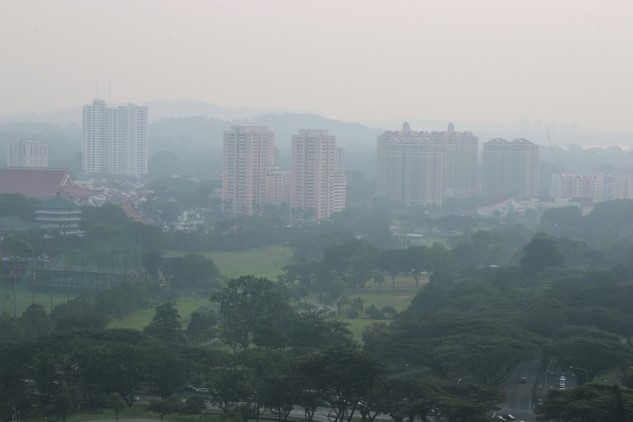
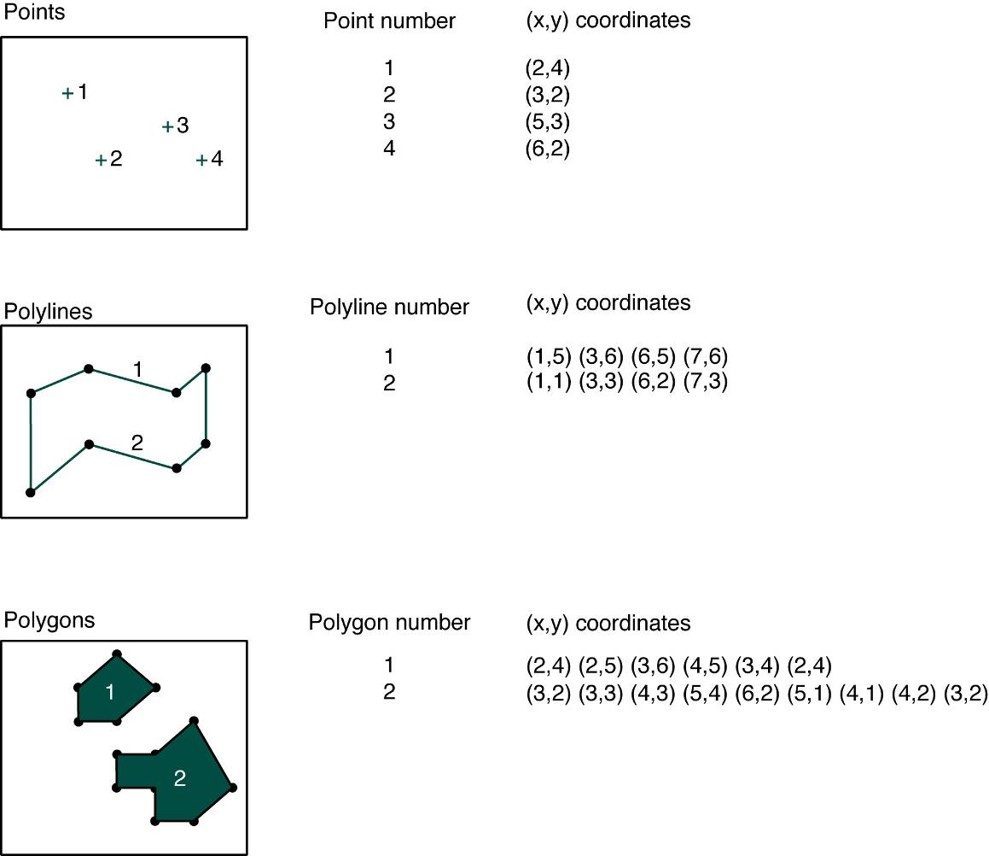
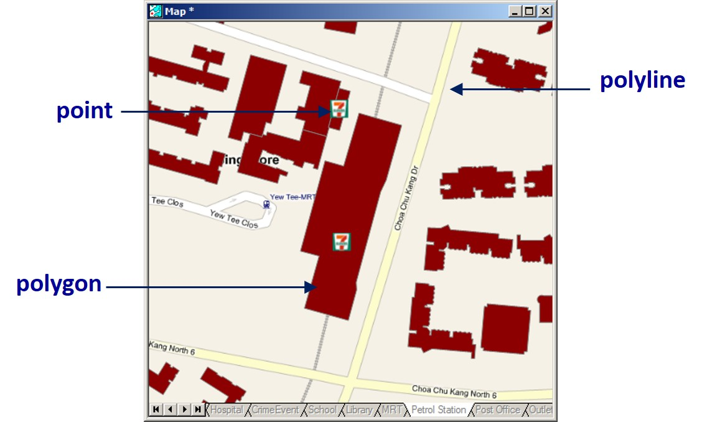
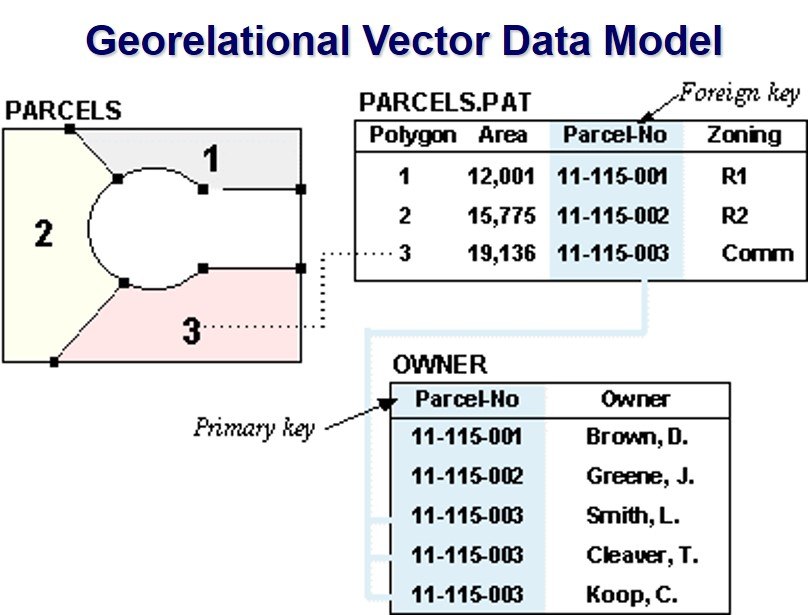
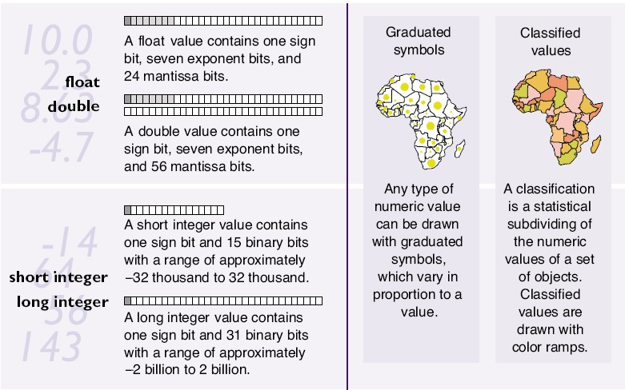
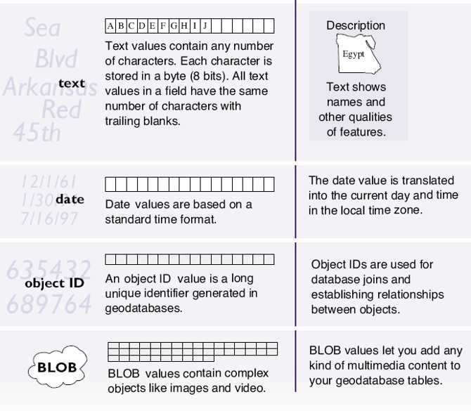
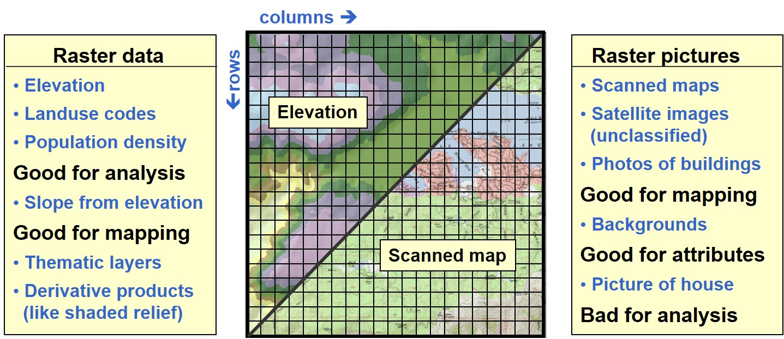
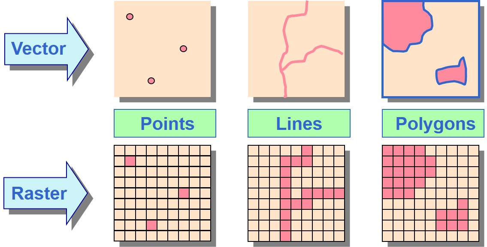
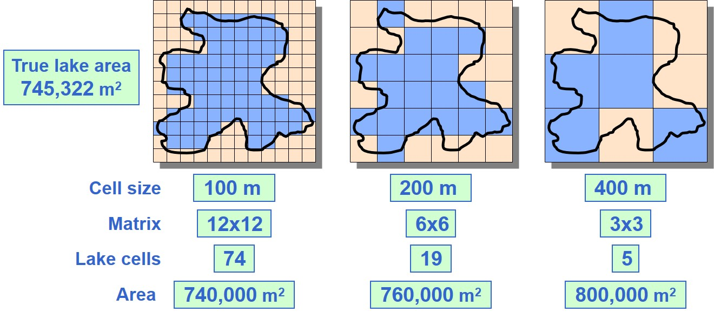
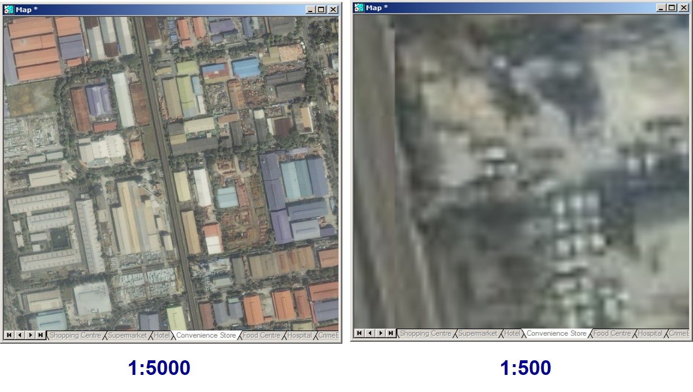

```{r setup, include=FALSE}
options(htmltools.dir.version = FALSE)
knitr::opts_chunk$set(
  fig.retina=3,
  cache = FALSE,
  echo = TRUE,
  message = FALSE, 
  warning = FALSE,
  hiline = TRUE
)
```

# What will you learn from this course?

.vlarge[
- Understand how GIS represent real world geography
- Understand the characteristics, advantages, and disadvantages of vector and rater data models
- Understand the basic concepts of georeferencing  and geocoding
]

---
## Getting to Know Geospatial Data Models

.vlarge[
- Basic concept of geographical data
- Basic geospatial data models
- Vector data models
    - Spaghetti data models
    - Topological data models
- Raster data models
]

---
## Discrete Objects and Continuous Fields

.vlarge[
- Two ways of conceptualizing geographic variation
    - The most fundamental distinction in geographic representation
- Discrete objects
    - The world as a table-top
    - Objects with well-defined boundaries
]

---
## Discrete Objects

.pull-left[
.large[
- Countable, persistent through time, perhaps mobile
- Human-made objects
    - Office buildings, houses, bus stops, etc
- Biological organisms
    - Animals, trees
]]

.pull-right[    

]

---
## Continuous Fields
.pull-left[
.large[
- Properties that vary continuously over space
    - Value is a function of location
    - Property can be of any attribute type, including direction
- Elevation as the archetype
    - A single value at every point on the Earth’s surface
    - The source of metaphor and language
    - Any field can have slope, gradient, peaks, pits
]]

.pull-right[


]

---
## Basic Spatial Data Models

.vlarge[
- Vector, implementation of discrete object conceptual model
    - Point, line and polygon representations
    - Widely used in cartography, and network analysis
- Raster, implementation of field conceptual model
    - Array of cells used to represent objects
    - Useful as background maps and for spatial analysis
]

---
## Vector Data Models

.pull-left[
.large[
- Used to represent points, lines, and areas
- All are represented using coordinates
    - One per point
- Lines as polylines
    - Straight lines between points
- Areas as polygons
    - Straight lines between points, connecting back to the start
    - Point locations recorded as coordinates
]]

.pull-right[

]

---
## Vector Database

.pull-left[
.large[
Building footprints are represented by polygon features, road reserves represented by polyline features, and convenient stores are represented by point features
]]

.pull-right[


]

---
## Georelational Vector Data Model

.pull-left[
.large[
Stores spatial and attribute data separately in a split system: spatial data (”geo”) in graphic fields and attribute data (“relational”) in a relational database
]]

.pull-right[

]

---
## Attribute Table

.center[

]

---
## Types of Attributes: Numerical

.center[


]

---
## Other Types of Attributes

.center[

]

---
## Vector Data File Format: shapefile

.large[
.pull-left[
- A shapefile is a simple, nontopological format for storing the geometric location and attribute information of geographic features.

- Geographic features in a shapefile can be represented by points, lines, or polygons (areas). 

- To find out more about shapefile, visit this [link](http://www.esri.com/library/whitepapers/pdfs/shapefile.pdf).

]]

.pull-right[

]

---
### Limitation of shapefile

.vlarge[
- It is proprietary (closed and controlled by ESRI).
- It’s a multifile format (.shp,.dbf.,.shx,.prj, encoding, other indexes, etc.) (everybody knows the problem with GIS newbies sending you solely the .shp… 😉).
- Attribute names are limited to 10 characters and only 255 attributes are allowed in .dbf.
- Limited data types. Data types are limited to float, integer, date and text with a maximum 254 characters. 
- Unknown character set. There is no way to specify the character set used in the database.
- It's limited to 2GB of file size. Although some tools are able to surpass this limit, they can never exceed 4GB of data.
]

---
### Limitation of shapefile

.vlarge[
- Uses ESRI’s [WKT](https://en.wikipedia.org/wiki/Well-known_text_representation_of_geometry). Can result in inconsistencies.
- Single geometry type per file. There is no way to save mixed geometry features.
- More complicated data structures are impossible to save. It's a "flat table" format.
- There is no way to store 3D data with textures or appearances such as material definitions. There is also no way to store solids or parametric objects.
- Projections definition. They are incompatible or missing.
- Line and polygon geometry type, single or multipart, cannot be reliably determined at the layer level, it must be determined at the individual feature level. 
]

---
### Other Vector GIS File Formats

.vlarge[
- MapInfo [TAB](https://en.wikipedia.org/wiki/MapInfo_TAB_format) format - MapInfo's vector data format using TAB, DAT, ID and MAP files.
- [Personal Geodatabase](https://desktop.arcgis.com/en/arcmap/latest/manage-data/administer-file-gdbs/personal-geodatabases.htm) - Esri's closed, integrated vector data storage strategy using Microsoft's Access MDB format
- [Keyhole Markup Language (KML)](https://en.wikipedia.org/wiki/Keyhole_Markup_Language) - XML based open standard (by OpenGIS) for GIS data exchange.
- [Geography Markup Language (GML)](http://en.wikipedia.org/wiki/Geography_Markup_Language) - XML based open standard (by OpenGIS) for GIS data exchange.
- [GeoJSON](https://en.wikipedia.org/wiki/GeoJSON) - a lightweight format based on JSON, used by many open source GIS packages.
- [TopoJSON](https://github.com/topojson/topojson), an extension of GeoJSON that encodes topology.
]

---
## Raster Data Model

.pull-left[
.large[
- Divide the world into square cells
- Register the corners to the Earth
- Represent discrete objects as collections of one or more cells
- Represent fields by assigning attribute values to cells
- More commonly used to represent fields than discrete objects
]]

.pull-right[


]

---
### Raster Database

.large[
- All raster formats are basically the same 
- Cells organized in a matrix of rows and columns
- Content is more important than format: data or picture?
]

.center[

]

---
### Characteristics of raster data model

.large[
- Pixel size
    - The size of the cell or picture element, defining the level of spatial detail.
    - All variation within pixels is lost.
- Assignment scheme
    - The value of a cell may be an average over the cell, or a total within the cell, or the commonest value in the cell.
    - It may also be the value found at the cell’s central point.
]

---
### Features as raster

.vlarge[
- Features lose uniqueness with raster representation a line becomes a collection of cells, not one feature)]

.center[

]

---
### Raster Resolution

.vlarge[
- Rasters always generalize spatial data
    - A function of cell size (smaller cells = higher resolution).
    - Impacts accuracy, processing speed, storage space.
]

.center[

]

---
### Raster Resolution and Spatial Details

.center[

]


```{r echo=FALSE, eval=FALSE}
library(pagedown)
pagedown::chrome_print("Lesson01-Introduction.html")
```