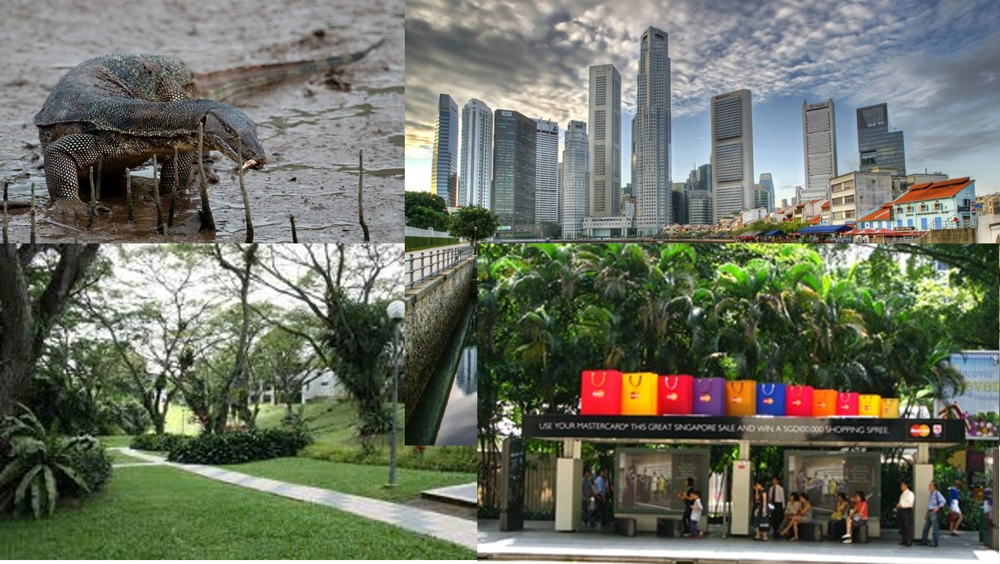
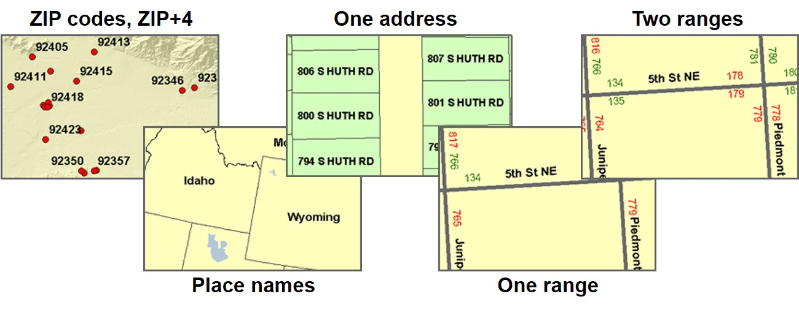

```{r setup, include=FALSE}
options(htmltools.dir.version = FALSE)
knitr::opts_chunk$set(
  fig.retina=3,
  cache = FALSE,
  echo = TRUE,
  message = FALSE, 
  warning = FALSE,
  hiline = TRUE
)
```

# What will you learn from this course?

.vlarge[
- Understand how GIS represent real world geography
- Understand the characteristics, advantages, and disadvantages of vector and rater data models
- Understand the basic concepts of georeferencing  and geocoding
]

---
## Getting to Know Geospatial Data Models

.vlarge[
- Basic concept of geographical data
- Basic geospatial data models
- Vector data models
    - Spaghetti data models
    - Topological data models
- Raster data models
]

---
## Discrete Objects and Continuous Fields

.vlarge[
- Two ways of conceptualizing geographic variation
    - The most fundamental distinction in geographic representation
- Discrete objects
    - The world as a table-top
    - Objects with well-defined boundaries
]

---
## Discrete Objects

.pull-left[
.large[
- Countable, persistent through time, perhaps mobile
- Human-made objects
    - Office buildings, houses, bus stops, etc
- Biological organisms
    - Animals, trees
]]

.pull-right[    

]

---
## Continuous Fields
.pull-left[
.large[
- Properties that vary continuously over space
    - Value is a function of location
    - Property can be of any attribute type, including direction
- Elevation as the archetype
    - A single value at every point on the Earth’s surface
    - The source of metaphor and language
    - Any field can have slope, gradient, peaks, pits
]]

.pull-right[


]

---
## Basic Spatial Data Models

.vlarge[
- Vector, implementation of discrete object conceptual model
    - Point, line and polygon representations
    - Widely used in cartography, and network analysis
- Raster, implementation of field conceptual model
    - Array of cells used to represent objects
    - Useful as background maps and for spatial analysis
]

---
## Vector Data Models

.pull-left[
.large[
- Used to represent points, lines, and areas
- All are represented using coordinates
    - One per point
- Lines as polylines
    - Straight lines between points
- Areas as polygons
    - Straight lines between points, connecting back to the start
    - Point locations recorded as coordinates
]]

.pull-right[

]

---
## Vector Database

.pull-left[
.large[
Building footprints are represented by polygon features, road reserves represented by polyline features, and convenient stores are represented by point features
]]

.pull-right[


]

---
## Georelational Vector Data Model

.pull-left[
.large[
Stores spatial and attribute data separately in a split system: spatial data (”geo”) in graphic fields and attribute data (“relational”) in a relational database
]]

.pull-right[

]

---
## Attribute Table

.center[

]

---
## Types of Attributes: Numerical

.center[


]

---
## Other Types of Attributes

.center[

]

---
## Vector Data File Format: shapefile

.large[
.pull-left[
- A shapefile is a simple, nontopological format for storing the geometric location and attribute information of geographic features.

- Geographic features in a shapefile can be represented by points, lines, or polygons (areas). 

- To find out more about shapefile, visit this [link](http://www.esri.com/library/whitepapers/pdfs/shapefile.pdf).

]]

.pull-right[

]

---
### Limitation of shapefile

.vlarge[
- It is proprietary (closed and controlled by ESRI).
- It’s a multifile format (.shp,.dbf.,.shx,.prj, encoding, other indexes, etc.) (everybody knows the problem with GIS newbies sending you solely the .shp… 😉).
- Attribute names are limited to 10 characters and only 255 attributes are allowed in .dbf.
- Limited data types. Data types are limited to float, integer, date and text with a maximum 254 characters. 
- Unknown character set. There is no way to specify the character set used in the database.
- It's limited to 2GB of file size. Although some tools are able to surpass this limit, they can never exceed 4GB of data.
]

---
### Limitation of shapefile

.vlarge[
- Uses ESRI’s [WKT](https://en.wikipedia.org/wiki/Well-known_text_representation_of_geometry). Can result in inconsistencies.
- Single geometry type per file. There is no way to save mixed geometry features.
- More complicated data structures are impossible to save. It's a "flat table" format.
- There is no way to store 3D data with textures or appearances such as material definitions. There is also no way to store solids or parametric objects.
- Projections definition. They are incompatible or missing.
- Line and polygon geometry type, single or multipart, cannot be reliably determined at the layer level, it must be determined at the individual feature level. 
]

---
### Other Vector GIS File Formats

.vlarge[
- MapInfo [TAB](https://en.wikipedia.org/wiki/MapInfo_TAB_format) format - MapInfo's vector data format using TAB, DAT, ID and MAP files.
- [Personal Geodatabase](https://desktop.arcgis.com/en/arcmap/latest/manage-data/administer-file-gdbs/personal-geodatabases.htm) - Esri's closed, integrated vector data storage strategy using Microsoft's Access MDB format
- [Keyhole Markup Language (KML)](https://en.wikipedia.org/wiki/Keyhole_Markup_Language) - XML based open standard (by OpenGIS) for GIS data exchange.
- [Geography Markup Language (GML)](http://en.wikipedia.org/wiki/Geography_Markup_Language) - XML based open standard (by OpenGIS) for GIS data exchange.
- [GeoJSON](https://en.wikipedia.org/wiki/GeoJSON) - a lightweight format based on JSON, used by many open source GIS packages.
- [TopoJSON](https://github.com/topojson/topojson), an extension of GeoJSON that encodes topology.
]

---
## Raster Data Model

.pull-left[
.large[
- Divide the world into square cells
- Register the corners to the Earth
- Represent discrete objects as collections of one or more cells
- Represent fields by assigning attribute values to cells
- More commonly used to represent fields than discrete objects
- [What is raster data?](https://desktop.arcgis.com/en/arcmap/10.3/manage-data/raster-and-images/what-is-raster-data.htm), ESRI. A good read to learn the basic of raster data: 
]]

.pull-right[

]

---
### Raster Database

.large[
- All raster formats are basically the same 
- Cells organized in a matrix of rows and columns
- Content is more important than format: data or picture?
]

.center[

]

---
### Characteristics of raster data model

.large[
- Pixel size
    - The size of the cell or picture element, defining the level of spatial detail.
    - All variation within pixels is lost.
- Assignment scheme
    - The value of a cell may be an average over the cell, or a total within the cell, or the commonest value in the cell.
    - It may also be the value found at the cell’s central point.
]

---
### Features as raster

.vlarge[
- Features lose uniqueness with raster representation a line becomes a collection of cells, not one feature)]

.center[

]

---
### Raster Resolution

.vlarge[
- Rasters always generalize spatial data
    - A function of cell size (smaller cells = higher resolution).
    - Impacts accuracy, processing speed, storage space.
]

.center[

]

---
### Raster Resolution and Spatial Details

.center[

]

---
### Raster Resolution and Spatial Extent

.pull-left[
.large[Small-scale satellite image]


]

--
.pull-right[
.large[Large-scale satellite image]


]

---
### Multi-band Raster Data

.center[

]

???
A raster can contain one or more bands. One type of multi-band raster dataset that is familiar to many of us is a color image. A basic color image consists of three bands: red, green, and blue. Each band represents light reflected from the red, green or blue portions of the electromagnetic spectrum. The pixel brightness for each band, when composited creates the colors that we see in an image.

---
### Raster Data Format

.large[
- [GeoTIFF](https://en.wikipedia.org/wiki/GeoTIFF): TIFF variant enriched with GIS relevant metadata.
- [JPEG2000](http://en.wikipedia.org/wiki/JPEG2000): Open-source raster format. A compressed format, allows both lossy and lossless compression.
- [BIL, BIP, and BSQ raster files](https://desktop.arcgis.com/en/arcmap/10.3/manage-data/raster-and-images/bil-bip-and-bsq-raster-files.htm): image format linked with satellite derived imagery, namely: BIL (Band Interleaved by Line),BIP (Band Interleaved by Pixel) and BSQ (Band Sequential) .  To learn more about these three data types, read [Fundamental of raster data](https://desktop.arcgis.com/en/arcmap/10.3/manage-data/raster-and-images/cell-size-of-raster-data.htm), ESRI.
- [ADRG](http://en.wikipedia.org/w/index.php?title=ADRG&action=edit&redlink=1): National Geospatial-Intelligence Agency (NGA)'s ARC Digitized Raster Graphics. 
- [Digital raster graphic (DRG)](http://en.wikipedia.org/wiki/Digital_raster_graphic): digital scan of a paper USGS topographic map.
- [ESRI grid](http://en.wikipedia.org/wiki/Esri_grid): proprietary binary and metadataless ASCII raster formats used by Esri. 
- [IMG](http://en.wikipedia.org/wiki/ERDAS_IMAGINE): ERDAS IMAGINE image file format.
- [ECW](http://en.wikipedia.org/wiki/ECW_(file_format)): Enhanced Compressed Wavelet (from ERDAS). A compressed wavelet format, often lossy. 
- [MrSID](https://en.wikipedia.org/wiki/MrSID): Multi-Resolution Seamless Image Database (by Lizardtech). A compressed wavelet format, allows both lossy and lossless compression.
]

---
## Unique Properties of GIS Data

.vlarge[
- Geographical reference

- Cartographic generalisation

- GIS data accuracy and uncertainty
]

---
## Coordinate Systems and Map Projections
### What is a coordinate system?

.center[

]

???
A coordinate system is an important property of an geospatial data.  It provides a location reference to the geospatial data.  

- A coordinate system is a reference system used to represent the locations of geographic features, imagery, and observations such as GPS locations within a common geographic framework.

- Each coordinate system is defined by:
    - Its measurement framework which is either geographic (in which spherical coordinates are measured from the earth's center) or planimetric (in which the earth's coordinates are projected onto a two-dimensional planar surface).
    - Unit of measurement (typically feet or meters for projected coordinate systems or decimal degrees for latitude–longitude).
    - The definition of the map projection for projected coordinate systems.
    - Other measurement system properties such as a spheroid of reference, a datum, and projection parameters like one or more standard parallels, a central meridian, and possible shifts in the x- and y-directions.
    
- There are two common types of coordinate systems used in mapping, namely: **geographic coordinate systems** and **projected coordinate system**.

---
### Geographical Coordinate Systems

.center[
]

.small[Reference: http://en.wikipedia.org/wiki/Map_projection]

???
GCS define locations on the earth using a three-dimensional spherical surface. For example, WGS84

They provides accuracy position information. Unit of measurement will be in either decimal degree or degree-minute-second format.

GCS, however, are not appropriate for distance and area measurements.  In this figure, it is clear that 1 degree distance at the north pole is relatively shorter than 1 degree at the equator.


---
### Projected Coordinate Systems

.large[
- Based on a map projection such as transverse Mercator, Albers equal area, or Robinson.
]

.center[
]

???
A **projected coordinate system** based on a map projection such as transverse Mercator, Albers equal area, or Robinson, all of which (along with numerous other map projection models) provide various mechanisms to project maps of the earth's spherical surface onto a two-dimensional Cartesian coordinate plane. 

Projected coordinate systems are sometimes referred to as **map projections**. For example, SVY21, the national projected coordinate system of Singapore.

PCS provides consistent length and area measurement across space.  Hence, it is important to transform a geospatial data from GCS to PCS before performing geospatial analysis.

---
### Singapore Projected Coordinate System

.center[
]

.large[
- [epsg.io](https://epsg.io/) provides a comprehensive list of country coordinate systems such as [svy21](https://epsg.io/3414).
]

???
Each country will have her own projected coordinate system.  Some country have more than one type of Project Coordinate Systems.

There are at least three coordinate systems commonly used in Singapore.  They are svy21, Kertau Cassini 1968, and Rectified Skewed Orthomorphic (RSO).  RSO is used in military and topographical mapping and svy21 is used for land and engineering surveying, cadastre, landuse and infrastructure mapping.

---
### EPSG Reference System 

.large[
Link to [epsg.io](https://epsg.io/)
]

.center[

]

???
The EPSG Geodetic Parameter Dataset is a structured dataset of Coordinate Reference Systems and Coordinate Transformations. In 2005, OGP absorbed the European Petroleum Survey Group or EPSG, (1986–2005) into its structure. 

EPSG was a scientific organization with ties to the European petroleum industry consisting of specialists working in applied geodesy, surveying, and cartography related to oil exploration. EPSG compiled and disseminated the EPSG Geodetic Parameter Set, a widely used database of Earth ellipsoids, geodetic datums, geographic and projected coordinate systems, units of measurement, etc.  

---
### What is geocoding 

- Reference data: features with address attributes
Points, lines, polygons.

.center[


.small[Source: http://en.wikipedia.org/wiki/Geocoding 
]]

???
Geocoding styles
When geocoding an address, a geocoding service searches through the features in the reference data feature class to find the feature with address attributes that most closely match the address. The geometry of the matching feature is then used to create geometry for the address. Geocoding services can further use other types of reference data, such as alternate street name tables and place name alias tables. Some of the styles available are:
 Single field geocoding service style
 US One Address geocoding service style
 US One Range geocoding service style
 US Streets geocoding service style
 ZIP geocoding service style
 ZIP+4 geocoding service style
 ZIP+4 Range geocoding service style
 US Alphanumeric Ranges geocoding service style
 US Hyphenated Ranges geocoding service style
 US Cities with State geocoding service style
 World Cities with Country geocoding service style

---
### GeoHash

.pull-left[
.large[
- [GeoHash](https://en.wikipedia.org/wiki/Geohash) is a public domain geocode system invented in 2008 by Gustavo Niemeyer.

- For more information, visit this [link](https://www.pubnub.com/learn/glossary/what-is-geohashing/) and  
]]

.pull-right[
.large[GeoHash of Singapore]


.small[
Source: https://www.movable-type.co.uk/scripts/geohash.html
]]

???
It encodes a geographic location into a short string of letters and digits. 
It is a hierarchical spatial data structure which subdivides space into buckets of grid shape, which is one of the many applications of what is known as a Z-order curve, and generally space-filling curves. (http://geohash.gofreerange.com/) 

---
### Geocoding in Singapore: SLA's Address-Point Data

.center[

]

---
### Structure of SLA’s Address-Point data

.center[

]

???
It is important to note that the 6-digit postal code used in Address-point data is in character data type and not numerical data type.  This is because at downtown area such as Outram Plannign subzone, the postal codes start with 0, as a result, if numeric data type is used.  These postal codes will truncated into five digits.

---
### [SLA Onemap Geocoding API](https://www.onemap.gov.sg/docs/#onemap-rest-apis)

.center[

]

---
### Geocoding options for QGIS users

- Geocode Tools of [MMQGIS](https://michaelminn.com/linux/mmqgis/) plugin.

.center[

]

---
## Sources of GIS data

.vlarge[
- Field surveying
    - Conventional land surveying
    - GPS surveying
- Digitising
- Remote sensing
    - Airborn
    - Satellite
- Digital data
    - Internet map services
    - Open Data.gov
]

---
### Field surveying

.center[

]

---
### Digitising

.center[

]

---
### Remotely Sensed Data

.center[

]

---
### Geospatial Digital Data from SLA

.center[

]

.small[Reference: http://www.asiageospatialforum.org/2011/proceeding/pps/leekim.pdf] 

---
### Geospatial Digital Data from Open Gov 

.pull-left[
[data.gov.sg](https://data.gov.sg/)


]

.pull-right[
[LTA DataMall](https://datamall.lta.gov.sg/content/datamall/en.html)


]

---
### OpenStreetMap (OSM)

.center[

]

- To learn more about OSM Singapore, visit this [link](http://wiki.openstreetmap.org/wiki/WikiProject_Singapore).
- To obtain the latest OSM extract for Singapore, visit this [link](http://download.bbbike.org/osm/bbbike/Singapore/)  

---
### Open Global Digital Data 

.pull-left[
[Natural Earth](http://www.naturalearthdata.com/)


]

.pull-right[
[GDAM: Global Administration Boundary Maps](https://gadm.org/)

]


```{r echo=FALSE, eval=FALSE}
library(pagedown)
pagedown::chrome_print("Lesson02.html")
```