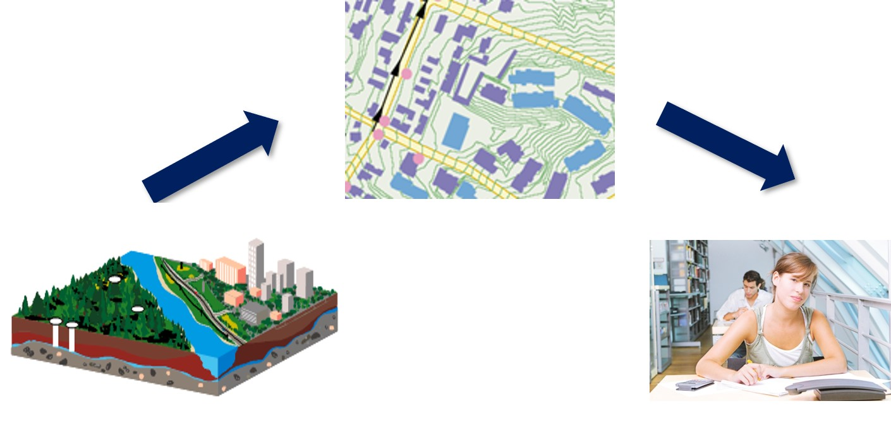
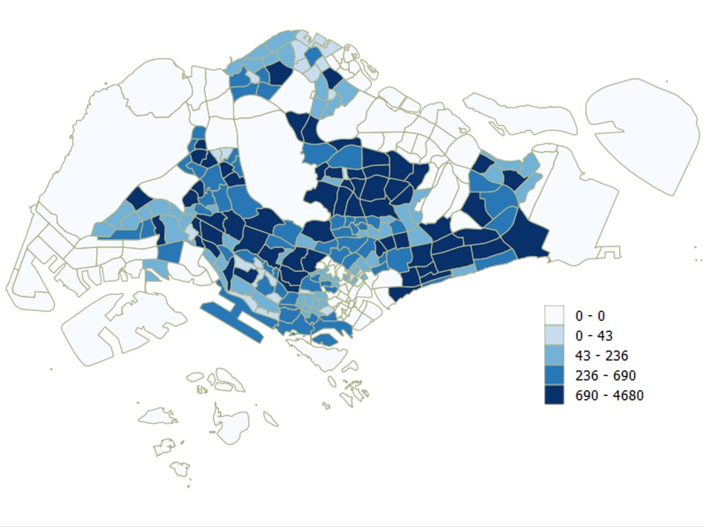
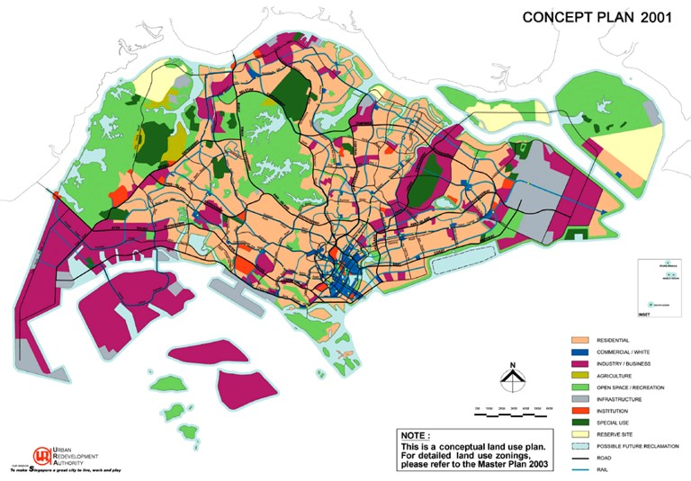
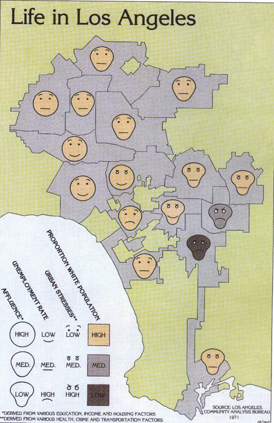
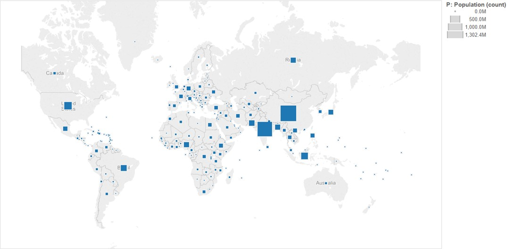
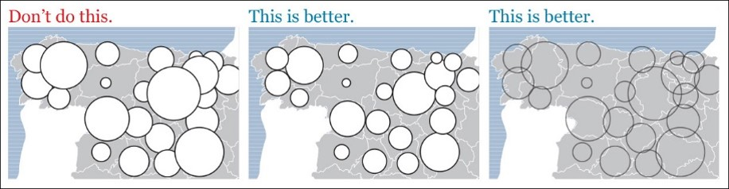
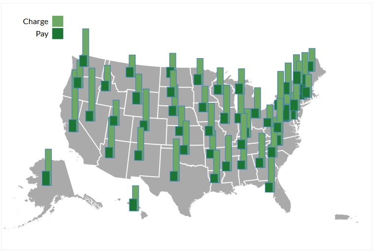
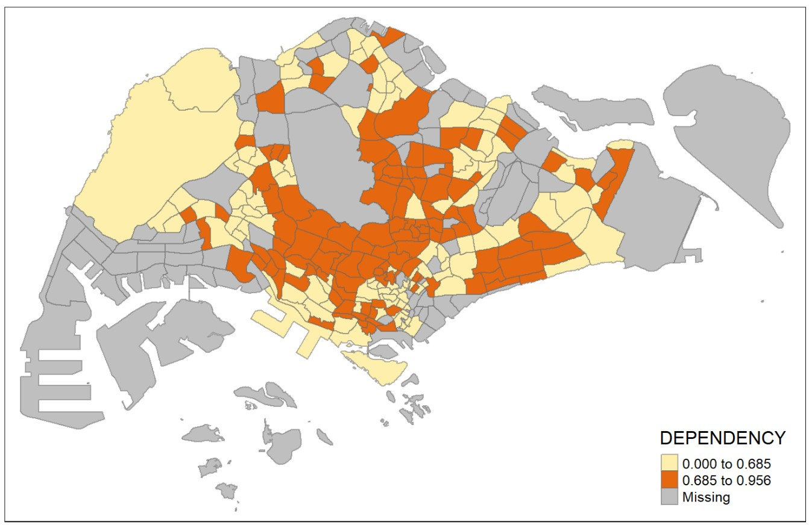
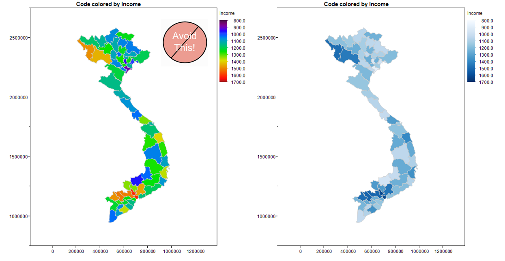
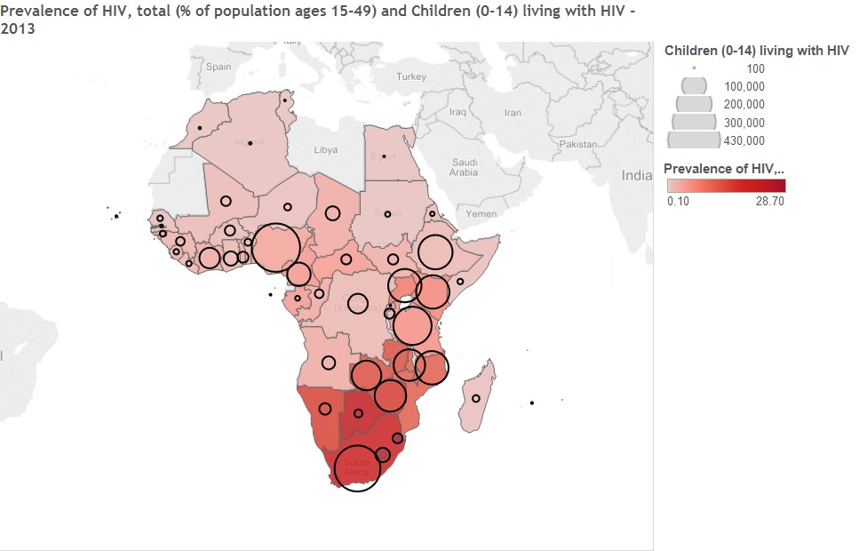

```{r setup, include=FALSE}
options(htmltools.dir.version = FALSE)
knitr::opts_chunk$set(cache = FALSE,
                      echo = TRUE,
                      eval = TRUE,
                      message = FALSE, 
                      warning = FALSE,
                      hiline = TRUE)
```

# Content

.vlarge[
+ Maps and Urban Environments
+ Typology of Maps
  + Reference maps
  + Thematic maps
+ Qualitative thematic mapping
+ Quantitative thematic mapping
  + Number of classes
  + Data classification
  + Colour scheme
]

---
## Learning objectives

.vlarge[
By the end of this lesson, students will be able: 

- to understand and explain the basic principles and methods of thematic mapping and cartographic design, and 
- to use these understanding to design analytical maps to enlighten.
]

---
## Visualising Urban Environments in a Map

.large[
An interface between geospatial data users and geospatial data.
]

.center[
.vlarge[
.blue[
**Old proverb: A picture is worth a thousand words.**


**New proverb: A map is worth a thousand numbers, maybe more**
]]]

???
A map is a model of our environments.

A map represents geographical data.  However, it is also an interface between map viewers and the 

---
## Role of Maps

.large[
+ Record and store spatially referenced data
+ Serve as computational aids
+ Serve as aids to mobility
+ Summarise complex, voluminous spatial data
+ Help us to explore spatial patterns
+ Help us to visualise large volume of spatial data
+ Serve as trigger devices to stimulate thought 
]

---
### Role of Maps: Map serves as a record

.center[

]

.small[Source: http://en.wikipedia.org/wiki/Battle_of_Singapore 
]

???
A map serves as a record of the physical and cultural environment at a particular time.  For example, the map above shows Singapore in early February 1942; the disposition of Allied ground forces is in red. The main north–south transport corridor, formed by Woodlands Road and the railway, connecting the city centre (in the southeast) and The Causeway (central north), is the black line running through the centre of the island. Sarimbun is at the north west corner of the island; Bukit Timah is located close to the centre on the transport corridor; Pasir Panjang is between the city centre and the southwest corner of the island and the "Jurong Line" is the bracket-like shape in red, just west of Woodlands Road land use allocation on Singapore Concept Plan in 2001.   

---
### Role of maps: Map reveals patterns

.center[

]

.small[Source: http://en.wikipedia.org/wiki/John_Snow_%28physician%29
]

???
While investigating an outbreak of cholera in London, Dr. John Snow noticed that a large proportion of deaths occurred in households near the Broad Street water pump.  He theorised that the water from this pump was the source of contamination and lobbied to have the pump handle removed so that people could not drink the water.  Although it's unlikely that this action stopped the epidemic (it was already waning when the pump handle was removed), the map he later constructed to visualize where the cholera deaths occurred provided strong support for his hypothesis (i.e. confirmation).

---
## Typology of Maps

.center[

]

---
### Reference map – Topography Map

.center[

]

???
Topographic maps are detailed, accurate graphic representations of features that appear on the Earth's surface. These features include:

+ cultural: roads, buildings, urban development, railways, airports, names of places and geographic features, administrative boundaries, state and international borders, reserves
+ hydrography: lakes, rivers, streams, swamps, coastal flats
+ relief: mountains, valleys, slopes, depressions
+ vegetation: wooded and cleared areas, vineyards and orchards.

A map legend (or key) lists the features shown on that map, and their corresponding symbols.

Topographic maps usually show a geographic graticule and a coordinate grid, so you can determine relative and absolute positions of mapped features.  

It is important to note that a map is merely a two or three dimensional representation of the physical environment at a given time.  Therefore, a map will never be entirely up to date.  Changes to the landscape and cultural features regularly occur (such as roads, vegetation, and buildings), resulting in maps becoming dated, although the rate of obsolescence varies depending upon location.

Traditionally present in paper printed format.

---
### Reference map – Topography Map


???
Figure on this slide shows the close-up view of a topographical map.  

+ Show the physical and cultural landscapes of the earth surface.
+ Different colours and symbols are used to represent real world features.
+ Labels are used to indicate locations and places.

---
## Thematic Mapping

.pull-left[
.center[
### Qualitative Thematic Map


]]

--
.pull-right[
.center[
### Quantitative Thematic Map


]]

---
### Visual Variables and Cartographic Symbols

.pull-left[
.center[
### Nominal or ordinal scales


]]

--
.pull-right[
.center[
### Ratio scale


]]

???
Nominal visual variables are best for emphasizing differences in kind, or qualitative differences.  The four visual variables that work best for showing nominal differences are: colour hue, shape, arrangement and orientation.  Figure above, for examples of these four nominal visual variables used each in point, linear and areal symbols.

Colour Hue such as red blue and green may be used to categorise features that are qualitative different such as a river and a road.

Quantitative visual variables are most effective for depicting differences in amount, or quantitative differences.  The visual variables that do a good job of showing ordinal differences are: colour value, colour saturation, size and texture/grain.  The figure above for examples of these four ordinal visual variables used each in point, linear and areal symbols.

Colour value or lightness of hue may be used to represent quantitatively different data (either rank-ordered data or numerical amounts) such as population density.  Value is typically light for low numbers (e.g., light green) and dark for high numbers (e.g., dark green).

Colour saturation or intensity of hue such as bright red compared with a dull, gray red can be used for quantitative data.

---
### Qualitative Thematic Map

.pull-left[
.center[
### Point symbol Map


]]

--
.pull-right[
.center[
### Line Symbol Map


]]

???
Different point symbols are used to represent facility types.

A road map is an example of a thematic map.  It shows the road network of an area.  In this map, lines with different colours, symbols, and markers are used to differentiate hierarchy of roads and transport facilities.  Additionally, labels are used to identify locations and places.


---
### Qualitative Thematic Map: Areas or Polygons

.center[

]

???
Land use map above is a good example of a discrete thematic map.  In this map, different colour hues are use to represent different land use types.

---
### Qualitative Map: Multivariate Map

.center[

]

???
Chernoff Faces: variation on the graduated symbol theme: many variables for each symbol.

---
### Quantitative Thematic Map: Dot Density Map

A dot-density map is a type of thematic map that uses dots or other symbols on the map to show the values of one or more numeric data fields. Each dot on a dot-density map represents some amount of data.

.center[


.small[one dot represent 100 households]
]

.small[
Reference: [Dot distribution map](https://en.wikipedia.org/wiki/Dot_distribution_map) at wiki and [Dot Density Maps](https://www.axismaps.com/guide/dot-density)
]

???
Dot density maps, or dot maps, portray the geographic distribution of discrete phenomena using an arrangement of identical point symbols, most commonly dots.
The dot density technique dates to at least the 19th century and is today accepted as one of the primary techniques for representing geographic patterns.  
Figure above shows the first dot density map.  It was published in 1830 by 1830 Armand Joseph Frere de Montizon.  It shows the population distribution of France.  Each dot represent 10,000 people.
Dot density maps are particularly useful for understanding global distribution of the mapped phenomenon and comparing relative densities of different regions on the map. Dot density maps are also easy to understand, requiring little cognitive effort by the map reader when compared to isoline maps. 
However, retrieval of specific information from dot density maps is difficult, as map users find manual counting of dots tedious and tend to underestimate dot totals as density increases. 

---
### Quantitative Thematic Map: Proportional Symbol Map

.center[

]

???
The proportional symbol technique uses symbols of different sizes to represent data associated with different areas or locations within the map. For example, the proportional maps above use circle with different sizes to represent millions of people.

There are two types of point features that are typically depicted with proportional symbols: features for which the data represents a geographic position directly (e.g., gallons of oil from individual oil wells), and features that are geographic areas to which data are aggregated and the data magnitudes are assigned to a representative point within the area (e.g., the geographic centroid of a state as in the examples above). In either case, the area of the symbol is scaled to represent the data magnitude, sometimes with a bit of exaggeration to adjust for a general tendency of human vision to underestimate differences in area. A variant on this direct data-to-symbol scaling groups values into categories first, then scales the symbol to represent the mean for the category, assigning a symbol to each place to represent the category range that the mean for the place falls within
 
---
### How to size circles incorrectly and correctly?

.large[
Figure below explains how attribute values are map on circles.  One strategy to overcome this problem is to use square instead of circle.]

.center[

]

---
### Quantitative Thematic Map: Proportional Symbol Map

.vlarge[
Instead of using circle, square symbol shall be used.]

.center[

]

???
Map readers' estimation of values from symbols has been the subject of extensive research by cartographers. These studies have generally found that readers make the most accurate estimates from bars and squares and are generally not as good at estimating values from circles, whose areas they tend to underestimate, especially for larger symbol sizes.  

---
### How to make proportional symbol maps clearer?

.large[
Strategy to symbolise the circle.
]

.center[

]


???
When designing a proportional symbol map, one of the important consideration is to avoid the circles blocking each other.  One possible strategy to overcome this problem is to applying opacity (also known as transparency).

---
### Proportional Symbol Map: Pie Chart Map

.large[
**Proportional pie chart map** places pie bar chart on a map based on the location of the observations.  
]

.center[
]

???
One important characteristic of proportional symbols is that they can easily be designed to represent more than one data value per location.  Among the most common example is a **pie chart map** in which a circle is scaled proportionally to some total, and the size of wedges within the circle is scaled to depict a proportion of a total for two or more sub-categories.  The map above uses circle size to depict total sales in each city, and the pie slices then depict proportion of the three shipping modes, namely: delivery truck, express air and regular air.

---
### Proportional Symbol Map: Bar Chart Map

.large[
**Proportional side-by-side bar map** places side-by-side bar chart on a map based on the location of the observations.]  

.center[
]

---
### Classified choropleth map

- A **classed choropleth map** combines areal units into a smaller number of groups.  Interval levels may vary, but typically 4 to 7 are used in a map.  There is different classification techniques used to divide up the intervals.  

.center[
]

???
A choropleth map can be either classified or unclassified.

---
### Unclassified choropleth map

- An **unclassified choropleth** map is similar to a classed choropleth map; however, an unclassed choropleth maps do not have an averaged statistic towards each particular colour.  

.center[
]

---
### Choropleth mapping technique - Number of classes

The readability of a choropleth map will be affected by the number of classes used.

.pull-left[
*  When a small number of classes is used, the spatial distribution reveals will be very limited. 


]

--
.pull-right[
*  When an appropriate number of classes is used, the spatial distribution reveals will be clear. 


]


---
### Choropleth mapping technique - Number of classes

Figure below provided a mathematical method to determine number of classes used for preparing a choropleth map.

.center[
]

---
### Choropleth map

.vlarge[Methods of choosing classes]

.large[
- Based on the nature of the distribution
    - quantile, equal interval, natural breaks, standard deviations, defined interval

- Arbitrary
    - Can be based on round numbers. 
    - Examples: Grouping according to age or census housing categories
    - Can result in empty categories
]

---
### Data classification method: Equal interval

.large[
- Divides the range of attribute values into equally sized classes.]

.center[

]

---
### Data classification method: Quantitle

.large[
- Same number of features per class.]

.center[

]

---
### Data classification method: Jenks (also known as Natural breaks)

.large[
- Default Jenk’s statistical optimization by finds natural groupings in the data.]

.center[

]

---
### Data classification method: Standard deviation 

.large[
- A measure of dispersion. Use if the distribution approximates a normal distribution.]

.center[

]

---
### Choropleth map - Colour scheme

.large[
[ColorBrewer](http://colorbrewer2.org/) is an online tool designed to help people select good color schemes for maps and other graphics.]

.center[

]

---
### Colour Scheme Tip

- Avoiding multiple colours in choropleth mapping
- Stick with a single hue (or a small set of closely related hues) and vary intensity from pale colours for low values to increasingly darker and brighter colours for high values.

.center[

]

---
### Quantitative Thematic Map - Bivariate

.large[
Symbolising features based on more than one attribute
]

.center[

]

---
### Quantitative Thematic Map - Bivariate Choropleth Map

Symbolized features based on more than one attribute

.center[

]

.small[
Source: http://kellystravelmap.blogspot.sg/2013/07/bivariate-choropleth-map.html and
http://icaci.org/files/documents/ICC_proceedings/ICC2013/_extendedAbstract/278_proceeding.pdf 
]

---
## Reference

[Proportional Symbols](https://www.axismaps.com/guide/proportional-symbols)

[Choropleth Maps](https://www.axismaps.com/guide/choropleth)

[Dot Density Maps](https://www.axismaps.com/guide/dot-density)

[The Basics of Data Classification](https://www.axismaps.com/guide/data-classification)

[Should a map be interactive?](https://www.axismaps.com/guide/should-a-map-be-interactive)

[Map interaction](https://www.axismaps.com/guide/map-interaction)


```{r echo=FALSE, eval=FALSE}
library(pagedown)
pagedown::chrome_print("Lesson04.html")
```

