```{r setup, include=FALSE}
options(htmltools.dir.version = FALSE)
knitr::opts_chunk$set(fig.retina=3,
                      cache = FALSE,
                      echo = TRUE,
                      message = FALSE, 
                      warning = FALSE)
```

```{r xaringan-themer, include=FALSE, warning=FALSE}
library(xaringanthemer)
style_duo_accent(
  primary_color = "#1381B0",
  secondary_color = "#FF961C",
  inverse_header_color = "#FFFFFF"
)
```

# Content

.large[
+ Introduction to Raster GIS
  + The basic concept of raster GIS data model
  + Raster database
  + Characteristics of raster
  + Raster resolution
+ Map Algebra Methods
  + Local functions
  + Focal functions
  + Neighbourhood functions
  + Zonal functions
]

---
## Raster GIS Data

.large[
+ All raster formats are basically the same 
  + Cells organized in a matrix of rows and columns
  + Content is more important than format: data or picture?
]

.center[

]

---
## Map Algebra

.pull-left[
.large[
+ Map algebra is a simple and an elegant set based algebra for manipulating geographic data, proposed by Dr. Dana Tomlin in the early 1980s. 
+ It is a set of primitive operations in a GIS which allows two or more raster layers ("maps") of similar dimensions to produce a new raster layer (map) using algebraic operations such as addition, subtraction etc.
]]

.pull-right[
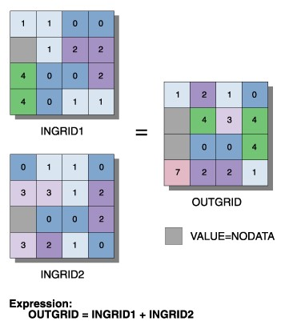
]

---
## Map Algebra Functions

.large[
+ Local function – characterising individual locations
+ Neighbourhood function – characterising locations within neighbourhood
+ Zonal function – characterising location within a zone
]

---
## Local function

.pull-left[
.large[
+ Local functions use only the data in a single cell to calculate an output value.
+ Potential operators fall into six categories:
  + trigonometric (i.e. sine, cosine, tangent, arcsine)
  + transformation (i.e. sqrt, exp, log) 
  + relational operations (>, <, =) 
  + statistical (i.e. mean, median, mode)
  + arithmetic (i.e. absolute value of x)
]]

.pull-right[

]

---
### Local function - trigonometric

.center[
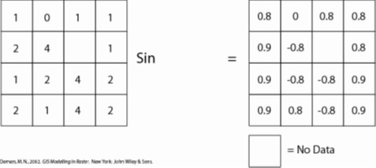
]

---
### Local function - relational operations 

.center[
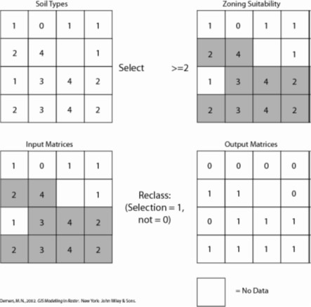
]

---
### Local function – transformation

.lareg[]
.center[

]

---
### Local function - arithmetic

.large[
- Local function involves two raster layers
]
.center[
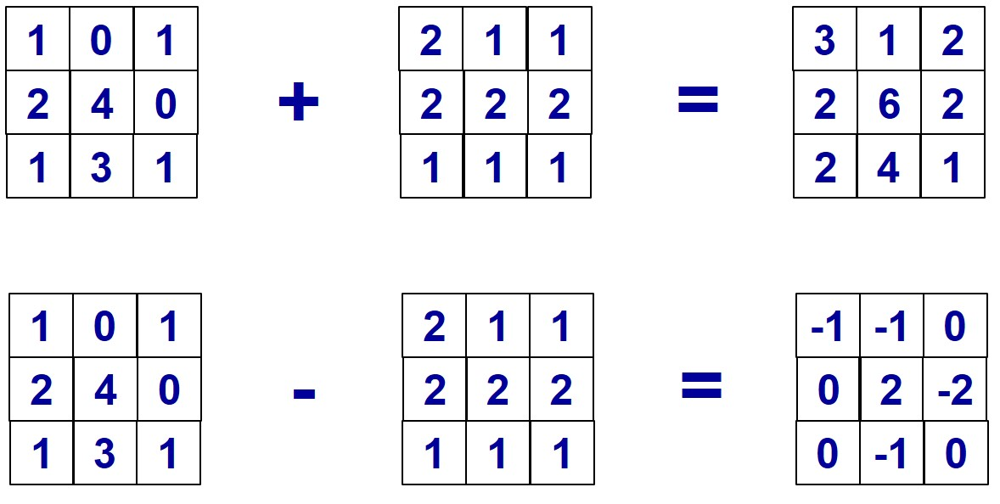
]

---
### Local function - statistical

.large[
- Local function involved more than two raster layers.
]
.center[
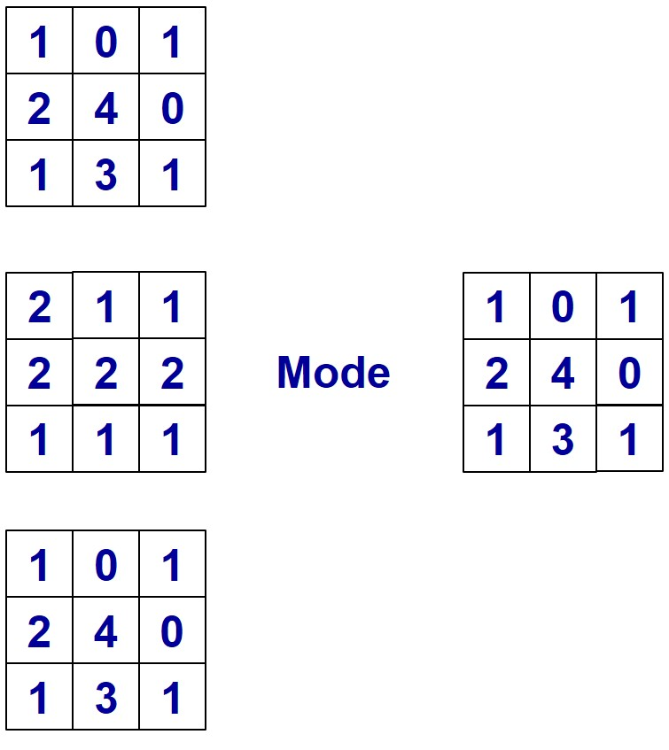
]

---
## Neighbourhood Functions

.pull-left[
.vlarge[
+ These are also called **focal** functions.
+ Local neighbourhood functions examine the target cell and immediate neighbours.
+ A value is returned based on their combined evaluation.
+ Neighbourhood scan be defined by rectangles, circles, wedges, doughnut shapes (annulus) etc.
]]

--
.pull-right[
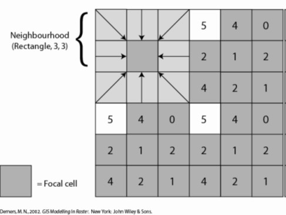
]

---
### Neighbourhood Functions

.large[
A doughnut shape can be drawn around a focal cell, and the values of the surrounding shape (referred to an annulus neighbourhood) are used to reclassify the focal cell.
]

.center[
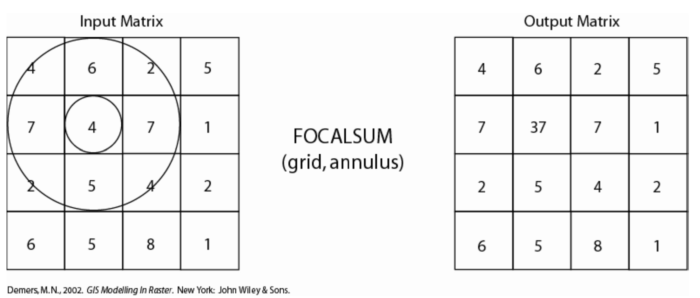
]

---
### Neighbourhood Functions: more examples

.pull-left[

]

--
.pull-right[
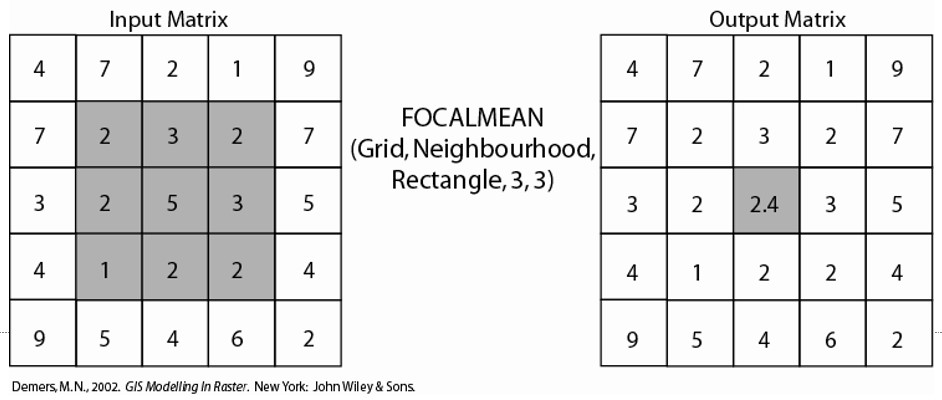
]

---
## Zonal Functions

.pull-left[
.large[
+ A zonal operation is employed on groups of cells of similar value or like features, not surprisingly called zones.  
+ These zones could be conceptualized as raster versions of polygons. Zonal rasters are often created by reclassifying an input raster into just a few categories.
+ Zonal operations may be applied to a single raster or two overlaying rasters. 
+ Given a single input raster, zonal operations measure the geometry of each zone in the raster, such as area, perimeter, thickness, and centroid. 
]]

--
.pull-right[
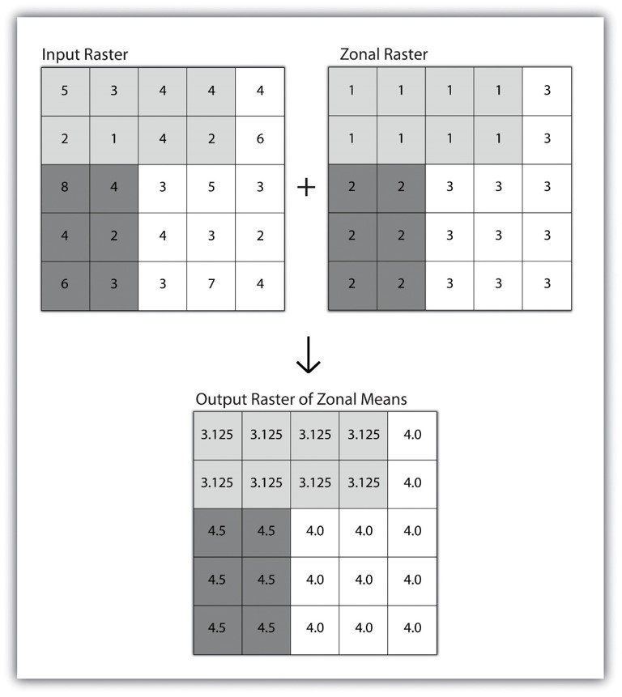
]

---
## Global Functions

.pull-left[
.large[
+ Global operations are similar to zonal operations whereby the entire raster dataset’s extent represents a single zone. 
+ Typical global operations include determining basic statistical values for the raster as a whole. 
  + For example, the minimum, maximum, average, range, and so forth can be quickly calculated over the entire extent of the input raster and subsequently be output to a raster in which every cell contains that calculated value.
]]

.pull-right[
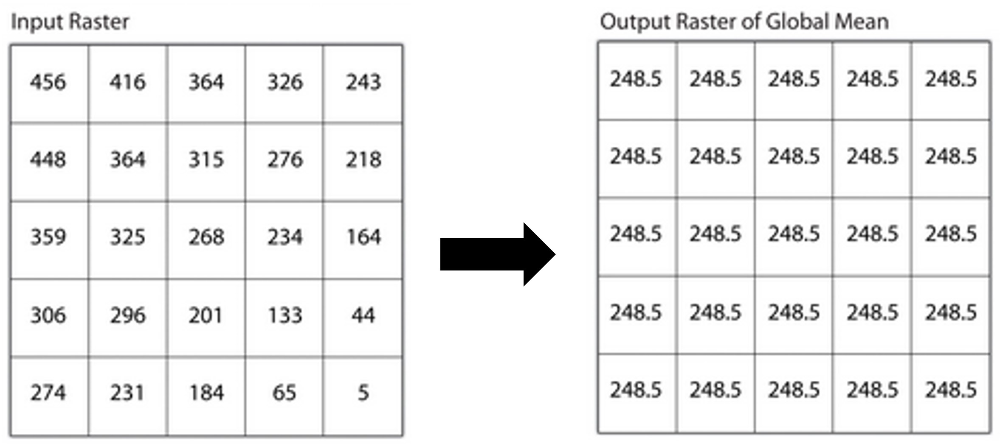
]

---
## Distance Functions: Euclidean Distance

.pull-left[
.vlarge[
+ The Euclidean distance functions describe each cell's relationship to a source or a set of sources.

+ The Euclidean distance output raster contains the measured distance from every cell to the nearest source. 
]]

.pull-right[
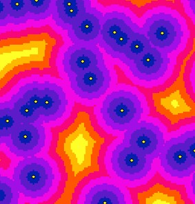
]

---
## Distance Functions: Euclidean Distance

.large[
+ The distances are measured as the crow flies (Euclidean distance) in the projection units of the raster, such as feet or meters and are computed from cell centre to cell centre.
]

.center[
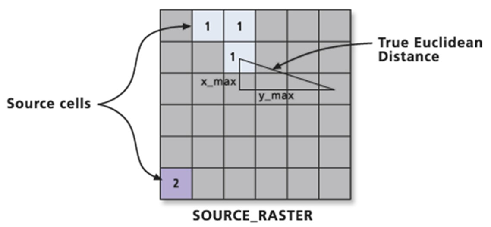
]

---
### Use Cells and Rings to Calculate Simple Proximity

.large[
Simple proximity is generated by summing a series of orthogonal and diagonal steps emanating from a starting location.
]

.center[
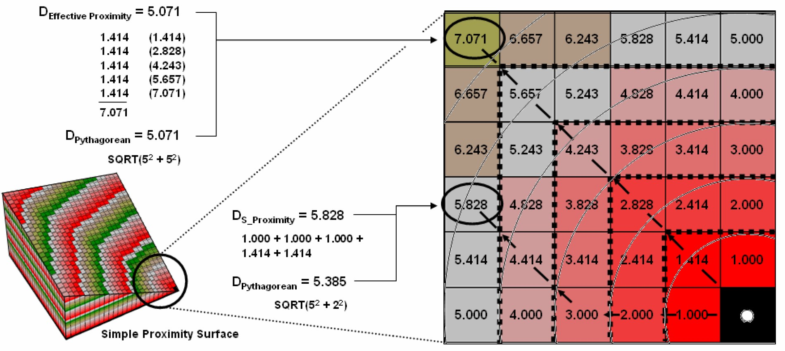
]

???
In the figure, the first “ring” is formed by the three cells adjoining the starting cell in the lower-right corner. The top and side cells represent orthogonal movement while upper-left one is diagonal. The assigned distance of the steps reflect the type of movement—orthogonal equals 1.000 and diagonal equals 1.414.

As the rings progress, 1.000 and 1.414 are added to the previous accumulated distances resulting in a matrix of proximity values. The value 7.01 in the extreme upper-left corner is derived by adding 1.414 for five successive rings (all diagonal steps). The other two corners are derived by adding 1.000 five times (all orthogonal steps). In these cases, the effective proximity procedure results in the same distance as calculated by the Pythagorean Theorem.

---
### Effective Proximity

.large[
+ **Effective proximity** is generated by summing a series of steps that reflect the characteristics and conditions of moving through geographic space.
]

.center[
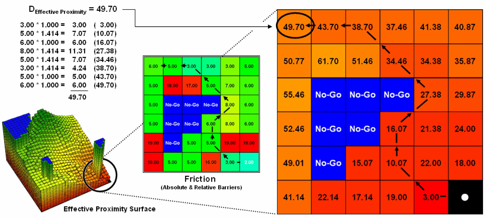
]

---
## Terrain Analysis

.vlarge[
+ Terrain models
+ Slope and Aspect
+ Hillshading
+ Terrain Profile
+ Visibility Analysis
]

---
### Terrain Mapping

.pull-left[
.vlarge[
+ Topography map

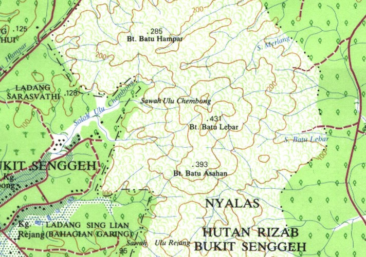
]]

--
.pull-right[
.vlarge[
+ Contour map
]

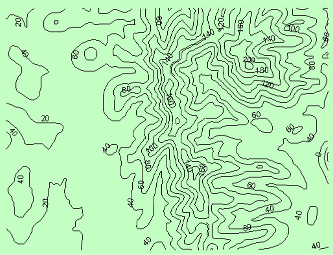
]

---
### Digital Elevation Model (DEM)

.vlarge[
+ A digital representation of the continuous variation of relief over space.]

.center[
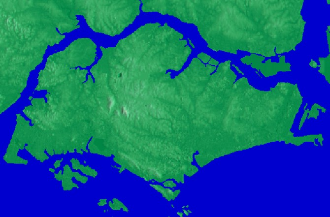
]

---
### Slope

.pull-left[
.large[
+ Slope identifies the steepest downhill slope for a location on a surface.
]


]

--
.pull-right[
.large[
Mathematics of slope
]

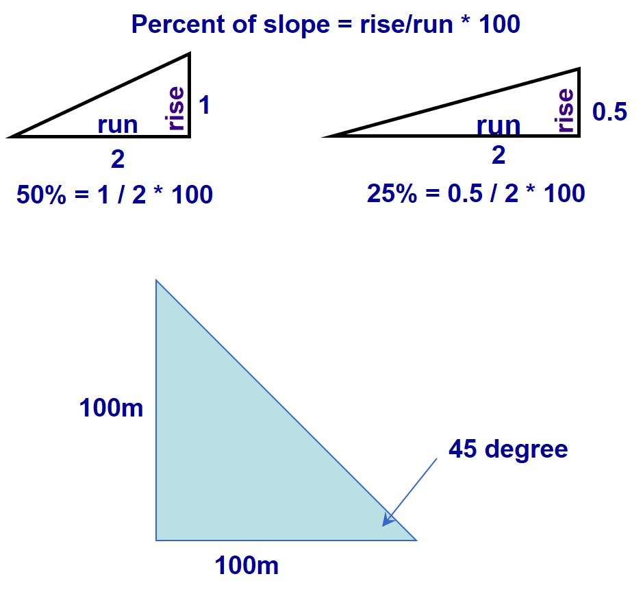
]

---
### Aspect

.pull-left[
.large[
+ Aspect is the direction that a slope faces.  It identifies the steepest downslope direction at a location on a surface.
+ Usage of aspect:
  + Find all west-facing slopes on a mountain as part of a search for the best slopes for building resort residential units.
  + Calculate the solar illumination for each location in a region as part of a study to determine the diversity of life at each. 
]]

.pull-right[
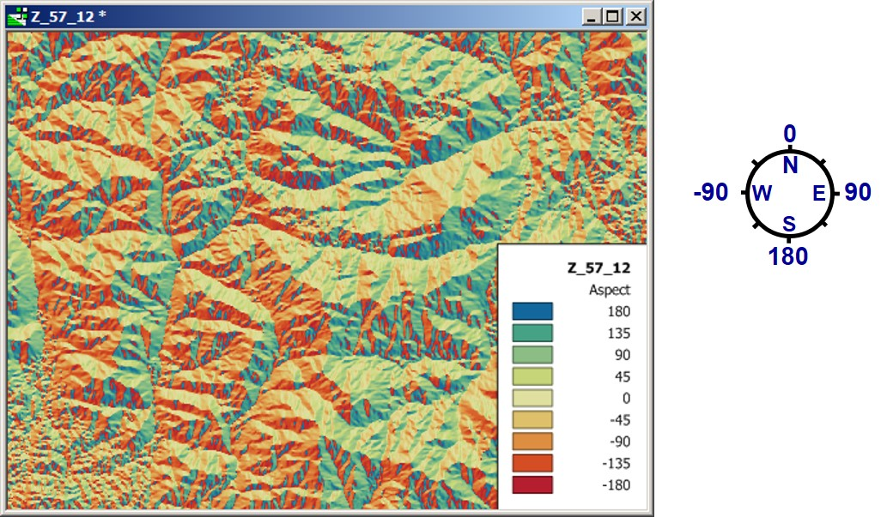
]

---
### Analytical Hillshading

.pull-left[
.vlarge[
+ Casts shadows with an imaginary light source.
+ Azimuth is the compass direction of the light source.
+ Altitude is the angle of the light source above the horizon.
]]

.pull-right[

]

---
### Analysing Visibility

.vlarge[
A line of sight is a line between two points that shows the parts the surface along the line that are visible to or hidden from an observer.]

.center[
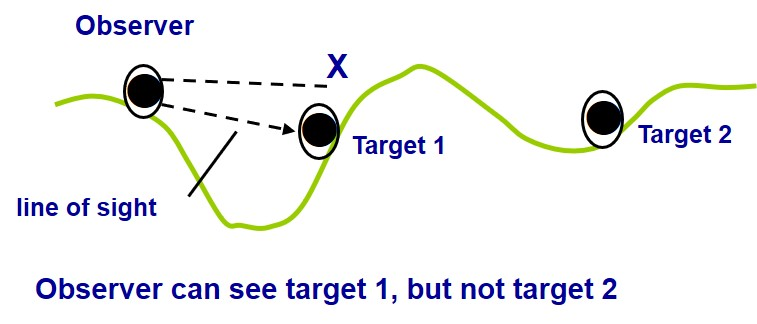
]

---
### Viewsheds

.vlarge[
Viewsheds are regions of visibility observable from one or more observation points.
]

.center[
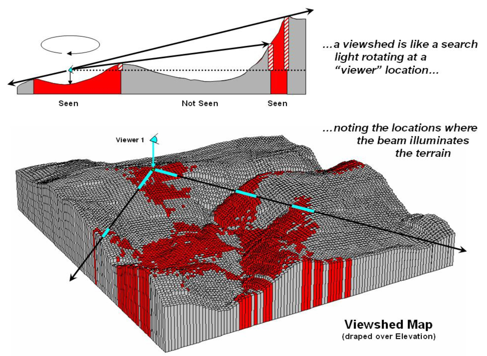
]

---
## Reference

.large[
+ [Beyond Mapping I](http://www.innovativegis.com/basis/BeyondMappingSeries/BeyondMapping_I/Default.htm)

+ [Beyond Mapping II - Spatial Reasoning](http://www.innovativegis.com/basis/BeyondMappingSeries/BeyondMapping_II/Default.htm)

+ [Beyond Mapping III - Map Analysis](http://www.innovativegis.com/basis/BeyondMappingSeries/BeyondMapping_III/)

+ [Beyond Mapping IV – GIS Modeling](http://www.innovativegis.com/basis/BeyondMappingSeries/BeyondMapping_IV/)     
]


```{r echo=FALSE, eval=FALSE}
library(pagedown)
pagedown::chrome_print("Lesson07.html")
```