```{r setup, include=FALSE}
options(htmltools.dir.version = FALSE)
knitr::opts_chunk$set(fig.retina=3,
                      cache = FALSE,
                      echo = TRUE,
                      message = FALSE, 
                      warning = FALSE)
```

```{r xaringan-themer, include=FALSE, warning=FALSE}
library(xaringanthemer)
style_duo_accent(
  primary_color = "#1381B0",
  secondary_color = "#FF961C",
  inverse_header_color = "#FFFFFF"
)
```

## Content

.vlarge[
+ Descriptive model

+ Prescriptive models
  + Binary method
  + Ranking method
  + Rating method

+ GIS‐Based Multiple‐Criteria Decision Analysis

+ Analytical Hierarchical Process (AHP)

+ Predictive model
] 

---
## GIS-based Descriptive Model

.vlarge[
+ Using GIS maps to describe the spatial distribution of real world phenomena.
]

.pull-left[
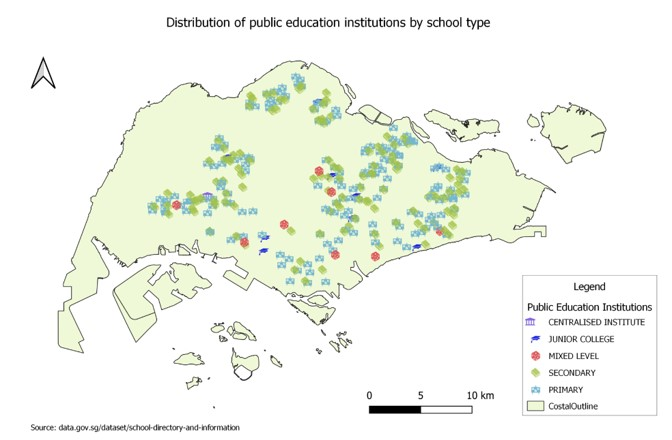
]

.pull-right[
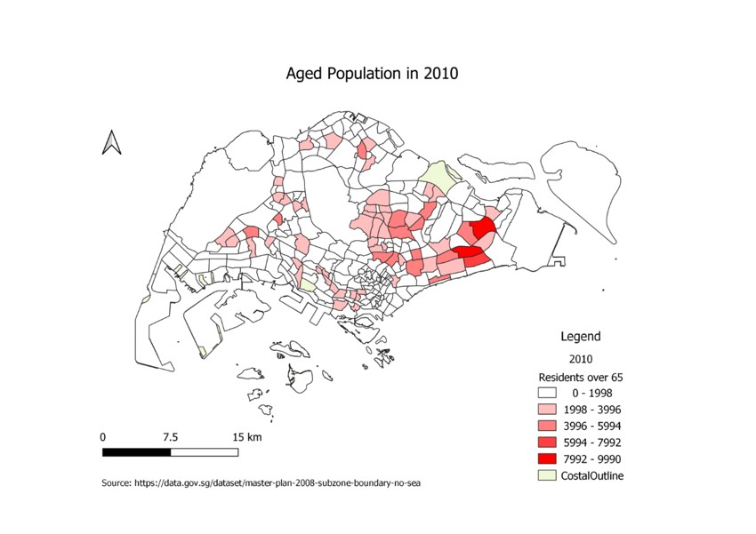
]

---
## GIS-based Descriptive Model

.vlarge[
+ Using GIS map, statistical graphic and table to describe footprint of a business.]

.center[
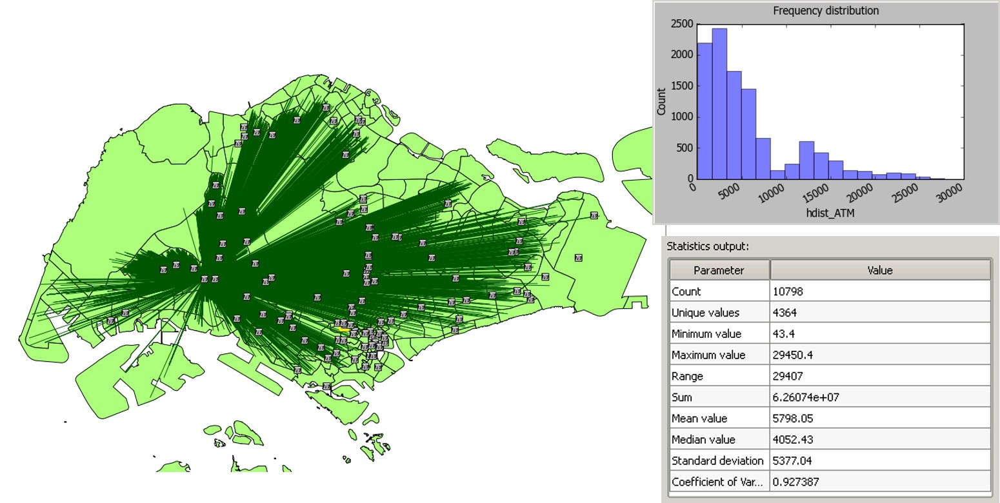
]

---
## GIS-based Descriptive Model

.vlarge[
+ Using GIS to analyse and to describe taxi hotspots.]

.center[
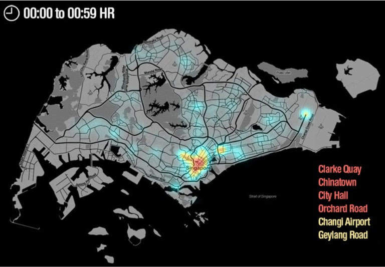
]

.small[
Source: Click on the wiki [link](https://wiki.smu.edu.sg/1213t2is415g1/IS415_2012-13_Term2_Assign2_Derek.Lee ).
]

---
## GIS-based Prescriptive Model

.vlarge[
+ Suitability analysis in a GIS context is a geographic, or GIS-based process used to determine the appropriateness of a given area for a particular use. 

+ The basic premise of GIS suitability analysis is that each aspect of the landscape has intrinsic characteristics that are to some degree either suitable or unsuitable for the activities being planned. 

+ The results are often displayed on a map that is used to highlight areas from high to low suitability.
]

---
### GIS-based Prescriptive Model: Suitability Analysis

.center[
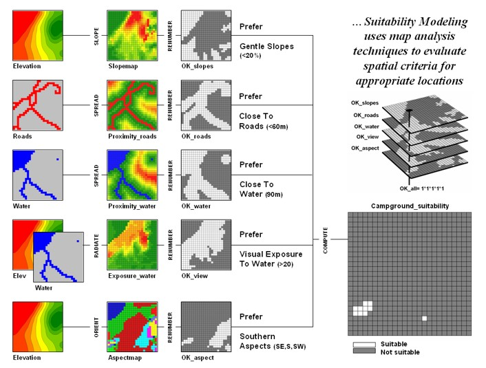
]

.small[
Source: Click on the wiki [link](http://www.innovativegis.com/basis/papers/other/asprschapter/#Berry6_Modeling_Frameworks).
]

---
### GIS-based Prescriptive Model: Land Suitability Analysis in History

.center[
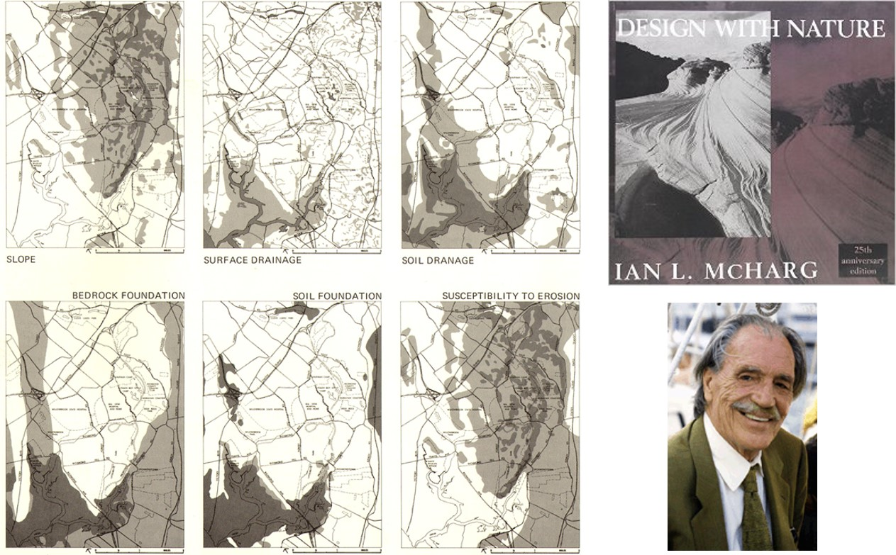
]

.small[
Source: Click on the wiki [link](https://en.wikipedia.org/wiki/Ian_McHarg).
]

---
### GIS-based Prescriptive Model: Binary Model

.center[
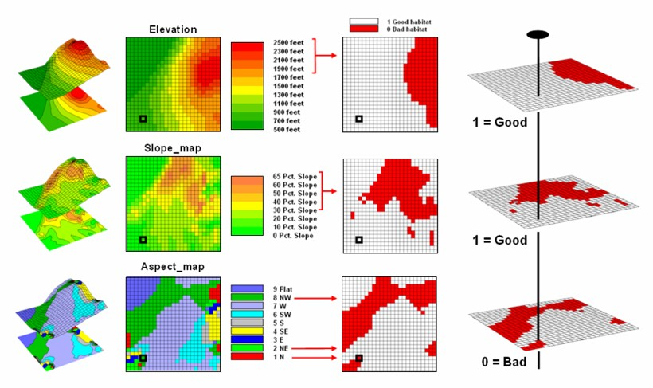
]

.small[
Source: Click on the wiki [link](http://www.innovativegis.com/basis/papers/other/asprschapter/#Berry6_1_1_Binary_Model).
]

---
### GIS-based Prescriptive Model: Rank model

.center[
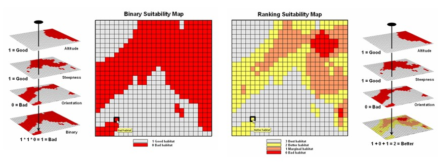
]

.small[
Source: Click on the wiki [link](http://www.innovativegis.com/basis/papers/other/asprschapter/#Berry6_1_2_Ranking_Model).
]

---
### GIS-based Prescriptive Model: Rating model

.center[
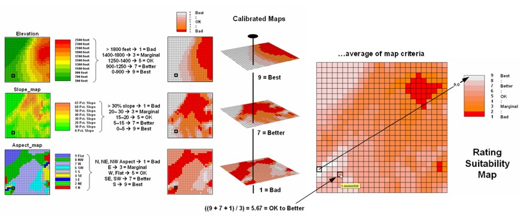
]

.small[
Source: Click on the wiki [link](http://www.innovativegis.com/basis/papers/other/asprschapter/#Berry6_1_3_Rating_Model).
]

---
## Multiple‐Criteria Decision Analysis Process

.center[
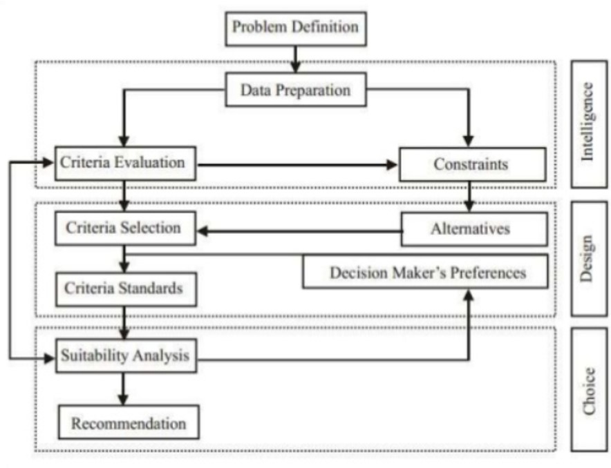
]

---
## GIS‐Based Multiple‐Criteria Decision Analysis

.center[
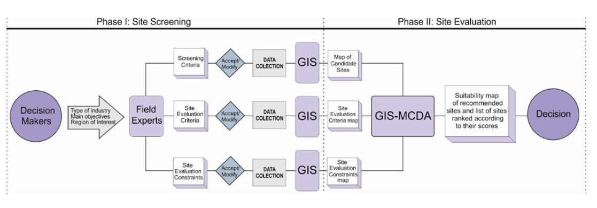
]

---
## Analytical Hierarchical Process (AHP)

.pull-left[
.large[
+ A method for decision making in situations where multiple objectives are present. 
+ It uses a pair-wise comparison matrix to calculate the relative value and costs of security requirements. 
+ By using AHP, the requirements engineer can also confirm the consistency of the result. 
+ AHP can prevent subjective judgment errors and increase the likelihood that the results are reliable.
+ To learn more, click on this [link](https://en.wikipedia.org/wiki/Analytic_hierarchy_process).
]]

.pull-right[

]

---
### AHP Steps

.large[
+ Review candidate requirements for completeness.

+ Apply the pair-wise comparison method to assess the relative value of the candidate requirements.

+ Apply the pair-wise comparison method to assess the relative cost of implementing each candidate requirement.

+ Calculate each candidate requirement's relative value and implementation cost, and plot each on a cost-value diagram.

+ Use the cost-value diagram as a map for analyzing the candidate requirements.
]

---
### AHP Pair-Wise Comparison Method

.center[
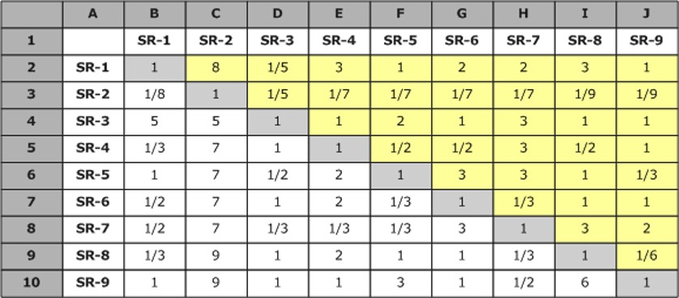
]

.small[Reference: Click on this [link](https://buildsecurityin.us-cert.gov/articles/best-practices/requirements-engineering/requirements-prioritization-case-study-using-ahp)]

---
### AHP Scoring

.center[
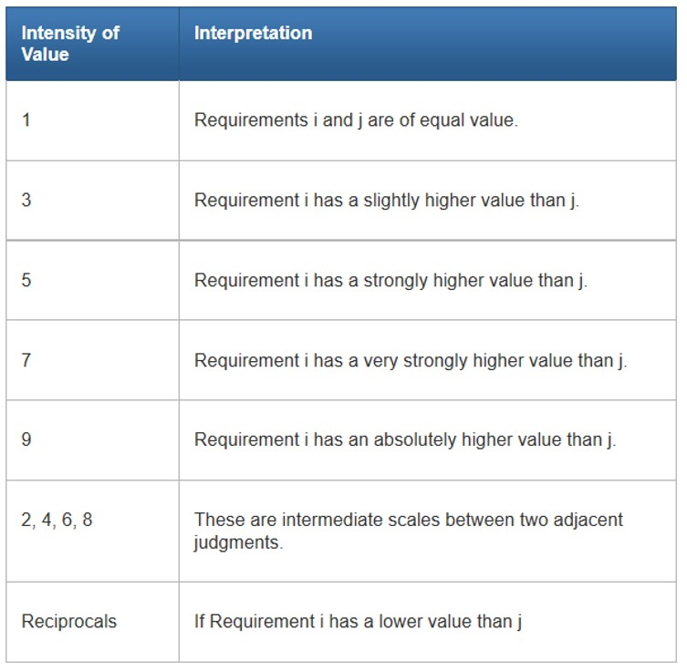
]

---
### AHP: Consistency Index and Consistency Ratio 

.center[
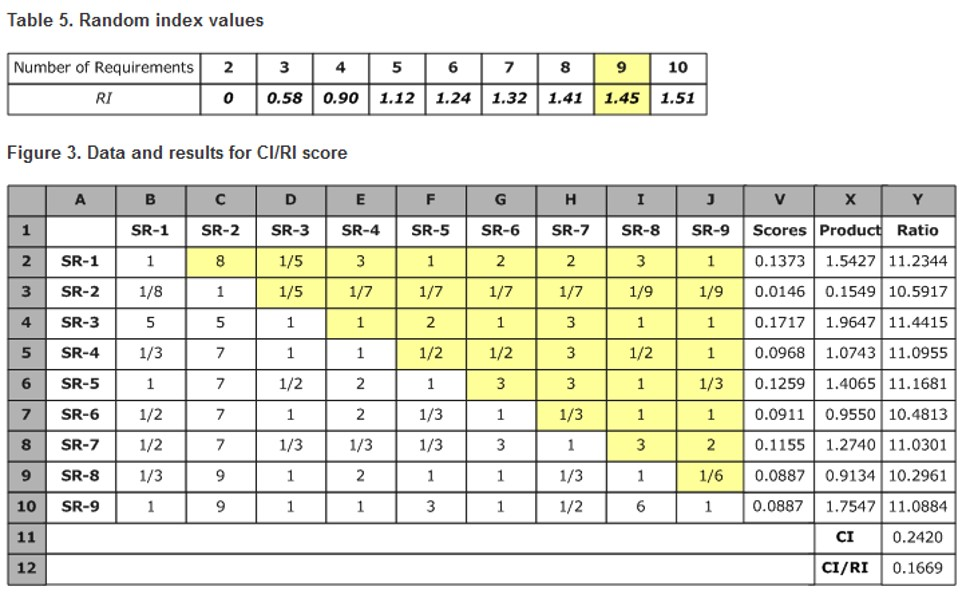
]

---
### Bank Branch Site Selection Study

.center[
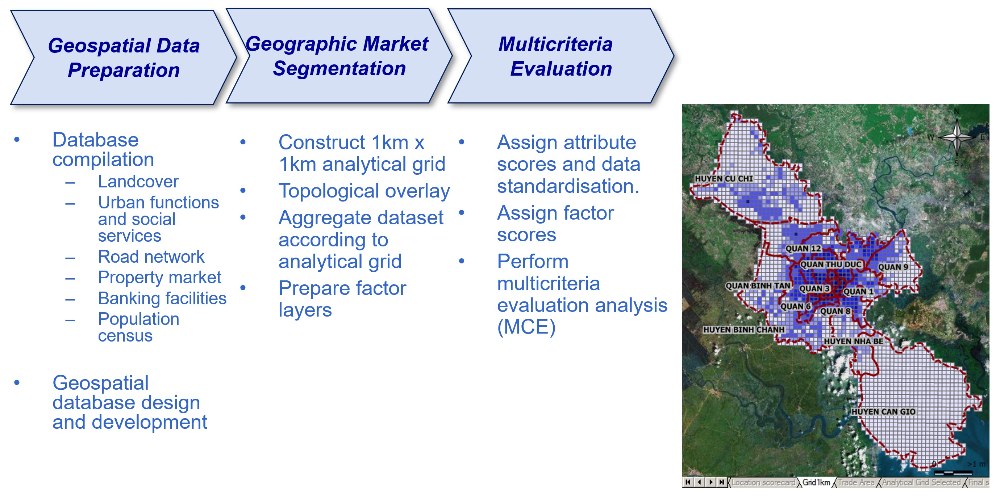

]


---
## GIS-based Predictive Model

.vlarge[
+ Geospatial hedonic pricing modelling
]

.center[
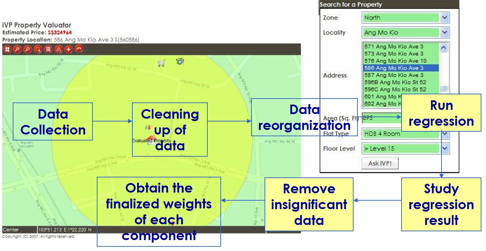
]


```{r echo=FALSE, eval=FALSE}
library(pagedown)
pagedown::chrome_print("Lesson08.html")
```
