```{r setup, include=FALSE}
options(htmltools.dir.version = FALSE)
knitr::opts_chunk$set(fig.retina=3,
                      cache = FALSE,
                      echo = TRUE,
                      message = FALSE, 
                      warning = FALSE)
```

```{r xaringan-themer, include=FALSE, warning=FALSE}
library(xaringanthemer)
style_duo_accent(
  primary_color = "#1381B0",
  secondary_color = "#FF961C",
  inverse_header_color = "#FFFFFF"
)
```

# Content

.vlarge[
+ Motivation of GeoWeb Mapping
+ History of GeoWeb Mapping
+ Fundamental of GeoWeb Mapping
+ GeoWeb Mapping Protocols
+ GeoWeb Mapping software
+ GeoWeb Mapping 2.0
]


---
## Motivation: Sharing geographic information

.pull-left[
.large[
+ Three possible ways to share geographic data.
+ Web GIS allows data to be shared over the Web
]]

.pull-right[
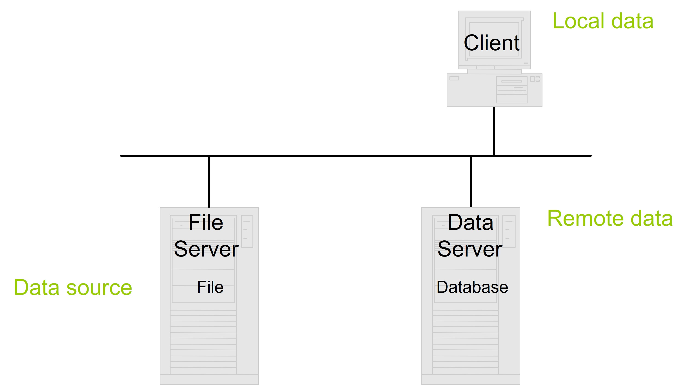
]

---
### Motivation: Isolated Island

.pull-left[
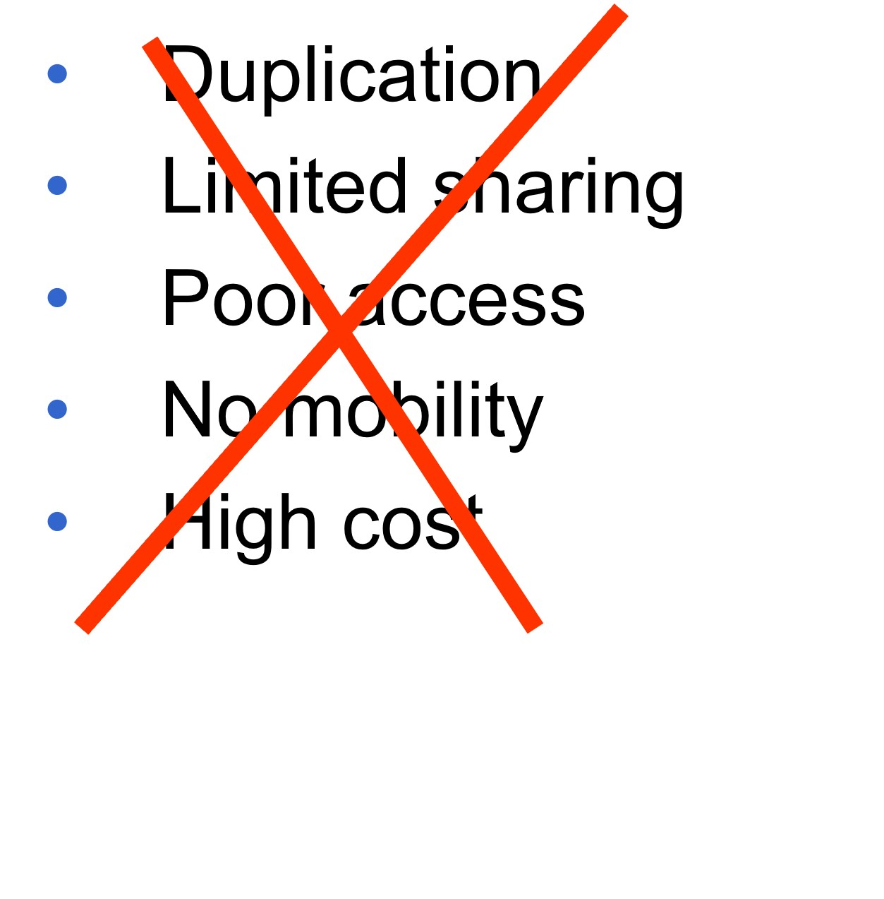
]

.pull-right[
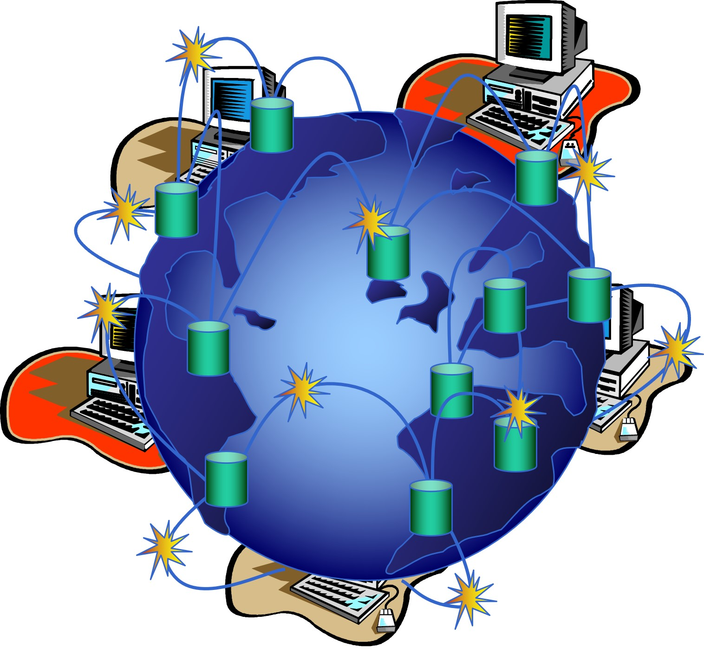
]


---
## GeoWeb Mapping in Action

.large[
+ An interesting [GeoWeb](https://corona.jakarta.go.id/en/peta-vaksinasi-kelurahan) create by our neighbour country for sharing COVID-19 vaccination information.
]

.center[
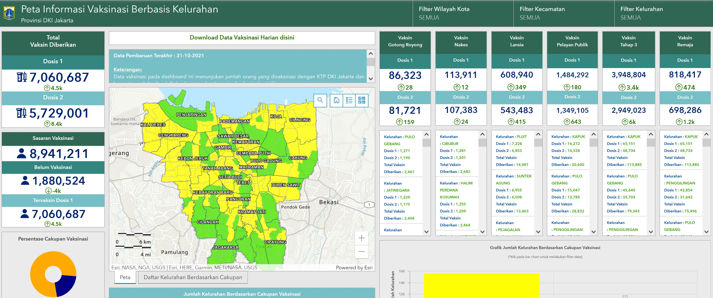]

---
## How A GeoWeb Mapping Service Works

.vlarge[
+ Client-server architecture]

.center[
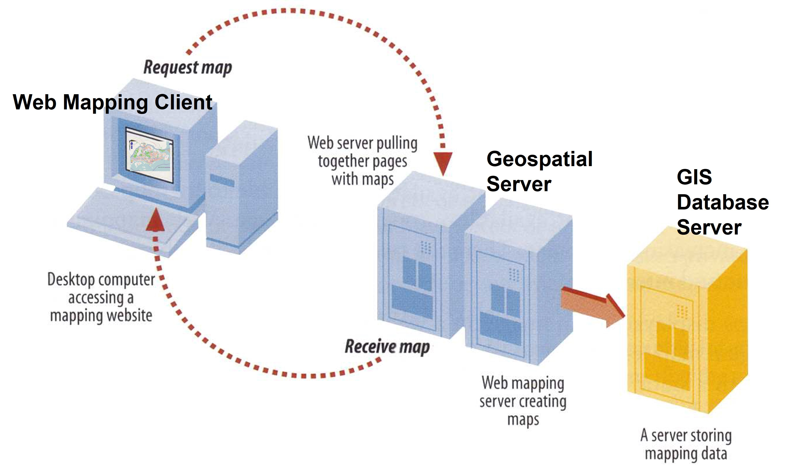
]

---
## GeoWeb Mapping Protocols

.vlarge[
+ Web Map Service (WMS)
+ Web Feature Service (WFS) 
+ Extensible Markup Language (XML)
+ Geography Markup Language (GML)
+ Keyhole Markup Language (KML) 
]

---
### Web Map Service (WMS)

.pull-left[
.large[
+ A standard protocol for serving georeferencing map images generated by a map server.
]

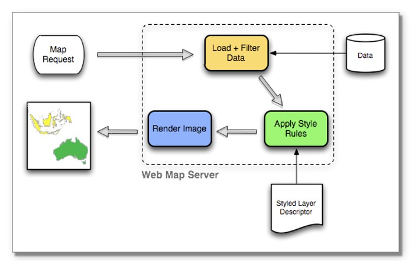

.small[
Source: http://en.wikipedia.org/wiki/Web_Map_Service and 
http://server.arcgis.com/en/server/latest/publish-services/linux/communicating-with-a-wms-service-in-a-web-browser.htm#GUID-EF5721D1-C928-447A-8EA5-5AF60FFE2EFC 
]]

--
.pull-right[
.large[
+ An example of WMS request.
]

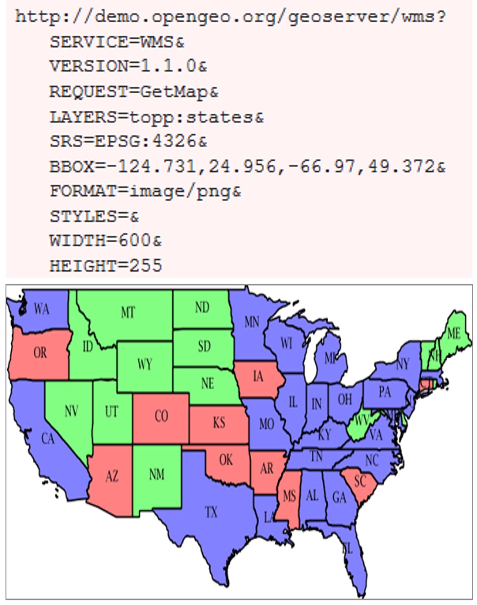
]

---
### An example of WFS request

.pull-left[
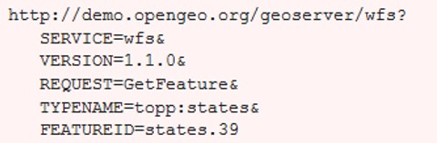
]


.pull-right[
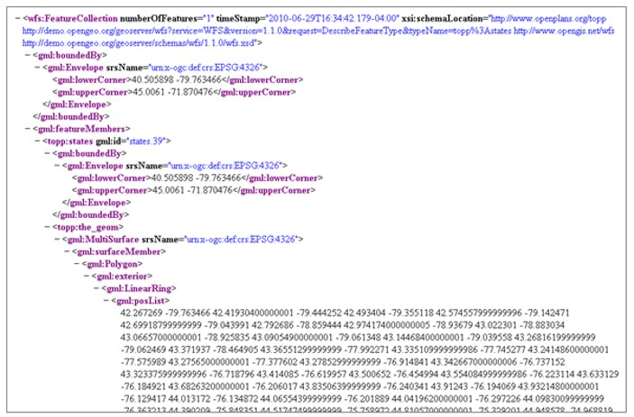
]

---
### Keyhole Markup Language (KML)

.pull-left[
.large[
+ KML is an XML notation for expressing geographic annotation and visualization within Internet-based, two-dimensional maps and three-dimensional Earth browsers.]

.small[
For more information: [Keyhole Markup Language@wiki](http://en.wikipedia.org/wiki/Keyhole_Markup_Language) and [Google mapping](http://news.cnet.com/8301-10784_3-9917421-7.html) spec now an industry standard.]
]

--
.pull-right[
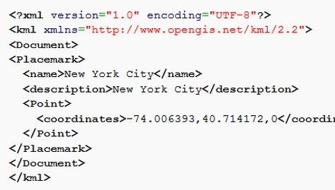
]

---
### Geography Markup Language (GML)

.large[
+ GML is the XML grammar defined by the Open Geospatial Consortium (OGC) to express geographical features.  
+ It serves as a modeling language for geographic systems as well as an open interchange format for geographic transactions on the Internet.]

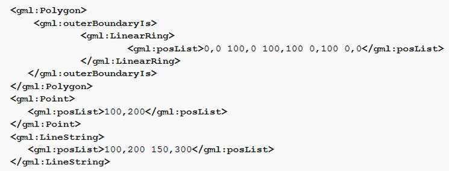

.small[For more information, refer to this [link](http://en.wikipedia.org/wiki/Geography_Markup_Language)]

---
### Geospatial Server Software

.pull-left[
.large[Commercial off-the-shelf (COS)]

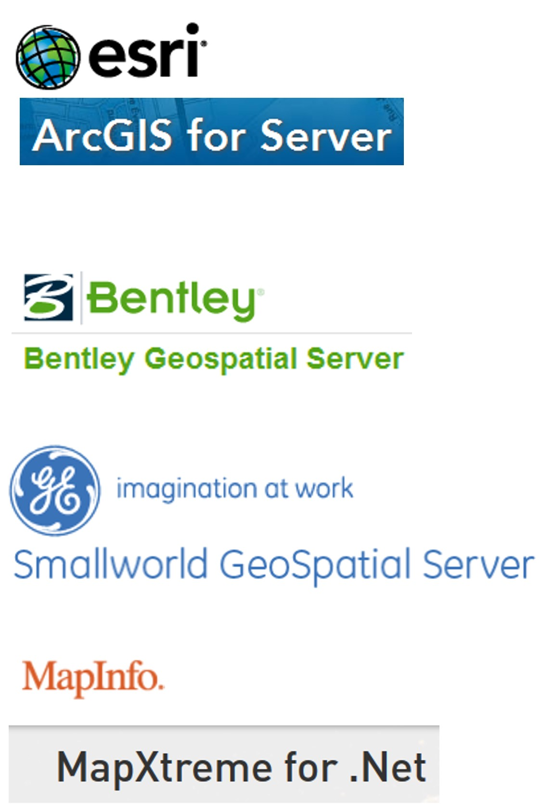
]

--
.pull-right[
.large[Open Source]

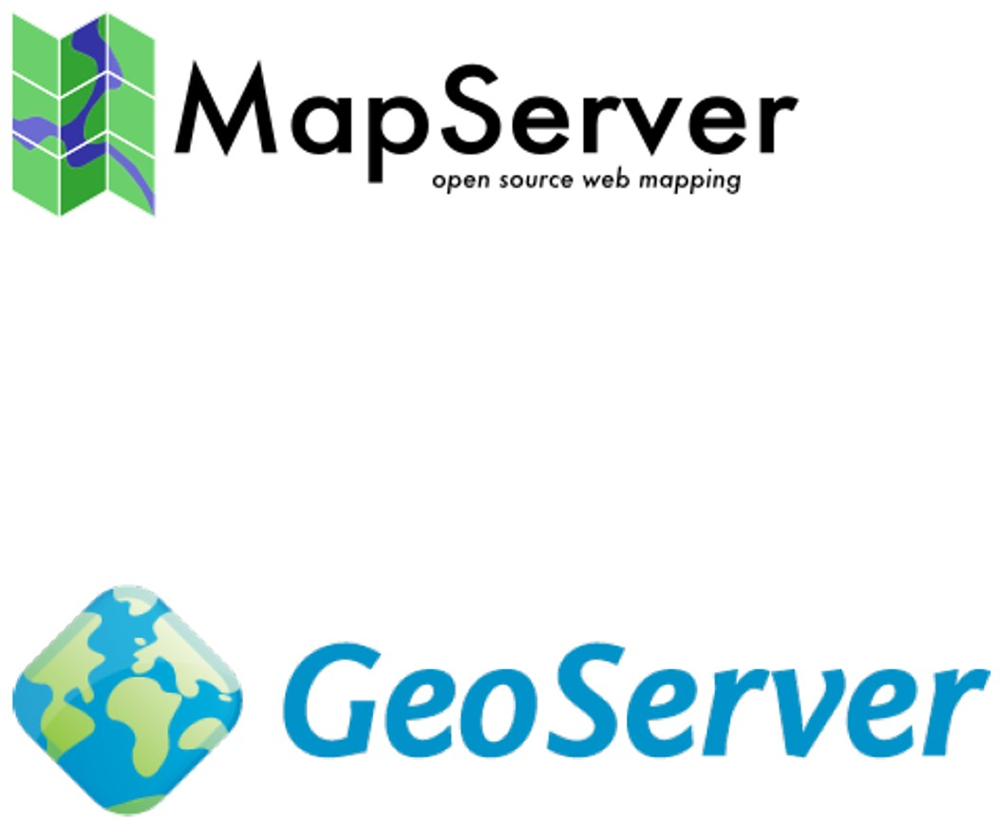
]

---
### ArcGIS Server (ESRI)

.pull-left[
.large[
+ A back-end server software component of ArcGIS Enterprise that makes your geographic information available to others in your organization and, optionally, anyone with an internet connection. 
+ This is accomplished through GIS services, which allow a server computer to receive and process requests for information sent by other devices.
+ To learn more, click on this [link](https://enterprise.arcgis.com/en/server/latest/get-started/windows/what-is-arcgis-for-server-.htm)]]

.pull-right[
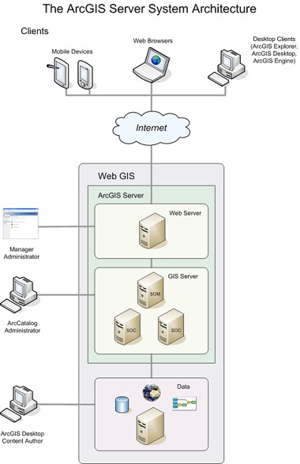
]

---
### GeoServer

.pull-left[
.large[
+ Java-based software server that allows users to view and edit geospatial data. 
+ Designed for interoperability, it publishes data from any major spatial data source using open standards. 
+ Use free and open source software
+ Integrate with existing mapping APIs such as Google Map, Yahoo Map, and Microsoft Bing Map. 
+ To learn more, click on this [link](http://geoserver.org/). 
]]

.pull-right[

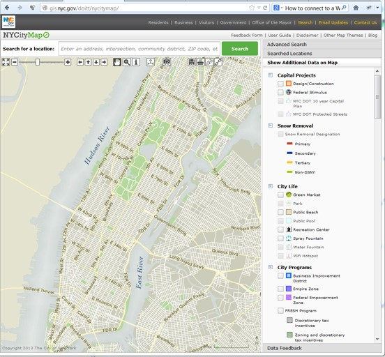
+ To visit the site, click on this [link](http://maps.nyc.gov/doitt/nycitymap/).
]

---
### Deficiencies of conventional web mapping

.vlarge[
+ Extremely high investment cost of backend server technologies, especially the COS system.
+ Data rich, content poor
+ Poor usability
+ Low client side capability
+ Platform incompatibilities
]

---
### GeoWeb Mapping evolution

.vlarge[
+ Impact of Rich Internet Application (RIA)
]

.center[
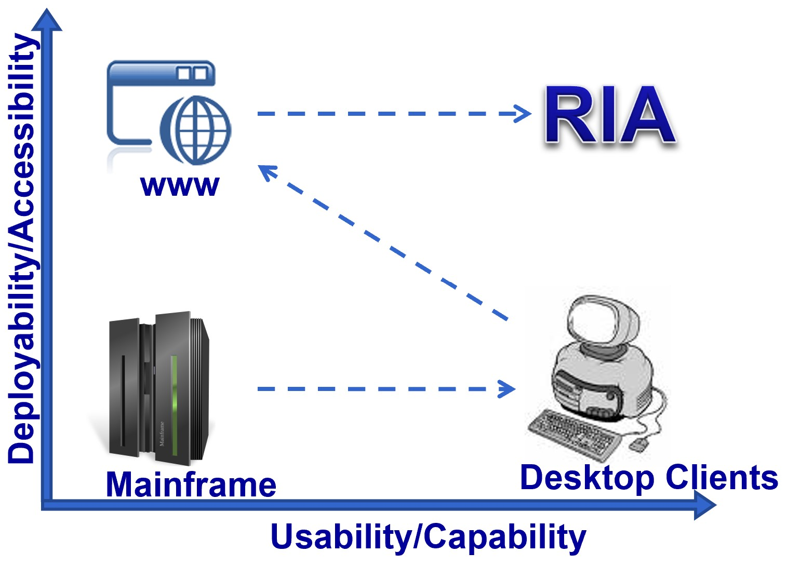

]

---
### OpenLayer

.large[
+ An open source (provided under a modified BSD license) JavaScript library for displaying map data in web browsers.

+ To find out more including download, click on this [link](http://openlayers.org/) and a collection of [Awesome OpenLayer](https://github.com/webgeodatavore/awesome-openlayers).
]

.center[
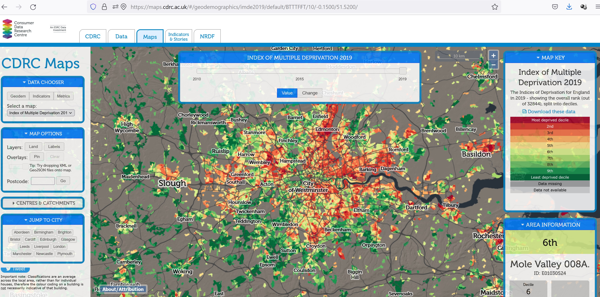

.small[The site [link](https://maps.cdrc.ac.uk/#/geodemographics/imde2019/default/BTTTFFT/10/-0.1500/51.5200/).]]

---
### Leaflet: JavaScript GeoWeb Mapping APIs

.pull-left[
.large[
+ An open-source (BSD license) JavaScript library for mobile-friendly interactive maps. (https://leafletjs.com/) 
+ It helps you bring geospatial data to life using HTML5, SVG and CSS, no plugin is required.
+ It can be used with almost any online map including proprietary tile servers.
+ Weighing just about 31 KB of JS, it has all the features most developers ever need for online maps including mobile.
+ To learn more and download, click on this [link](https://leafletjs.com/).
]]

--
.pull-right[
.large[
+ Who use Leaflet?]

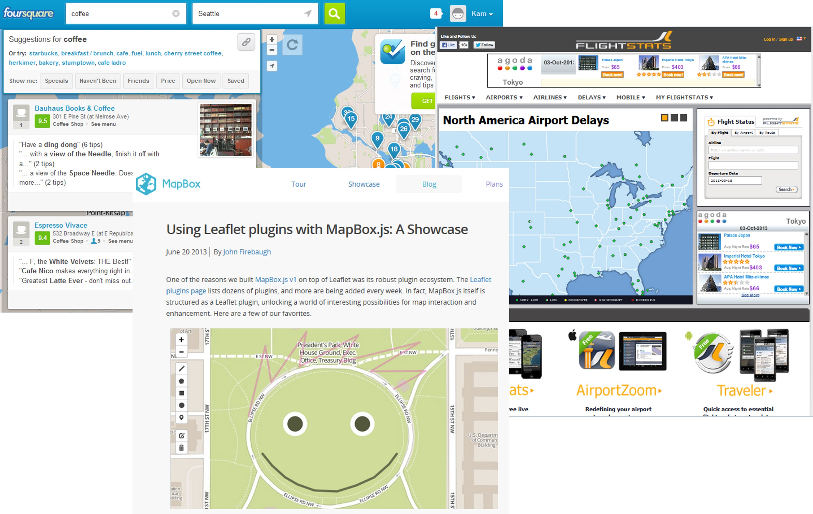
]

---
### qgis2web plug-in

.pull-left[
.large[
+ qgis2web generates a web map from your current QGIS project, either as OpenLayers, Leaflet, or Mapbox GL JS. 
+ It replicates as many aspects of the project as it can, including layers, styles (including categorized and graduated), and extent. 
+ No server-side software required. 
+ To learn more, click on this [link](https://github.com/tomchadwin/qgis2web/wiki).
]]

.pull-right[
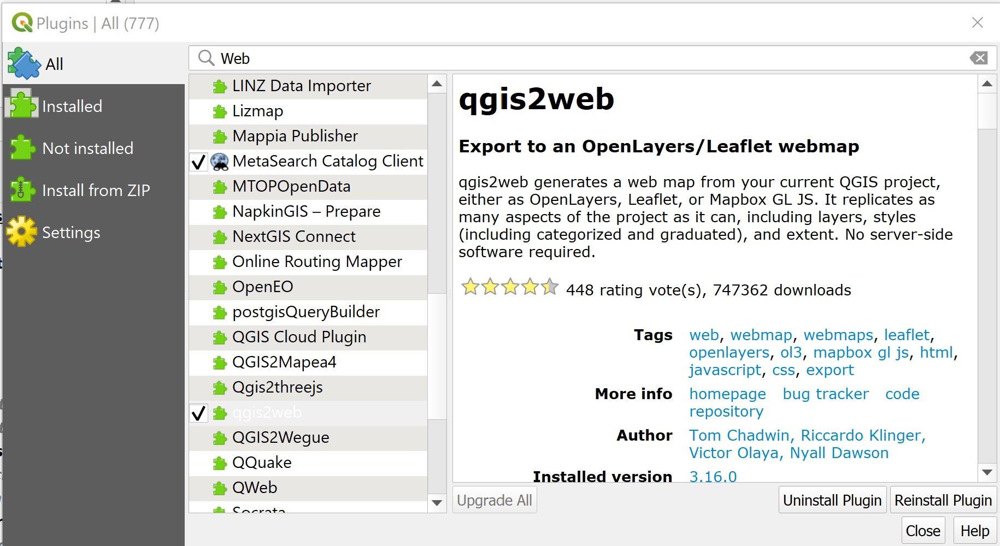
]


```{r echo=FALSE, eval=FALSE}
library(pagedown)
pagedown::chrome_print("Lesson11.html")
```