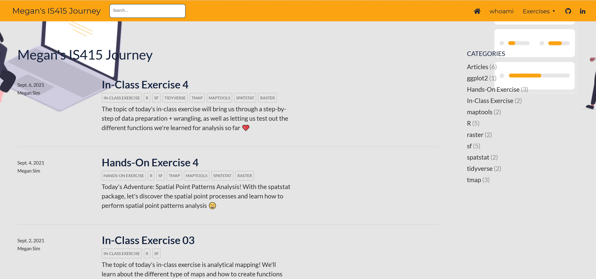

```{r setup, include=FALSE}
options(htmltools.dir.version = FALSE)
knitr::opts_chunk$set(
  fig.width=9, fig.height=3.5, fig.retina=3,
  out.width = "100%",
  cache = FALSE,
  echo = TRUE,
  message = FALSE, 
  warning = FALSE,
  hiline = TRUE
)
```

```{r xaringan-themer, include=FALSE, warning=FALSE}
library(xaringanthemer)
style_duo_accent(
  primary_color = "#1381B0",
  secondary_color = "#FF961C",
  inverse_header_color = "#FFFFFF"
)
```

# Content

.vlarge[
+ An overview of distill for RMarkdown
+ Setting up the environment
  + Installing git
  + Signing-up Github
  + Signing-up Netlify
+ My First Web blog
]

---
## Why you are here?

.pull-left[
.large[
In Business: Show me your business card!]


]

--
.pull-right[
.center[
.large[
In university: Show me your blog!]

]]

---
## Why you are here?

+ You want to publish professionally edited web post like below without having to learn web editing.

.pull-left[

]

.pull-right[

]

---
## What is distill for R Markdown?

.large[
Distill for R Markdown is a web publishing format optimized for scientific and technical communication. Distill articles include:

+ Reader-friendly typography that adapts well to mobile devices.
+ Features essential to technical writing like LaTeX math, citations, and footnotes.
+ Flexible figure layout options (e.g. displaying figures at a larger width than the article text).
+ Attractively rendered tables with optional support for pagination.
+ Support for a wide variety of diagramming tools for illustrating concepts.
+ The ability to incorporate JavaScript and D3-based interactive visualizations.
+ A variety of ways to publish articles, including support for publishing sets of articles as a [Distill website](https://distill.pub/2020/communicating-with-interactive-articles/) or as a [Distill blog](https://blogs.rstudio.com/ai/?_ga=2.77907540.1548782515.1631147933-1670780590.1620114500).]

.small[
Reference: [distill for RMarkdown](https://rstudio.github.io/distill/)
]

---
## [R Markdown](https://rmarkdown.rstudio.com/): The R software environment in reproducible research

.pull-left[
.large[
R Markdown provides an authoring framework for data science. You can use a single R Markdown file to both:
- save and execute code
- generate high quality reports that can be shared with an audience

Use this [link](https://rmarkdown.rstudio.com/index.html) to learn more about RMarkdown.]]

.pull-right[

]


---
## Getting Started

.vlarge[
+ Installing git
  + Download git at this [link](https://git-scm.com/downloads) and install in your computer. 
]

--
.vlarge[
+ Register with github
  + visit this [link](https://github.com/) and create a github account.
]

--
.vlarge[
+ Signing up at Netlify
  + visit this [link](https://www.netlify.com/) and signing up with Netlify.
]

--
.vlarge[
+ Installing R Packages
  + distill for R Markdown
  + [usethis](https://usethis.r-lib.org/) 
]


---
.center[
## Let's Get Your Hands Dirty!


]


---
## To Learn More:

.vlarge[

+ [git in RStudio](https://r4dsa.netlify.app/posts/2021-05-22-git-in-rstudio/)

+ [Building a blog with distill for R Markdown](https://r4dsa.netlify.app/posts/2021-05-21-building-a-blog-with-distill-for-r-markdown/)

+ If you encountered github token issue, please refer to [Solving git(GitHub) token issue](https://r4dsa.netlify.app/posts/2021-05-23-git-token/)   ] 

---
## References

.vlarge[

+ Visit [here](https://rstudio.github.io/distill/) to learn more about distill for R Markdown.

+ This [link](https://pkgs.rstudio.com/distill/reference/index.html) provides the reference guide of distill for R Markdown.

+ [(Re-)introducing Distill for R Markdown](https://blog.rstudio.com/2020/12/07/distill/)

+ [distilltools](https://ellakaye.github.io/distilltools/) 

To be inspired:

+ [The distillery](https://jhelvy.github.io/distillery/index.html)

+ [Personalizing the Distill Template](https://www.ericekholm.com/posts/2021-04-02-personalizing-the-distill-template/)

]

```{r echo=FALSE, eval=FALSE, warning=FALSE, message=FALSE}
library(pagedown)
pagedown::chrome_print("R4DSA-Topic7.html")
```


