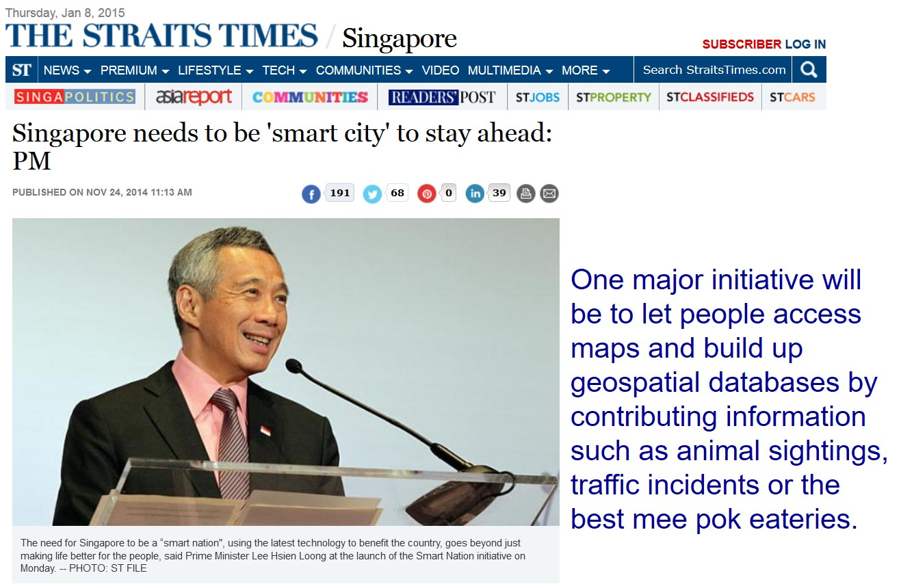

```{r setup, include=FALSE}
options(htmltools.dir.version = FALSE)
knitr::opts_chunk$set(
  fig.width=9, fig.height=3.5, fig.retina=3,
  out.width = "100%",
  cache = FALSE,
  echo = TRUE,
  message = FALSE, 
  warning = FALSE,
  hiline = TRUE
)
```

## What will you learn from this lesson?

.large[
- Introducing Urban Planning
    - Motivation of urban planning
    - Urban planning practice
    - Urban planning in Singapore
- Geographic Information Systems (GIS) Fundamentals
    - Basic concepts of GIS
    - Major components of a GIS
    - GIS toolkits
]

---
class: middle

## What is Urban Planning?

--

### - A .brown[technical] and .brown[political process] concerned with the development and design of land use and the environment and the infrastructure passing into and out of urban areas.

--

### - The primary concern is the .brown[public welfare], which includes considerations of efficiency, sanitation, protection and use of the environment, as well as effects on social and economic activities.

--

### - Urban planning is considered an .brown[interdisciplinary] field that includes social engineering and design sciences.

---
class: middle
## Urban Planning in Practice

--
### Practitioners of urban planning are concerned with research and analysis, strategic thinking, architecture, urban design, public consultation, policy recommendations, implementation and management.

--
### Enforcement methodologies include governmental zoning, planning permissions, and building codes, as well as private easements and restrictive covenants.

---
## Urban Planning in Singapore

.center[
### Functions of Singapore’s national planning authority


]

.small[
Source: Singapore, [Urban Redevelopment Authority](http://www.ura.gov.sg) 
]

---
## Why Geographic Information Matters?

.vlarge[
About 80% of all data maintained by organizations around the world has a location component.] (Source: BusinessWeek Research Services, 2006)

.center[

]

---
## GI in Smart Nation

.center[

]

.small[
Source: [Singapore needs to be 'smart city' to stay ahead: PM](http://www.straitstimes.com/news/singapore/more-singapore-stories/story/new-3d-map-collate-local-knowledge-part-smart-nation-pro#sthash.aUxbyCei.dpuf )
]

---
### The explosion in the availability of Government GI

.center[

]

---
class: middle
## GIS Fundamentals

--
### - Introduction to GIS

--
### - Major component of a GIS

--
### - GIS functions

--
### - GIS toolkits

---
### GIS as a toolkit

.large[
A Geographic Information System (GIS) is a toolkit for creating, managing, analyzing, visualising, and sharing data of any kind according to where it's located.
]

.center[

]

---
### Components of a GIS

.large[GIS extends the study of information systems by including geospatial data management, geoprocessing and geographically mediated knowledge.]

.center[

]

---
class: middle
## Getting to Know GIS Functions

--
### Geospatial Data Management

--
### GIS Mapping and Geovisualisation

--
### GIS Analysis

---
### Geospatial Data Management: Data Capture

.center[

]

---
### Geospatial Data Management: Data Integration

.large[
- Spatial Information + Attribute Information
- Spatial data model: vector vs raster
]


---
### Geospatial Data Management: Georeferencing

.large[
Integrating layers of GIS data into an unified view
]

.center[

]

---
### Geovisulisation: interactive maps

.center[


]

---
class: middle
## GISs generates information

--
### - Locations		What is at.........?

--
### - Conditions	Which environment.....?

--
### - Trends		What has changed....?

--
### - Patterns		What data are related.......?

--
### - Models		What if ...............?

---
### GIS analysis – vector-based

.large[
- Geoprocessing techniques: buffering, overlaying etc
]

.center[

]

---
### GIS analysis – raster-based

.large[
Map algebra, surface analysis, cartographic modelling. 
]

.center[

]

---
### GIS Analysis – network-based

.large[
Shortest path analysis, travelling salesman modelling, network service area
]

.center[

]

---
### GIS Analysis: 3d Urban Models

.center[


]

.small[
[Link](https://arlduc.org/vis/threejs_mindrider_sampledata/mindrider_sample.html) to an 3d Urban Model
]

---
### GIS as a Melting-Pot

.large[
Planning Support Systems for city
]

.center[

]

---
## GIS platforms

.center[


]

---
### GIS Desktop Software

.center[
.vlarge[Proprietary vs Open Source
]


]

---
### QGIS: An Open Source Desktop GIS

.large[
Visit this [link](https://qgis.org/en/site/) to earn more about QGIS.
]

.center[

]

---
### ArcGIS vs QGIS

.center[


.small[
Reference: [27 Differences Between ArcGIS and QGIS – The Most Epic GIS Software Battle in GIS History](https://gisgeography.com/qgis-arcgis-differences/)
]]

---
### GIS Users in Singapore

.center[

]

---
## GIS Supported Urban Planning Framework

.center[

]

---
### Social Consciousness

.large[
Using GIS to create a better world]

.center[

]

---
class: middle
## In conclusion, GIS support 

--
### Better informed decision making

--
### Better communication with management

--
### Better communication between departments

--
### Better problem solving

--
### More efficient use of resources

--
.center[
## GIS = Get Intelligent Solutions

]

```{r echo=FALSE, eval=FALSE}
library(pagedown)
library(pdftools)
pagedown::chrome_print("Lesson01-Introduction.html")
pages <- pdftools::pdf_info("Lesson01-Introduction.pdf")$pages
filenames <- sprintf("slides/slides_%02d.png", 1:pages)
dir.create("slides")
pdftools::pdf_convert("Lesson01-Introduction.pdf", filenames = filenames)
slide_images <- glue::glue(
  "
---
{{width=100%, height=100%}}
")
slide_images <- paste(slide_images, collapse = "\n")
md <- glue::glue(
  "
  ---
  output: powerpoint_presentation
  ---
  {slide_images}
  "
)
cat(md, file = "slides_powerpoint.Rmd")
```

```{r eval=FALSE}
rmarkdown::render("slides_powerpoint.Rmd") 
```


