```{r setup, include=FALSE}
options(htmltools.dir.version = FALSE)
knitr::opts_chunk$set(
  fig.width=9, fig.height=3.5, fig.retina=3,
  out.width = "100%",
  cache = FALSE,
  echo = TRUE,
  message = FALSE, 
  warning = FALSE,
  hiline = TRUE
)
```

```{r xaringan-themer, include=FALSE, warning=FALSE}
library(xaringanthemer)
style_duo_accent(
  primary_color = "#1381B0",
  secondary_color = "#FF961C",
  inverse_header_color = "#FFFFFF"
)
```

## Content

.vlarge[
- Geospatial Data Modelling: Basic Concepts
- Geospatial Data Abstraction
- Topology Data Models
- Other Geospatial Spatial Data Properties
- Geospatial Data Repositories
- Metadata of Geospatial Data
]

---
## Geospatial Data Modelling

.vlarge[
Thinking beyond the data
]

.center[
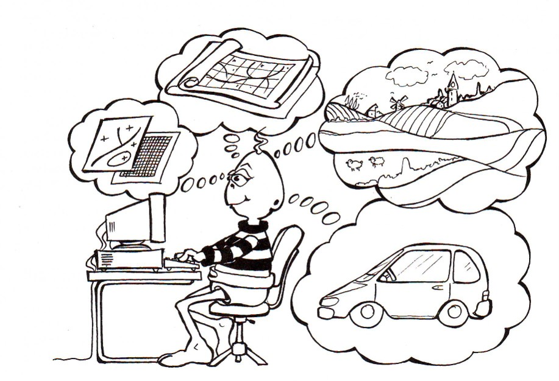
]

---
### Geospatial Data Modelling Process

.center[
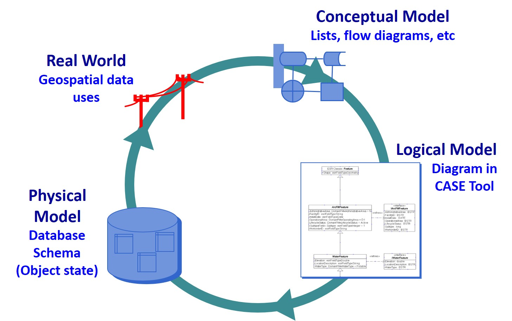
]

---
### Levels of Data Model Abstraction

.center[
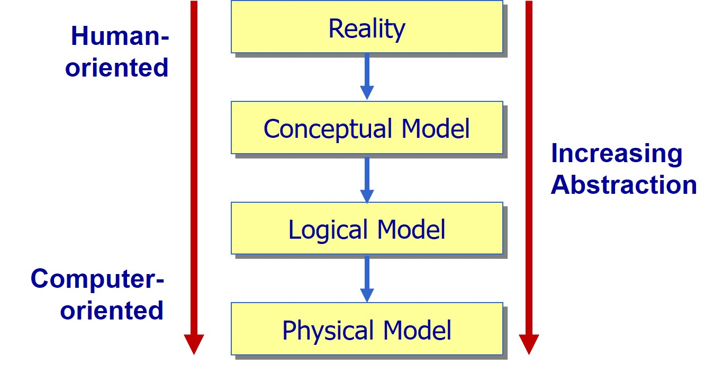
]

---
### Why should we worry about?

.center[
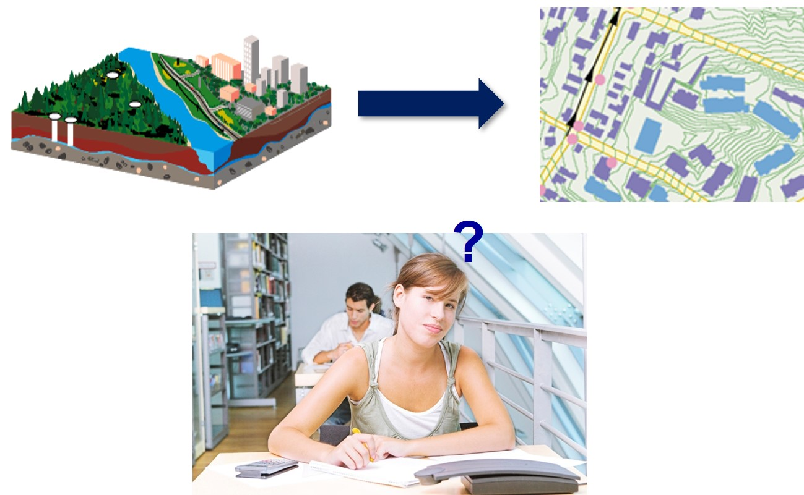
]

---
### What to represent?

.large[
The world is infinitely complex, but computer systems are finite.  
- Representations must somehow limit the amount of details captured.
] 

.center[
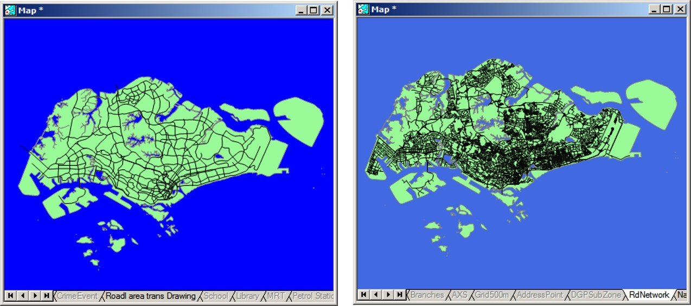
]

---
###  At what level of generalisation? 
.center[
### Little White Lies and Lots of Them

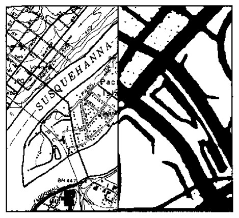
]

---
###  How to represent? 

+ A MRT station can be represented by a point feature or a polygon feature.

.center[
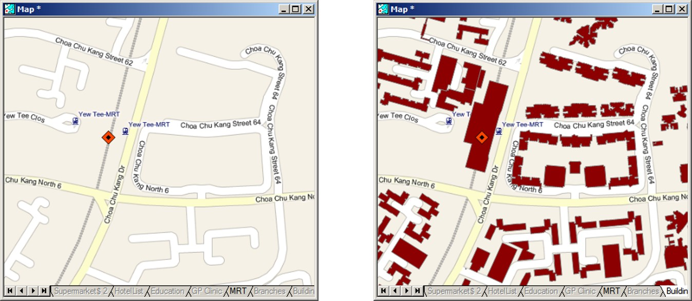
]

---
###  How to capture multiple contexts? 

+ Geographical data link place, time, and attribute.
.center[
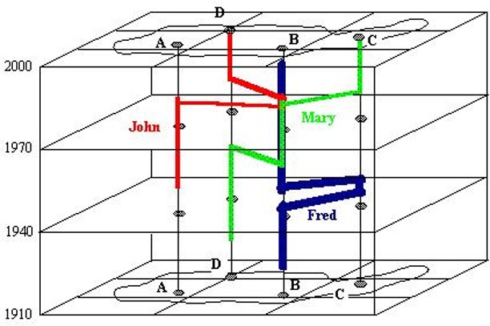
]

---
### Accuracy and Precision 

.pull-left[
+ Accuracy  can be defined as the degree or closeness to which the information on a map matches the values in the real world.
    + In GIS data, accuracy can be referred to a geographic position, but it can be referred also to attribute, or conceptual accuracy .
+ Precision refers how exact is the description of data.
    + Precise data may be inaccurate, because it may be exactly described but inaccurately gathered. (Maybe the surveyor made a mistake, or the data was recorded wrongly into the database).
]

.pull-right[
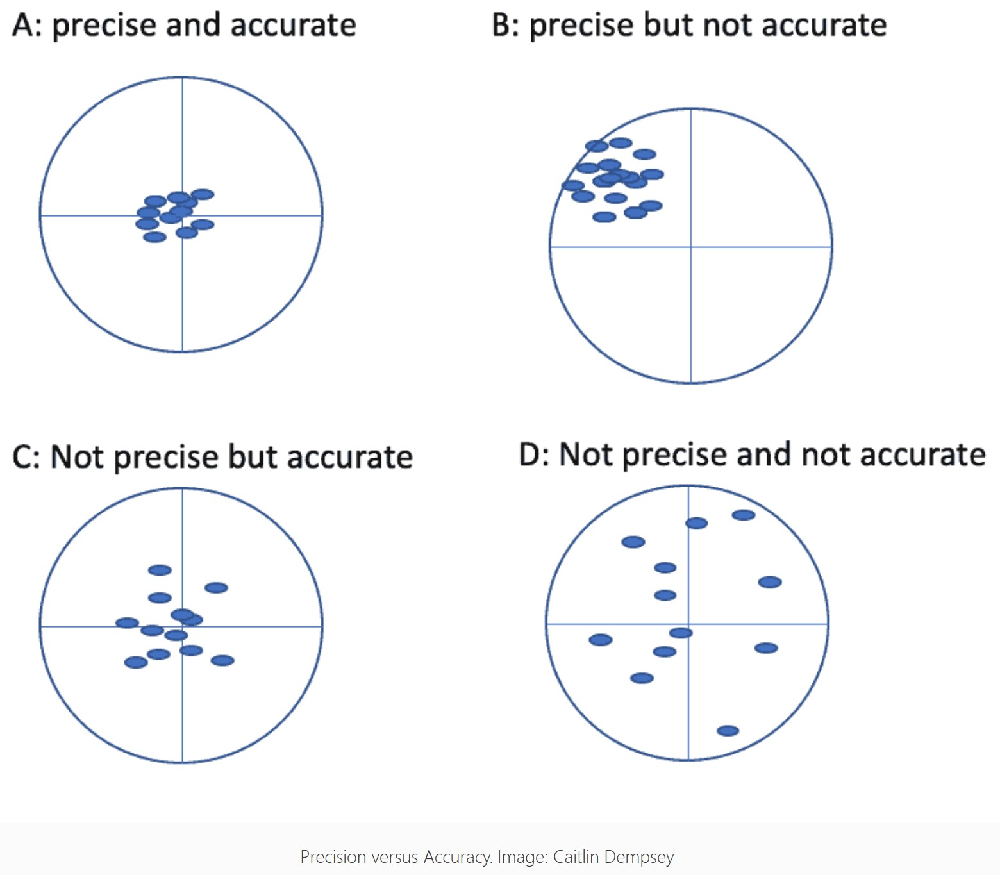
]

---
##  Motivation of topological data models 

+ Topological errors

.center[
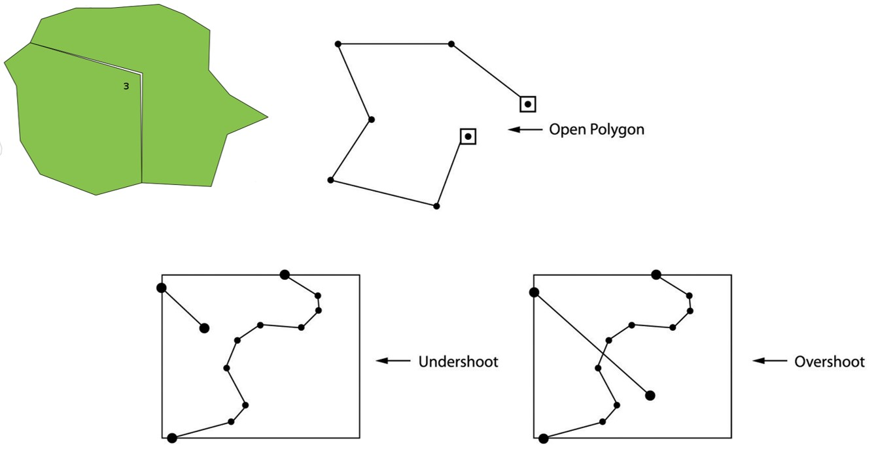
]

---
###  What is Topological Errors? 

+ Topological errors occur often during the digitizing process. Errors of the operator may result in polygon knots, and loops, and there may be some errors associated with damaged source maps as well.

.center[
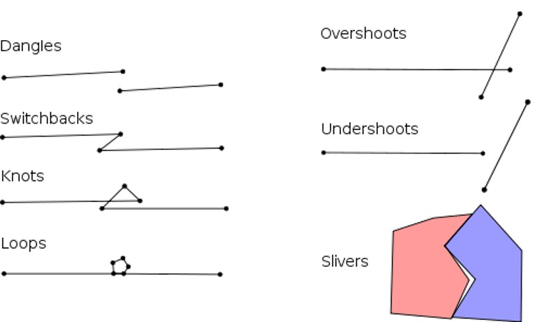
]

---
###  Topological data models 

+ Data redundancy
.center[
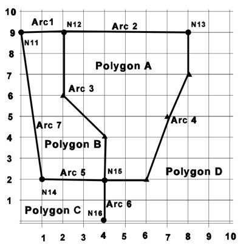
]

---
###  Intelligence GIS Data Model: Topology 

+ It manages spatial relationships by representing spatial objects (point, line, and area features) as an underlying graph of topological primitives?nodes, faces, and edges.

.center[
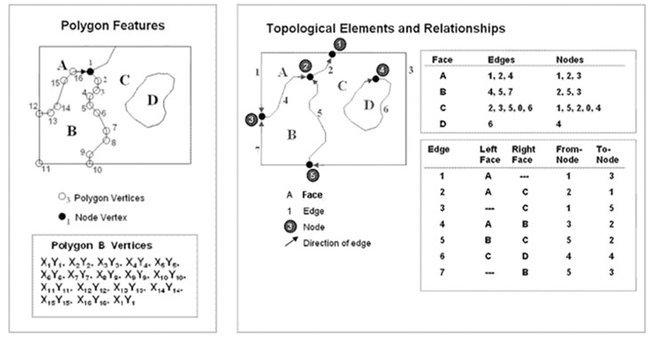
]

.small[
Source: [ArcGIS Topology basics](https://desktop.arcgis.com/en/arcmap/10.3/manage-data/topologies/topology-basics.htm) 
]

---
###  Topological Data Models: ArcGIS Coverage 

+ A coverage is a georelational data model that stores vector data and their topology.

.center[
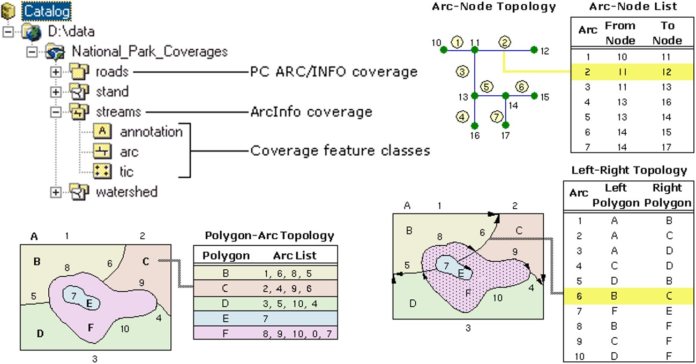
]

.small[Reference: [What is a coverage?](https://desktop.arcgis.com/en/arcmap/10.3/manage-data/coverages/what-is-a-coverage.htm)
] 

---
###  Rule-based Topology 

+ Topology rules define the permissible spatial relationships between features.
	+ The rules you define for a topology control the relationships between features within a feature class, between features in different feature classes, or between subtypes of features.

.center[
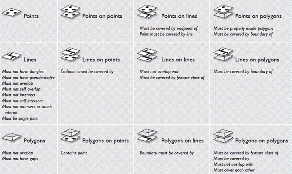
]	
	
.small[	
Source: [Topology in ArcGIS](https://desktop.arcgis.com/en/arcmap/10.3/manage-data/topologies/topology-in-arcgis.htm)]

---
###  Rule-based Topology: ArcGIS Geodatabase 

.pull-left[
+ The geodatabase is a collection of geographic datasets of various types used in ArcGIS and managed in either a file folder or a relational database.
	+ It is the native data source for ArcGIS and is used for editing and data automation in ArcGIS.
+ For more information, visit [What is a geodatabase?](https://pro.arcgis.com/en/pro-app/2.7/help/data/geodatabases/overview/what-is-a-geodatabase-.htm)
]

.pull-right[
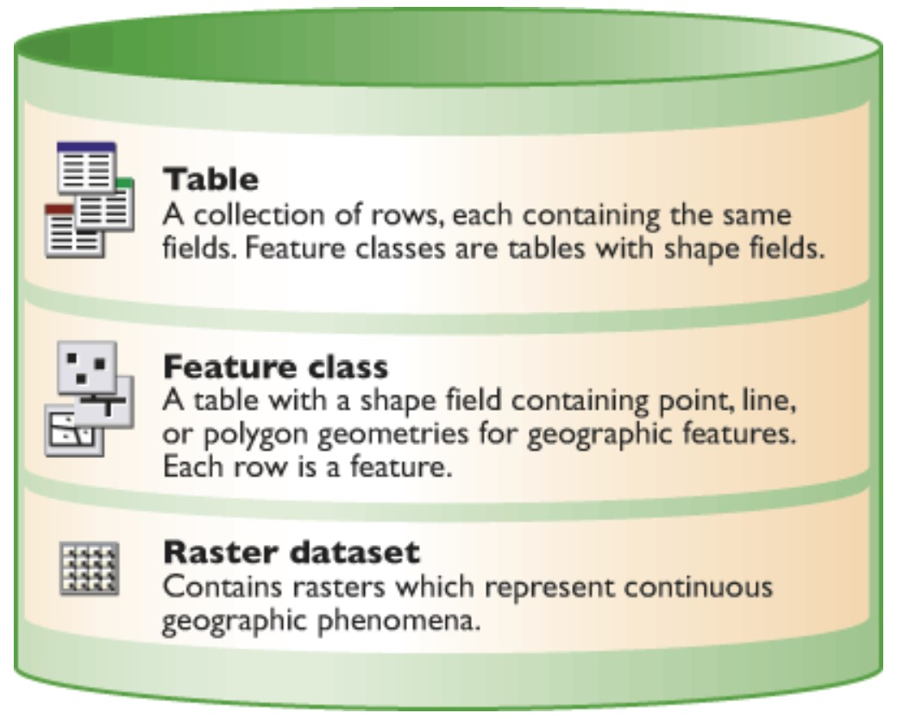
]

---
##  Issue of Multi-user editing: Transactions 

.pull-left[
.large[
+ A transaction is a group of changes that are made to a database as a coherent group.  All the changes that form part of a transaction are either committed or the database is rolled back to its initial state
	+ The solutions: pessimistic locking vs optimistic versioning
]]


.pull-right[
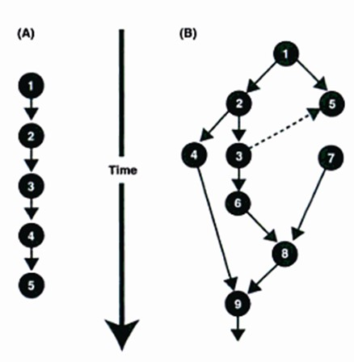

.small[
Source: Longley, P.A. et. Al. (2005) 2 nd Edition, Geographic Information Systems and Science, John Wiley & Sons.]
]

---
###  Versioning 

.pull-left[
.large[
+ Creating multiple versions for editing and resolving conflict.
]]

.pull-right[
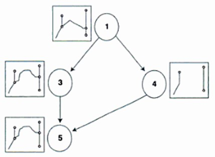

.small[
Source: Longley, P.A. et. Al. (2005) 2 nd Edition, Geographic Information Systems and Science, John Wiley & Sons.
]]


---
###  Spatial Indexing 

.pull-left[
.large[
+ Spatial indexes are used by spatial databases to optimise spatial queries.
	+ Indexes used by non-spatial databases cannot effectively handle features such as how far two points differ and whether points fall within a spatial area of interest.
]]	

.pull-right[
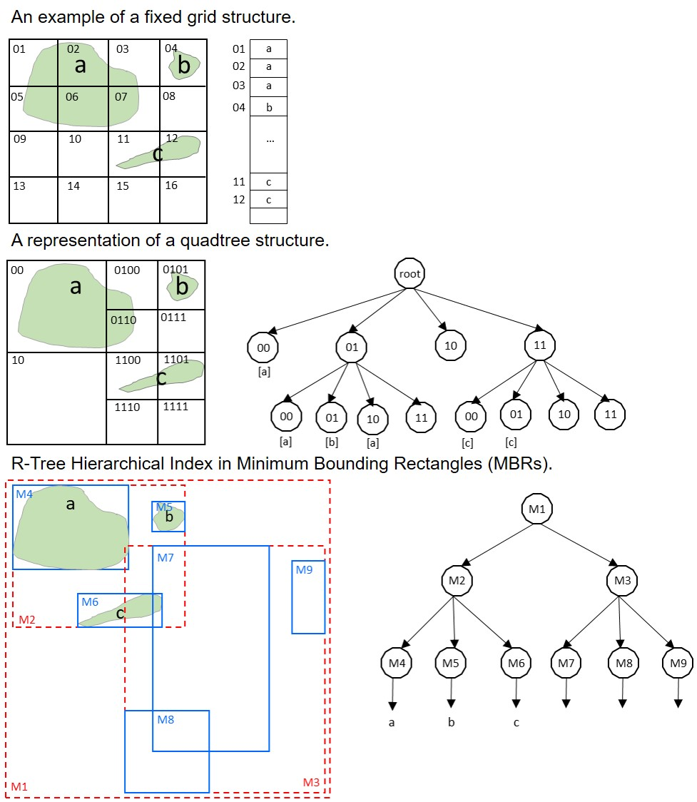

To learn more about Spatial Indexing, refer [DM-66 - Spatial Indexing](https://gistbok.ucgis.org/bok-topics/spatial-indexing)
]

---
##  Geospatial Data Repositories 

.vlarge[
+ File-based
	+ Vector format
	+ Raster format
	+ Database management systems
+ Middleware
+ Geospatial extension
	+ Commercial
	+ Open source
]


---
###  About SpatiaLite 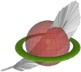

+ An open source library intended to extend the SQLite core to support fully fledged Spatial SQL capabilities.
	+ SQLite is intrinsically simple and lightweight:
		+ a single lightweight library implementing the full SQL engine
		+ standard SQL implementation: almost complete SQL-92
		+ no complex client/server architecture
		+ a whole database simply corresponds to a single monolithic file (no size limits)
		+ any DB-file can be safely exchanged across different platforms, because the internal architecture is universally portable
		+ no installation, no configuration
+ SpatiaLite is licensed under the MPL tri-license terms. you are free to choose the best-fit license between:
	+ the MPL 1.1
	+ the GPL v2.0 or any subsequent version
	+ the LGPL v2.1 or any subsequent version
	+ For more information
	+ [Homepage](https://www.gaia-gis.it/fossil/libspatialite/index)

---
###  GeoPackage 

.large[
+ An open, non-proprietary, platform-independent and standards-based data format for geographic information system implemented as a SQLite database container.
+ To learn more about geopackage, visit [geopackage homepage](https://www.geopackage.org/) and at [wiki](https://en.wikipedia.org/wiki/GeoPackage).  
]

.center[
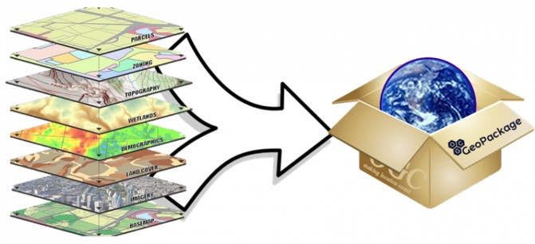
]

---
###  Getting to know GeoPackage 

.large[
+ Use open source SQLite as the storage engine, more reliable and platform independent than MDB, but with the advantage of easy, language independent, read/write access via SQL.
	+ The SQLite engine is open source and multi-platform, so no Windows dependency.
	+ The SQLite engine stores data in a single file, so no need to zip/unzip all the time .
	+ Leverage existing OGC standards like the WKT standard for spatial reference systems, and the WKB standard for binary geometry representation.
+ Document the format and include an extension mechanism so it can evolve over time and so third parties can experiment with new extensions.
+ To learn more, read [Getting Started With GeoPackage](http://www.geopackage.org/guidance/getting-started.html) 
]

---
###  Enterprise Geographic DBMS 

.large[
+ Provide spatial database management functions on top of conventional database management systems
	+ For example IBM DB2 Spatial Extender, Informix Spatial Datablade
]

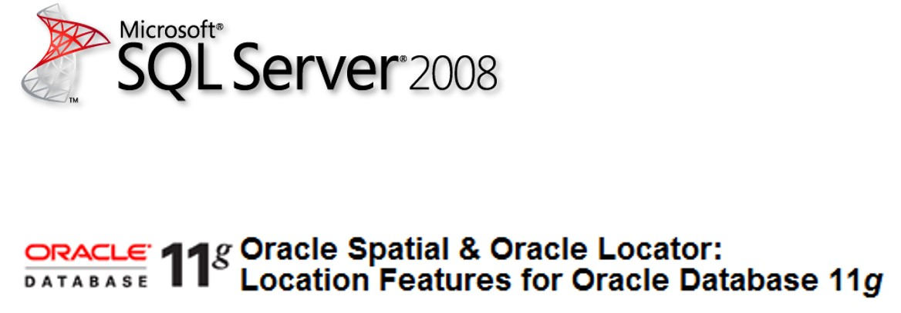

---
###  Geographic Middleware Extensions 

.large[
+ Middle-tier application server that extend the DBMS software kernel to manage geographic data
	+ For example: Geomedia Transaction Server, SpatialWare from MapInfo, Enterprise Server from Manifold]

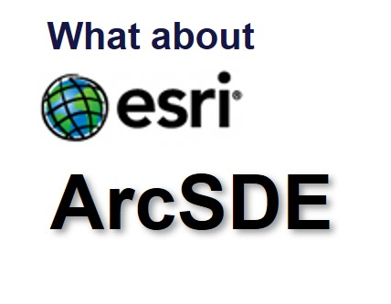

---
###  About PostGIS 

.pull-left[
.large[
+ [**PostGIS**](http://postgis.net/) spatially enables the [**PostgreSQL**](https://www.postgresql.org/) open source relational database. The database can then be used to store and query geospatial data (vector and raster).
+ To learn more, visit [Introduction to PostGIS](https://postgis.net/workshops/postgis-intro/introduction.html) and [wiki](https://en.wikipedia.org/wiki/PostGIS).
]]

.pull-right[
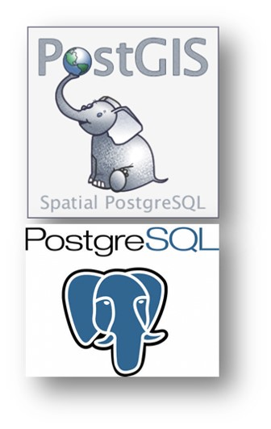
]

---
###  Main Features of PostGIS 

.large[
+ High performance, robust spatial database built on PostgreSQL
	+ Simple Features for SQL (SFSQL) compliance
	+ Proven reliability and transactional integrity (ACID compliance)
	+ Provides spatial representations of geometry types both vector (points , lines, polygons) and raster.
	+ Support for common and advanced spatial operations such as geometry creation and conversion, reprojection , buffer, convex hull, generalization, union, and more
	+ Geodetic support for measurements across the globe/dateline
	+ Command-line and graphical tools for flexible management
Yes, PostGIS is on its way!
+ To learn more, read [Why should you care about PostGIS? — A gentle introduction to spatial databases](https://medium.com/@tjukanov/why-should-you-care-about-postgis-a-gentle-introduction-to-spatial-databases-9eccd26bc42b) and [PostGIS Manual](https://postgis.net/docs/).

]

---
###  Who Use PostGIS 

.vlarge[
+ Proprietary Desktop: ArcGIS, Manifold, Safe FME, CadCorp SIS, MapInfo Professional
	+ Proprietary Server: ArcServer , Ionic Enterprise, MapDotNet Server
	+ Open Source Server: GeoServer , Mapserver , Mapnik , DeeGree , SharpMap
	+ Open Source Desktop: GRASS, QGIS, uDig , gvSIG
]

---
###  Carto: Database on the cloud 

.large[
+ [Carto](https://carto.com/) is a Software as a Service (SaaS) cloud computing platform that provides GIS and web mapping tools in the browser. (Formally know as CartoDB )
	+ Carto was built on open source software including PostGIS and PostgreSQL .
	+ The tool uses JavaScript extensively, including use in the front end web application, back end Node.js based APIs, and for the client libraries.
+ To learn more, visit [wiki](https://en.wikipedia.org/wiki/CartoDB)	and [How CARTO works](https://carto.com/help/getting-started/how-carto-works/)
]

---
##  Meta data: Data about the data 

.large[
+ Identification information
	+ Data quality information
	+ Spatial data organisation information
	+ Spatial reference information
	+ Entity and attribute information
	+ Distribution information
	+ Meta data reference information
	+ Citation information
	+ Time period information
	+ Contact information
]

---
###  An example of metadata 

.pull-left[
.large[
+ Metadata is information about data. Similar to a library catalog record, metadata records document the who, what, when, where, how, and why of a data resource. 
+ Geospatial metadata describes maps, Geographic Information Systems (GIS) files, imagery, and other location-based data resources. 
+ To learn more, visit [Geospatial Metadata](https://www.fgdc.gov/metadata)]
]

.pull-right[
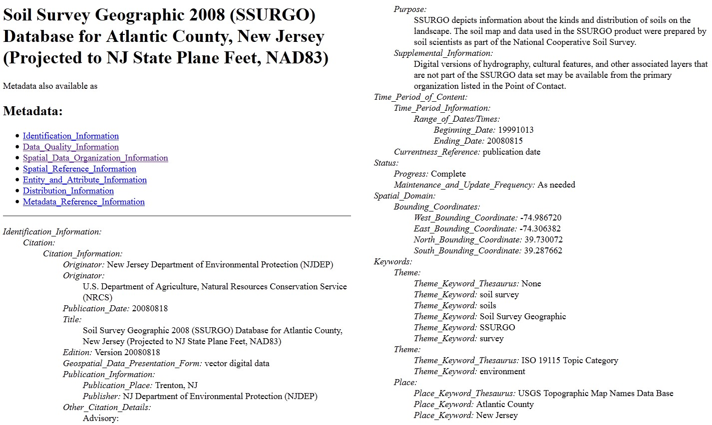
]


```{r echo=FALSE, eval=FALSE}
library(pagedown)
library(pdftools)
pagedown::chrome_print("Lesson03.html")
pages <- pdftools::pdf_info("Lesson03.pdf")$pages
filenames <- sprintf("slides/slides_%02d.png", 1:pages)
dir.create("slides")
pdftools::pdf_convert("Lesson03.pdf", filenames = filenames)
slide_images <- glue::glue(
  "
---
{{width=100%, height=100%}}
")
slide_images <- paste(slide_images, collapse = "\n")
md <- glue::glue(
  "
  ---
  output: powerpoint_presentation
  ---
  {slide_images}
  "
)
cat(md, file = "slides_powerpoint.Rmd")
```


