```{r setup, include=FALSE}
options(htmltools.dir.version = FALSE)
knitr::opts_chunk$set(fig.retina=3,
                      cache = FALSE,
                      echo = TRUE,
                      message = FALSE, 
                      warning = FALSE)
```

# Content

.vlarge[
+ Identifying and Measurment
+ Spatial Query
+ Geoprocessing Techniques
  + CLIP, DISSOLVE, APPEND, SPLIT, and ERASE
+ Proximity Analysis
  + Buffering
  + Thiessen Polygon
+ Topological Overlaying
]


---
## What will you learn from this course?

.large[
+ Identify or measure geographic data
+ Search geographical features by attributes
+ Transform GIS data using geoprocessing tools such as clip, dissolve, and merge
+ Answer location related questions using vector-based GIS analysis functions such as spatial query, buffering, topology overlay, and spatial overlay
+ Perform specialised spatial analysis using mathematical algorithms such as centroid, convex hull, voronoi, and districting.   
]

---
## GIS Analysis or the end of Mathematics?

.pull-left[
.vlarge[
+ Identifying & Measuring
+ Selection
+ Geoprocessing 
+ Buffering
+ Overlay
]]

.pull-right[
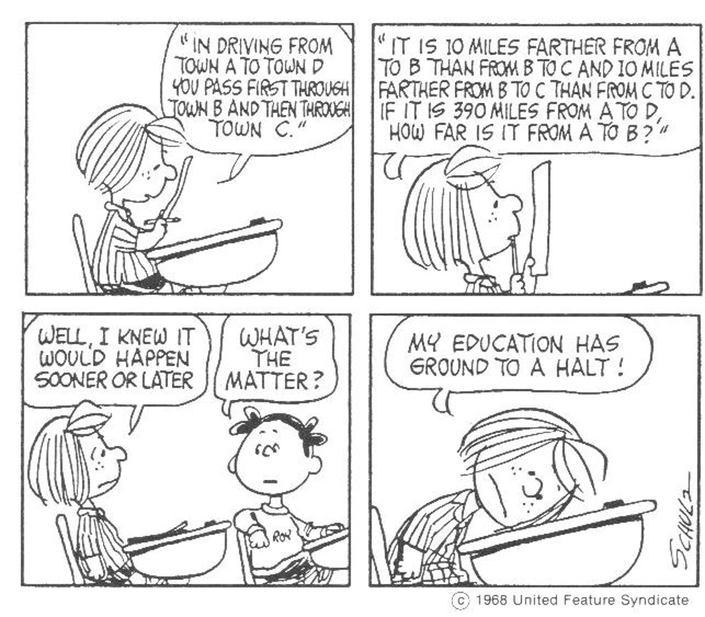
]

---
### Identifying

.large[
A GIS provides interactive identify tool to retrieve the underlying information of a geospatial feature.]

.center[
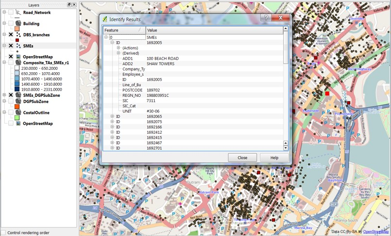
]

---
### Measuring

.large[
A GIS provides interactive distance, area and angle measurements]

.center[
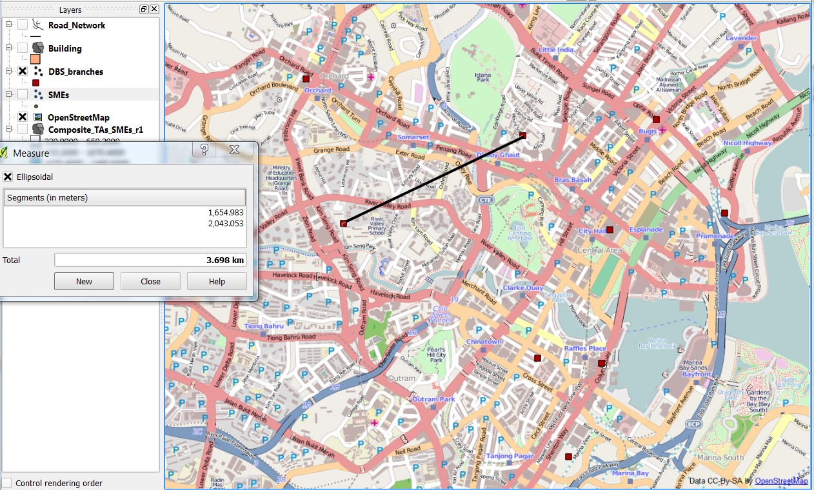
]

---
## GIS Analysis or the end of Mathematics?

.pull-left[
.vlarge[
+ Identifying & Measuring
+ Selection 
+ Geoprocessing 
+ Buffering
+ Overlay
]]

.pull-right[

]

---
### Selection by feature

.vlarge[A GIS provides functions to allow user to interactive select a feature or a collection of features.]

.center[
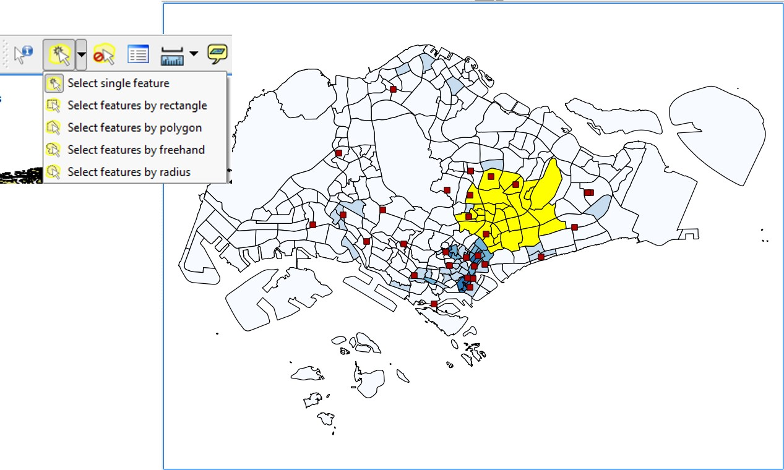
]

???
The easiest way to search and query spatial data in a GIS.
Selecting features highlight those attributes of interest, both on the screen and in the attribute table, for subsequent display and analysis.
Different approaches can be used:
Selection tools
Query by attribute(s)
Query by geography

---
### Selection using Query SQL

.pull-left[
Provides fast selection in tables, drawings, and drawing layers in maps using “one line” simple queries using data field associated with objects

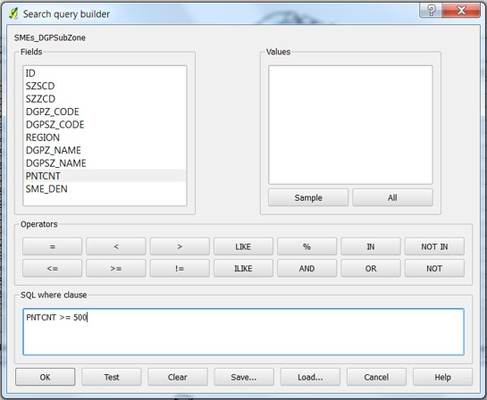
]

.pull-right[
+ SQL query – table view

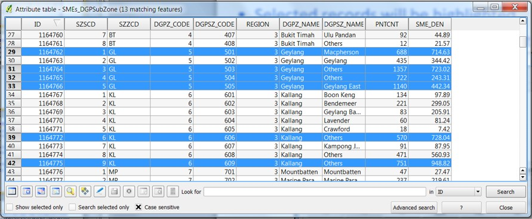

+ SQL query – map view

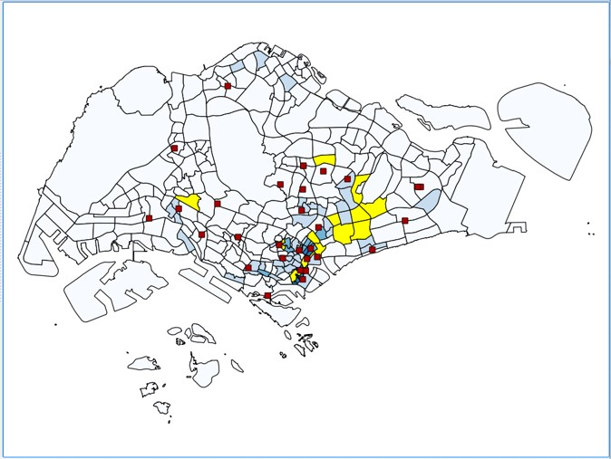
]

---
## GIS Analysis or the end of Mathematics?

.pull-left[
.vlarge[
+ Identifying & Measuring
+ Selection
+ Geoprocessing 
+ Buffering
+ Overlay
]]

.pull-right[

]

---
### Spatial Query – Query by geography

.large[
Selection base of spatial relationship.  For example, select all SMEs in Sungei Kedut.
]

.center[
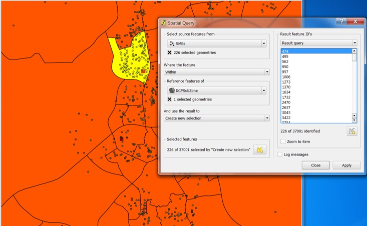
]

???
Spatial query is the process of selecting features based on their geographic relationship, or spatial relationship, to other features. 

---
### Spatial Query - Intersect

.pull-left[
.large[
- This often used spatial query technique selects all features in the target layer that share a common locale with the source layer.
]]

.pull-right[
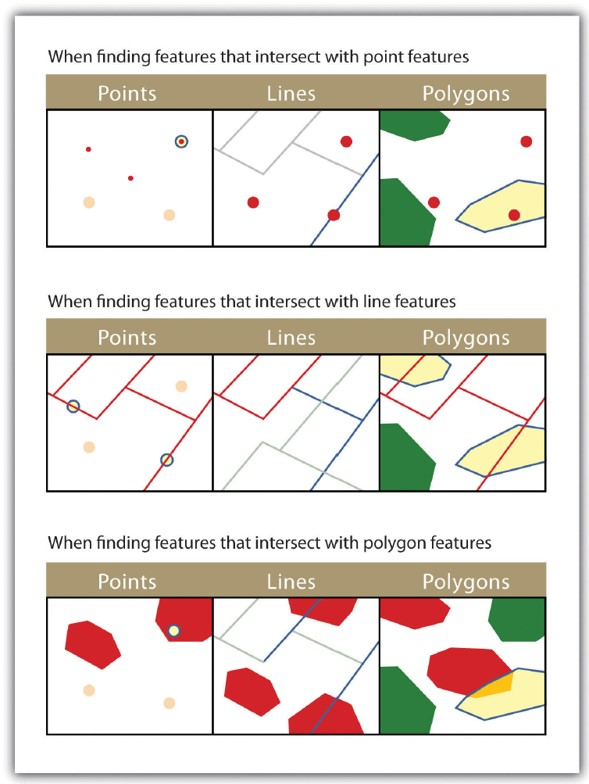
]

---
### Spatial Query – Are Within A Distance Of

.pull-left[
.large[
+ This technique requires the user to specify some distance value, which is then used to buffer the source layer.
]]

.pull-right[
.large[
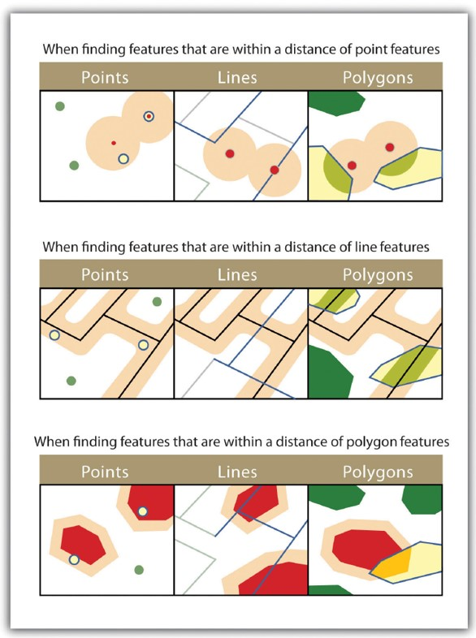
]]

---
### Spatial Query – Completely Contain

.large[
+ This spatial query technique returns those features that are entirely within the source layer.  Features with coincident boundaries are not selected by this query.
+ It allows for points, lines, or polygon as the target layer, but only polygons can be used as a source layer.
]

.center[
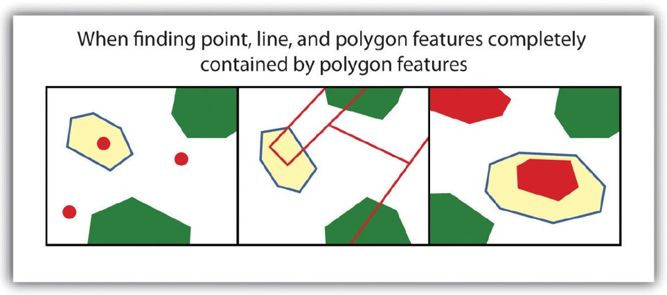
]

---
### Spatial Query – Are Completely Within

.large[
+ This query selects those features in the target whose entire spatial extent occurs within the geometry of the source layer.
+ It allows for points, lines, or polygon as the target layer, but only polygons can be used as a source layer.
]

.center[
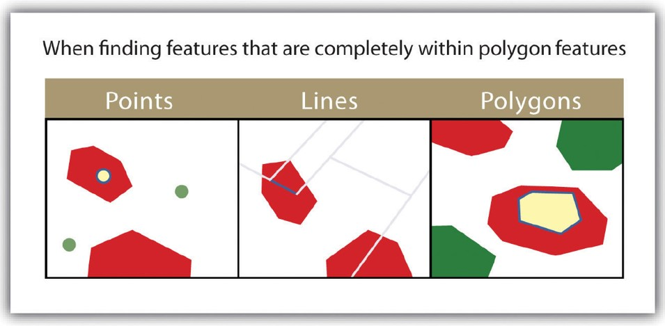
]

---
### Spatial Query – Have Their Centre In

.pull-left[
.large[
+ This technique selects target features whose center, or centroid, is located within the boundary of the source feature dataset.
+ It allows points, lines, or polygon layers to be used as both the source and target layers.
]]

.pull-right[
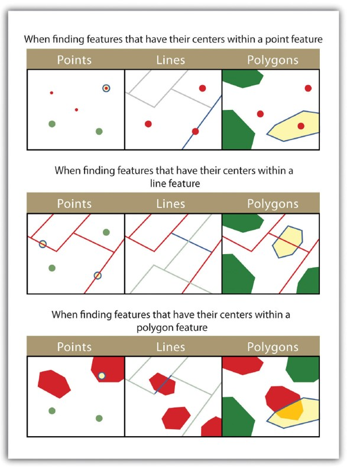
]

---
### Spatial Query – Share A Line Segment

.pull-left[
.large[
+ This spatial query selects target features whose boundary geometries share a minimum of two adjacent vertices with the source layer.
+ It allows for line or polygon layers to be used for either of the source and target layers.
]]

.pull-right[
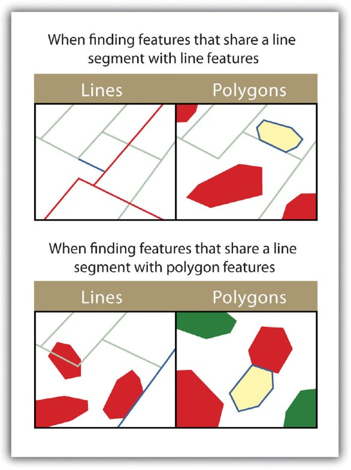
]

---
### Spatial Query – Touch The Boundary Of 

.pull-left[
.large[
+ This methodology is similar to the INTERSECT spatial query; however, it selects line and polygon features that share a common boundary with target layer.
+ It allows for line or polygon layers to be used as both the source and target layers.
]]

.pull-right[
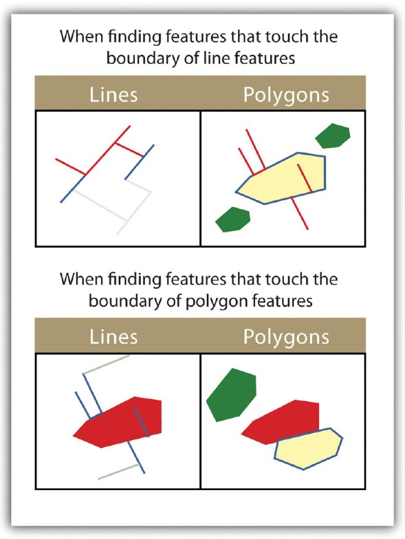
]

---
### Spatial Query – Are Identical To

.large[
+ This spatial query returns features that have the exact same geographic location.  
+ It can be used on points, lines, or polygons, but the target layer type must be the same as the source layer type.]

.center[
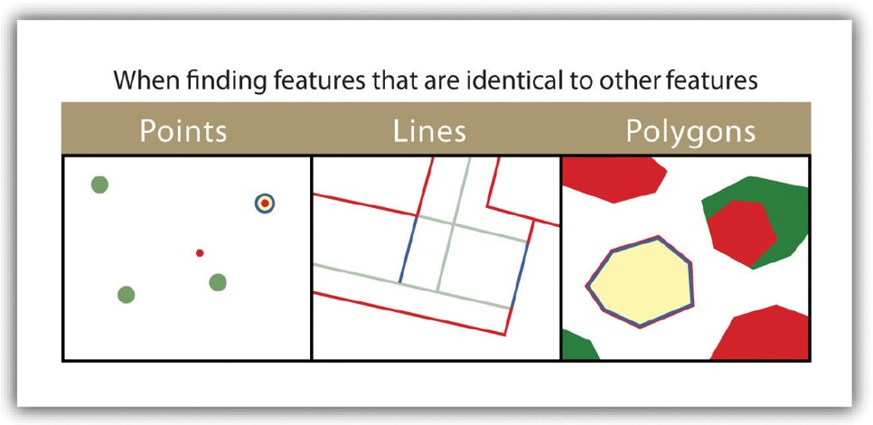
]

---
### Spatial Query – Are Crossed By the Outline Of

.pull-left[
.large[
+ This selection criteria returns features that share a single vertex but not an entire line segment.
+ It allows for line or polygon layers to be used as both source and target layers.
]]

.pull-right[
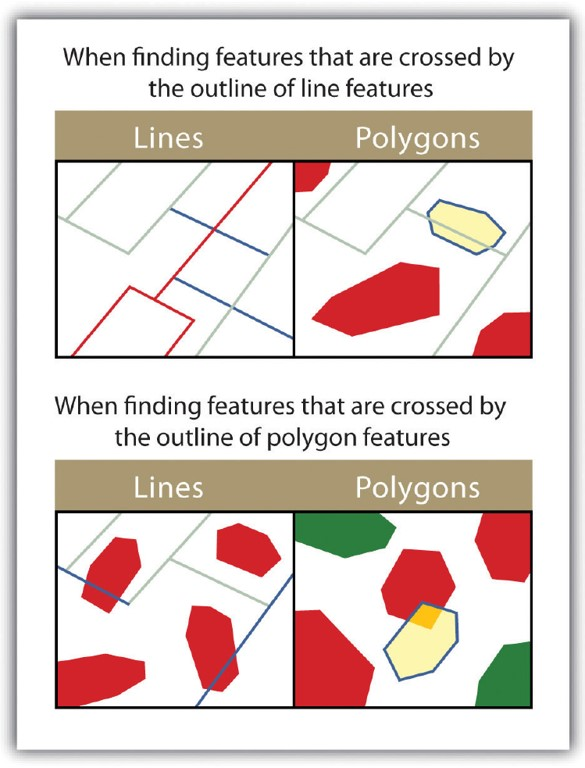
]

---
### Spatial Query - Contain

.pull-left[
.large[
+ This method is similar to the COMPLETELY CONTAIN spatial query; however, features in the target layer will be selected even if the boundaries overlap.
+ It allows for point, line, or polygon features in the target layer when points are used as a source; when line and polygon target layers with a line source; and when only polygon target layers with a polygon source.
]]

.pull-right[
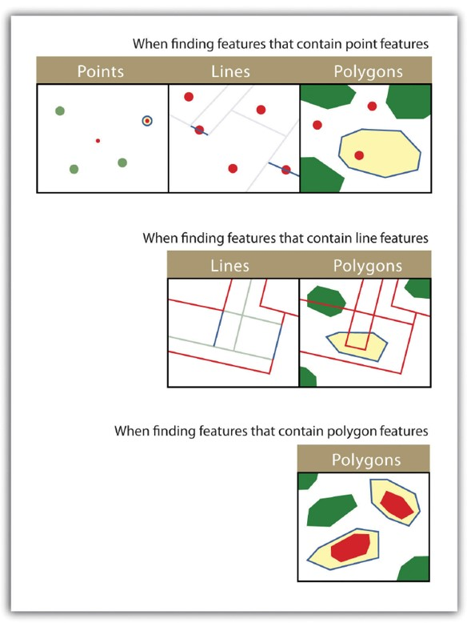
]

---
### Spatial Query – Are Contained By

.pull-left[
.large[
+ This method is similar to the ARE COMPLETELY WITHIN spatial query; however, features in the target layer will be selected even if the boundaries overlap.
+ It allows for point, line, or polygon features in the target layer when polygons are used as a source; when point and line target layers with a line source; and when only point target layers with a point source.]]

.pull-right[
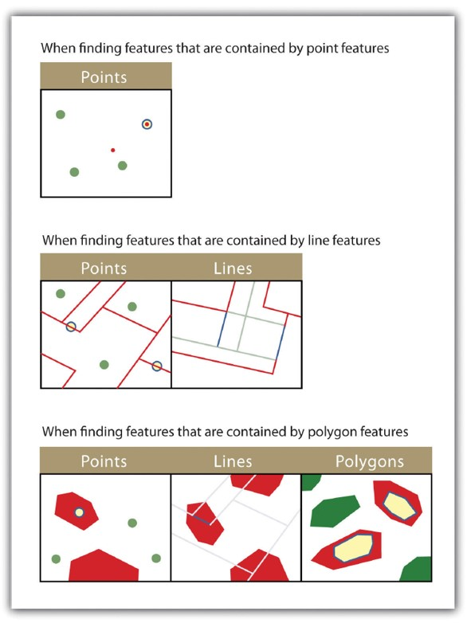
]

---
## Geoprocessing functions

.pull-left[
.large[
A collection of GIS functions for transforming the geometrics of GIS data

+ CLIP
+ DISSOLVE
+ APPEND
+ SPLIT
+ ERASE
etc
]]

---
### Geoprocessing function: Clip

.large[
+ Clip creates a new layer that includes only those features of the input layer that fall within the area extent of the clip layer.
]

.center[
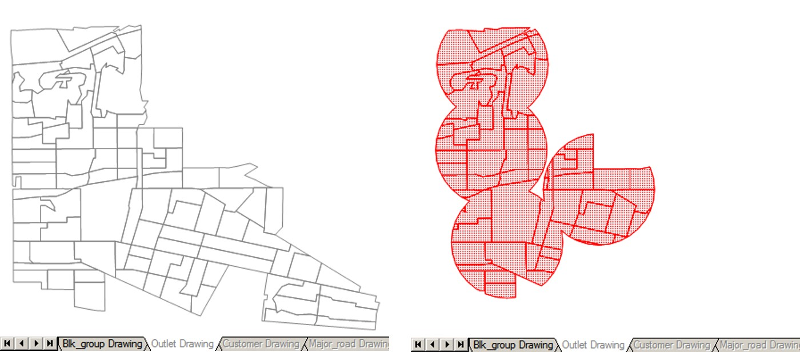
]

---
### Geoprocessing function: Erase

.large[
+ Erase removes from the input layers those features that fall within the area extent of the erase layer.
]

.center[
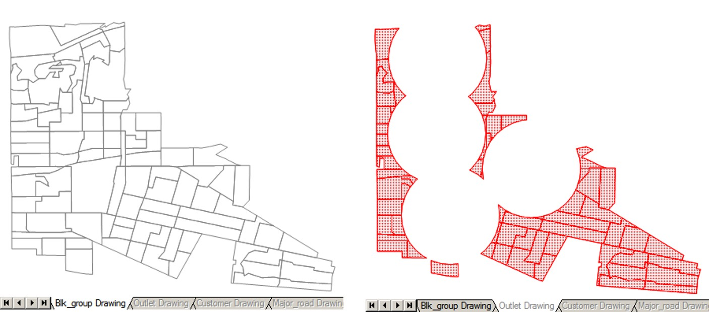
]

---
### Geoprocessing function: Dissolve

.large[
+ Dissolve aggregates features that have the same attribute value or values.
+ This function needs only one input GIS data lasyer.]

.center[
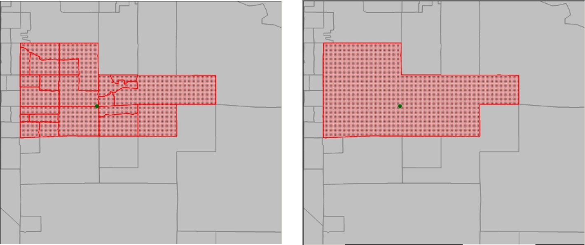
]

---
### Geoprocessing function: Append

.large[
+ Append creates a new layer by piecing together two or more layers.
+ The output can then be used as a single layer for data query or display. 
]

.center[
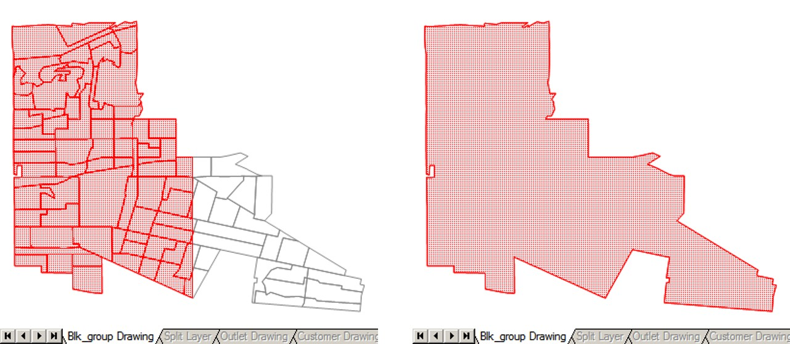
]

---
### Geoprocessing function: Split

.large[
+ Split divides the input layer into two or more layers.
+ A split layer, which shows area subunits, is used as the template for dividing the input layer.
]

.center[
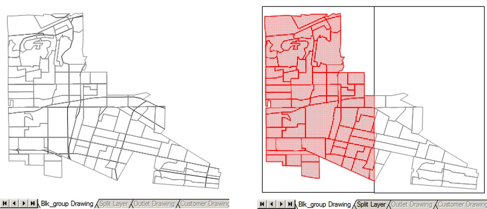
]

---
## Proximity Analysis: Finding what's nearby

.pull-left[
.large[
+ One of the most powerful operations of a GIS.
+ Many important questions hinge on proximity, the distance between features of interest.
    + How closed are secondary schools to alcohol and tobacco stores?
    + What neighbourhood are far from NTUC Fairprice?
    + Which buildings will be affected by the construction of Thomson-East Coast Line?
]]

--
.pull-right[
.large[
+ Based on the concept of proximity, **buffering** creates two areas: one area that is within a specified distance of selected features and the other area that is beyond.
+ The area that is within the specified distance is called **buffer zone**.
+ Features for buffering may be points, lines, or areas.
]]

---
### Buffering

.pull-left[
.large[
**Buffering a point layer**

+ Outlets are point objects.  The 1km buffer around outlets are area objects.] 

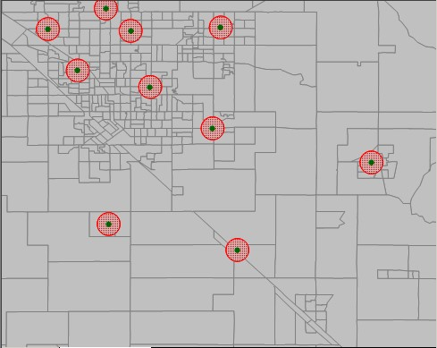
]

--
.pull-right[
.large[
**Buffering a line layer**

+ Highway is a line object and the output buffer is a polygon object.] 

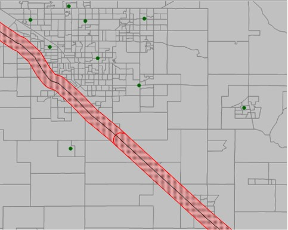
]

---
### Buffering a polygon layer

.pull-left[
.large[
**Buffering outward a polygon layer**

+ SCIS building is a polygon object and the output buffer is also a polygon object 
.] 

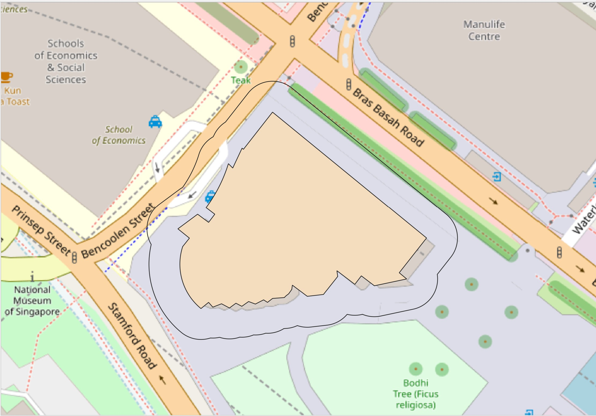
]

--
.pull-right[
.large[
**Buffer inward a polygon feature**

+ If you are buffering a polygon feature, you can choose to create the buffers that are inside the polygon(s).] 

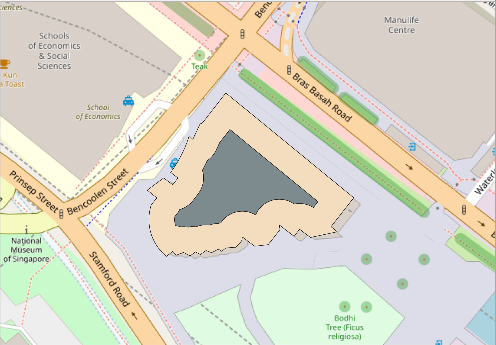
]

---
### Buffering a polygon layer

.pull-left[
.large[
**Buffers without boundaries dissolved**

+ These buffers were created by keeping the boundaries between buffers.] 

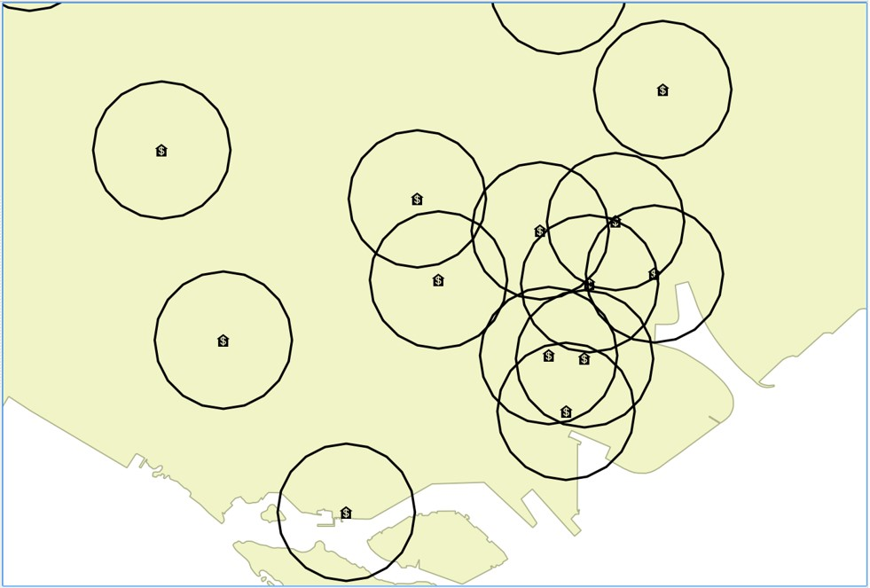
]

--
.pull-right[
.large[
**Buffers with boundaries dissolved**

+ These buffers were created by dissolving the boundaries.] 

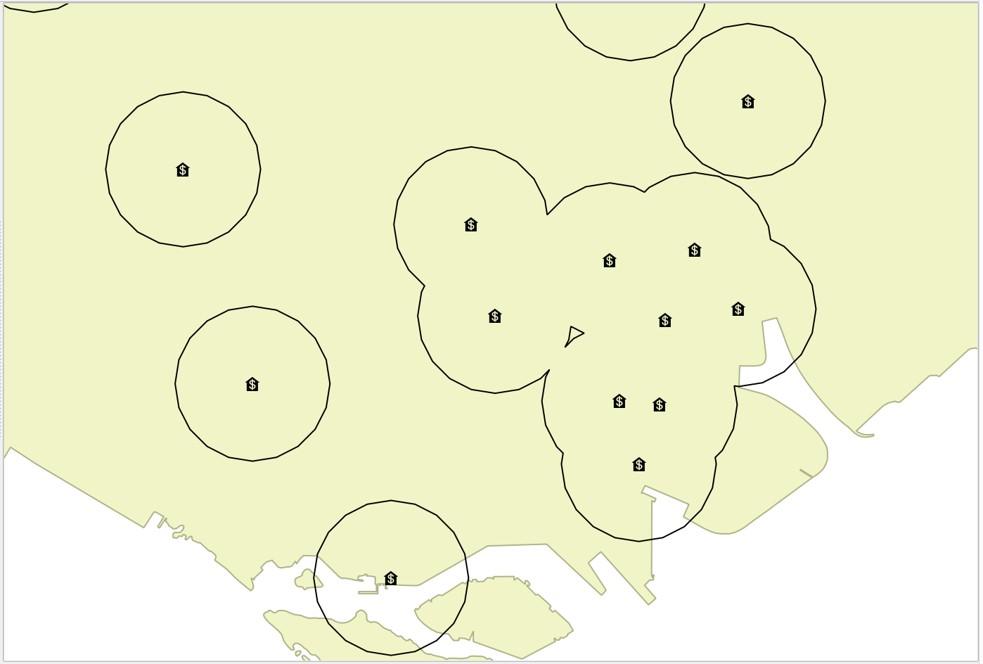
]

---
### Buffering a polygon layer

.pull-left[
.large[
**Buffers with different distances**

+ Width of the buffer can be determined by an attribute of the object.] 

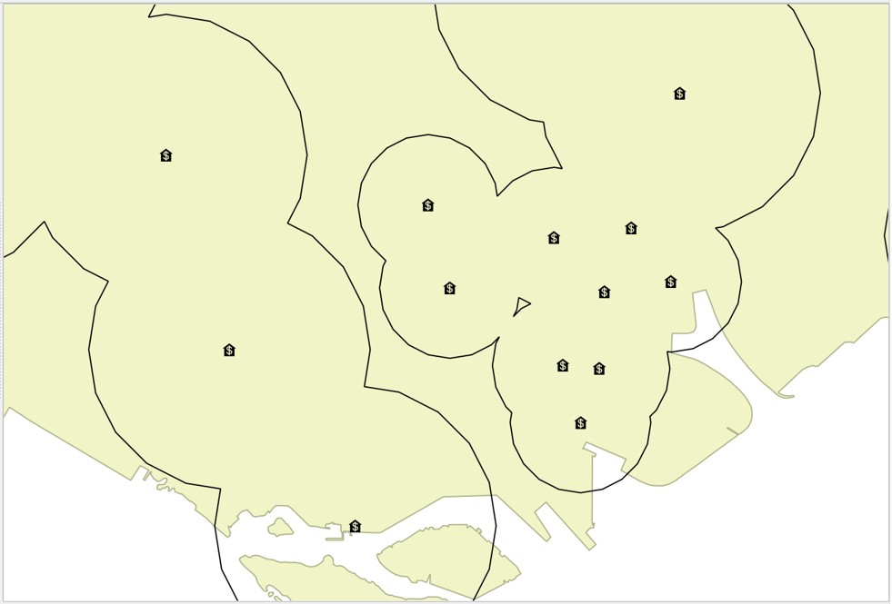
]

--
.pull-right[
.large[
**Nested buffers**

+ A nested buffers of 500m, 1000, and 1500 around a MRT station
] 

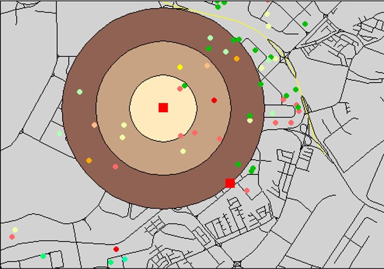
]

---
## GIS Analysis or the end of Mathematics?

.pull-left[
.vlarge[
+ Identifying & Measuring
+ Selection
+ Geoprocessing 
+ Buffering
+ Overlay
]]

.pull-right[

]

---
### Map Analysis Technique: Manual Overlaying

.large[
One of the oldest map analysis method popularlise by Ian McHarg
]

.center[
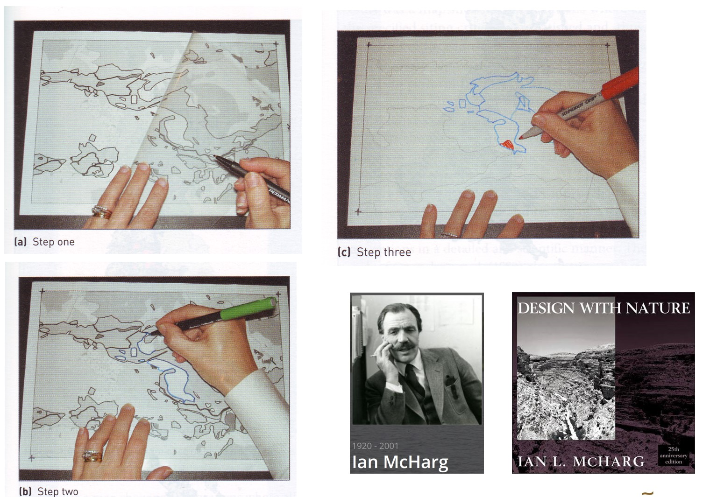
]


.small[Source: [Ian McHarg, Overlay Maps and the Evaluation of Social and Environmental Costs of Land Use Change.](https://escholarship.org/uc/item/5x78n2gn) ]

---
### What is Topological Overlay?

.large[
+ A topology overlay operation combines the geometries and attributes of two feature layers to create the output.
+ All overlays require two layers: a GIS data layer that may contain polygons, lines and points and an overlay layer that must contain **polygons**.
  + The polygons in the overlay drawing guide the operation of the chosen overlay function to create a new, result layer. 
+ Feature layers to be overlaid must be **spatially registered** and based on the **same coordinate system**. 
]

---
### Point-in-polygon Overlay

.pull-left[
.large[
+ Overlay point objects on areas, compute **is contained in** relationship. 
+ Result is a new attribute for each point 
]]

.pull-right[
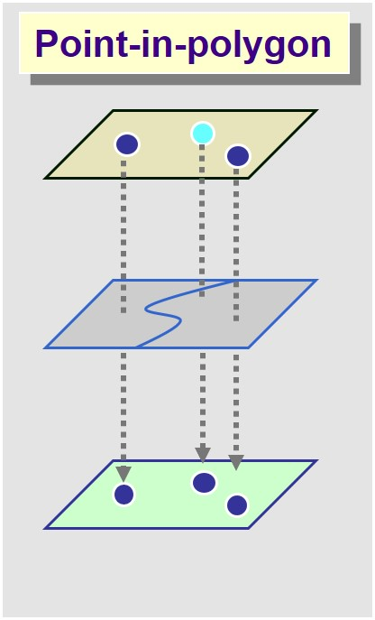
]
---
### Line-in-polygon Overlay

.pull-left[
.large[
+ Overlay line objects on polygon objects, compute **is contained in** relationship. 
+ Lines are broken at each polygon object boundary 
+ Number of output lines is greater than number of input lines. 
+ Containing polygon is new attribute of each output line. 
]]

.pull-right[
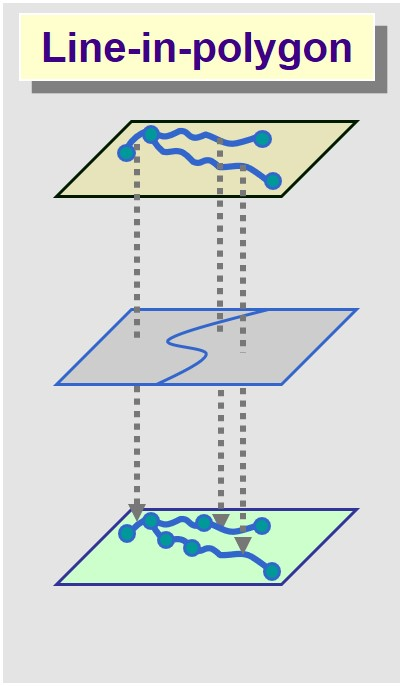
]

---
### Polygon-on-polygon Overlay

.pull-left[
.large[
+ Overlay two layers of polygon objects. 
+ Boundaries are broken at each intersection. 
+ Number of output polygons likely greater than the total number of input polygons. 
+ After overlay we can recreate either of the input layers by dissolving and merging based on the attributes contributed by the input layer.
]]

.pull-right[
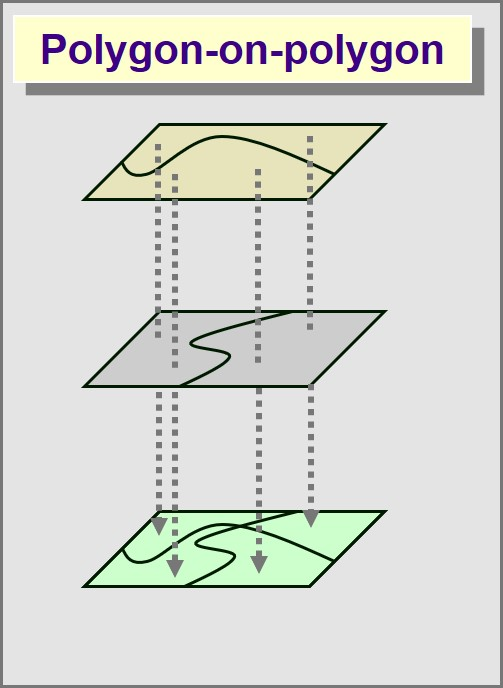
]

---
### Polygon-on-polygon Overlay: Union

.pull-left[
.large[
+ Union preserves all features from the inputs.
+ The boundary extent of the output combines the boundary extents of both input layers.
+ Union requires that both input layers be polygon layers.
]]

.pull-right[
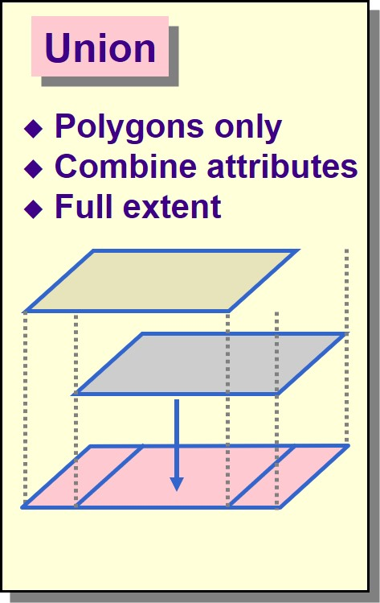
]
---
### Polygon-on-polygon Overlay: Intersect

.pull-left[
.large[
+ Intersect preserves only those features that fall within the area extent common to the inputs. 
+ The input layers may contain different features types. ]]

.pull-right[
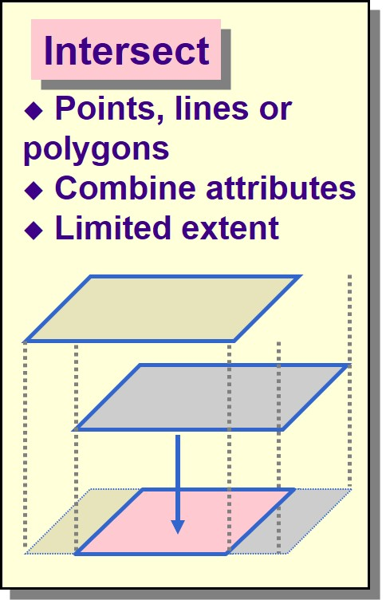
]

---
### Polygon-on-polygon Overlay: Identity

.pull-left[
.large[
+ Identity preserves only features that fall within the boundary extent of the layer defined as the **input** layer.
+ The other layer is called **identity** layer.
+ The input layer may contain points, lines, or polygon, and the identity layer is a **polygon** layer.
]]

.pull-right[
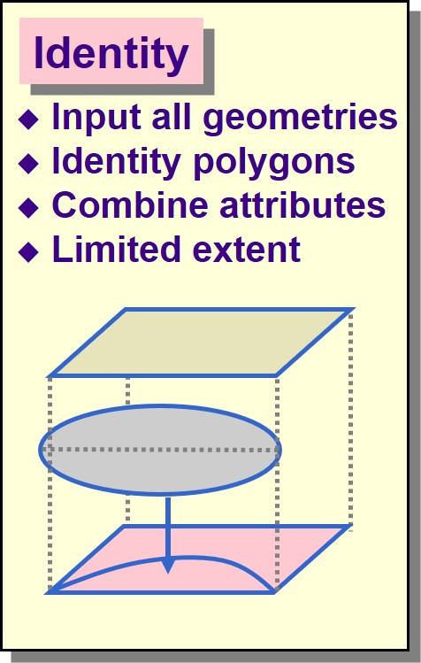
]

---
### Issue of Topological Overlay: Slivers

.center[
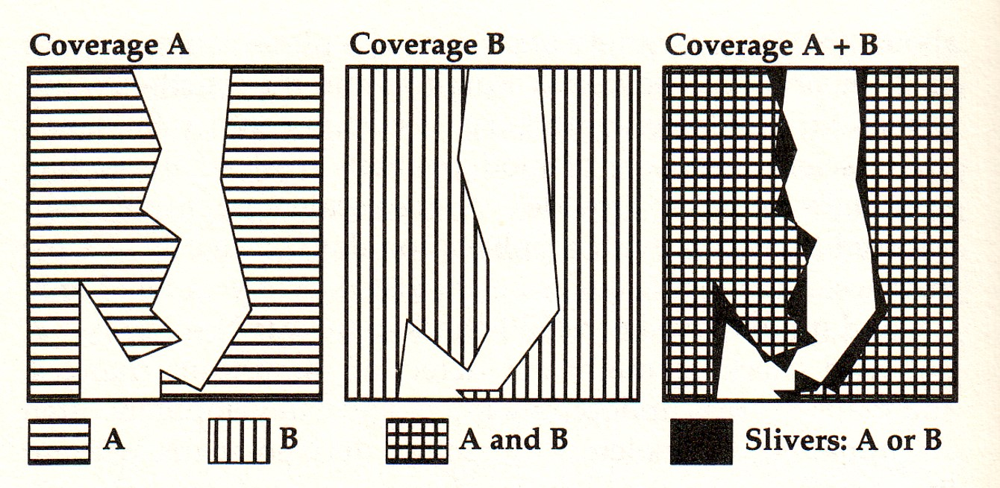
]


???
During polygon overlay, many new and smaller polygons are created, some of which may not represent true spatial variations.  
The small, invalid polygons are called spurious or sliver polygons and can be a major problem in polygon overlay.
Most GIS packages incorporate some kind of tolerance in overlay operations to remove slivers. 

---
### Issue of Topological Overlay: Error Propagation

.large[
+ **Error propagation** refers to the generation of errors that are due to the inaccuracies of the input layers.
+ **Sliver** are examples of errors in the inputs that can propagate to the analysis output.
+ Error propagation in overlay usually involves two types of error: positional and identification.
  + **Positional errors** can be caused by the inaccuracies of boundaries that are due to digitizing or interpretation errors.
  + **Identification errors** can be caused by the inaccuracies of attribute data such as inaccurate coding of polygon values. 
]

---
## Reference

Jochen Albrecht (2007) **Key Concepts and Techniques in GIS**, Chapter 4-6. SAGE Publication.  This book is available in smu library.  Click on this [link](https://ebookcentral-proquest-com.libproxy.smu.edu.sg/lib/smu/detail.action?pq-origsite=primo&docID=456755).


```{r echo=FALSE, eval=FALSE}
library(pagedown)
pagedown::chrome_print("Lesson04.html")
```
