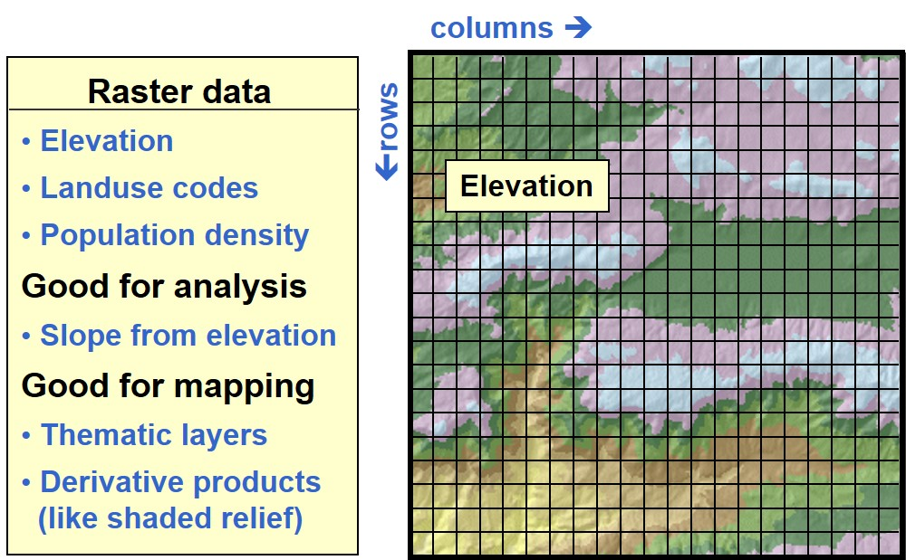
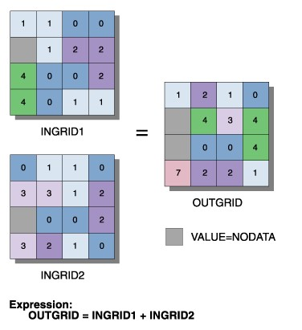
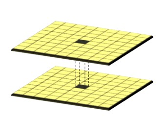
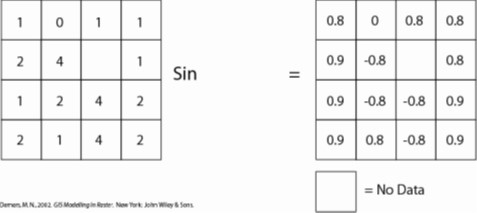
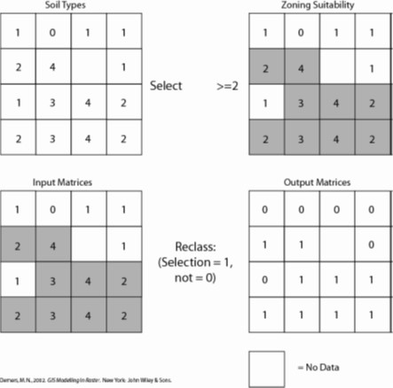
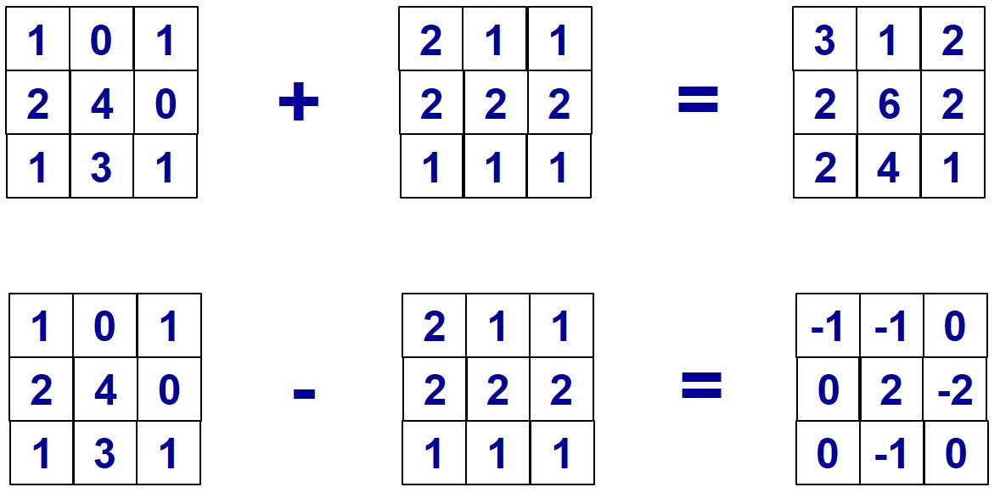

```{r setup, include=FALSE}
options(htmltools.dir.version = FALSE)
knitr::opts_chunk$set(fig.retina=3,
                      cache = FALSE,
                      echo = TRUE,
                      message = FALSE, 
                      warning = FALSE)
```

```{r xaringan-themer, include=FALSE, warning=FALSE}
library(xaringanthemer)
style_duo_accent(
  primary_color = "#1381B0",
  secondary_color = "#FF961C",
  inverse_header_color = "#FFFFFF"
)
```

# Content

+ Introduction to Raster GIS
  + The basic concept of raster GIS data model
  + Raster database
  + Characteristics of raster
  + Raster resolution
+ Map Algebra Methods
  + Local functions
  + Focal functions
  + Neighbourhood functions
  + Zonal functions

---
## Raster Database

.large[
+ All raster formats are basically the same 
  + Cells organized in a matrix of rows and columns
  + Content is more important than format: data or picture?
]

.center[

]

---
## Map Algebra

.pull-left[
.large[
+ Map algebra is a simple and an elegant set based algebra for manipulating geographic data, proposed by Dr. Dana Tomlin in the early 1980s. 
+ It is a set of primitive operations in a GIS which allows two or more raster layers ("maps") of similar dimensions to produce a new raster layer (map) using algebraic operations such as addition, subtraction etc.
]]

.pull-right[

]

---
## Map Algebra Functions

.large[
+ Local function – characterising individual locations
+ Neighbourhood function – characterising locations within neighbourhood
+ Zonal function – characterising location within a zone
]

---
## Local function

.pull-left[
.larg[
+ Local functions use only the data in a single cell to calculate an output value.
+ Potential operators fall into six categories:
  + trigonometric (i.e. sine, cosine, tangent, arcsine)
  + transformation (i.e. sqrt, exp, log) 
  + relational operations (>, <, =) 
  + statistical (i.e. mean, median, mode)
  + arithmetic (i.e. absolute value of x)
]]

.pull-right[

]

---
### Local function - trigonometric

.center[

]

---
### Local function - relational operations 

.center[

]

---
### Local function - arithmetic

.center[

]


---
## Reference


```{r echo=FALSE, eval=FALSE}
library(pagedown)
pagedown::chrome_print("Lesson05.html")
```