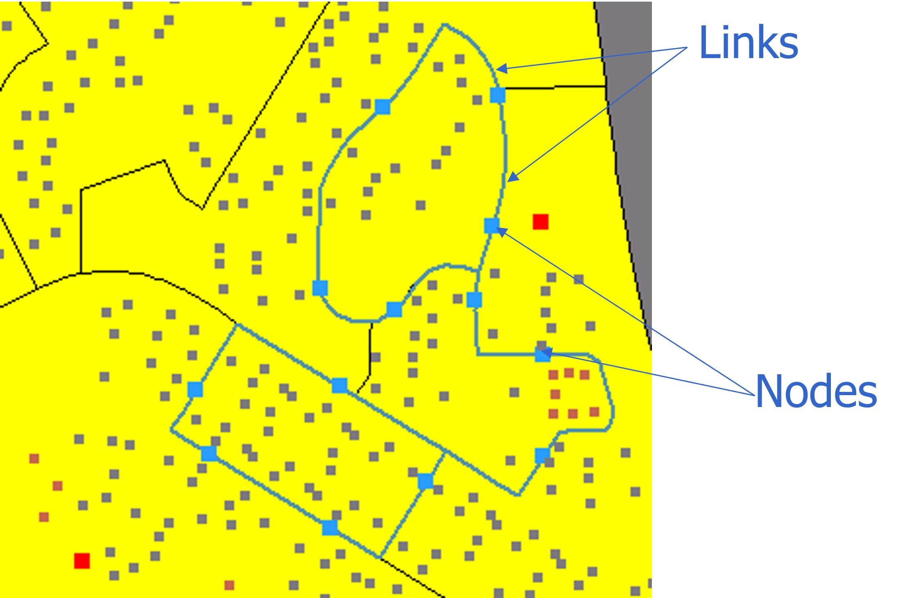
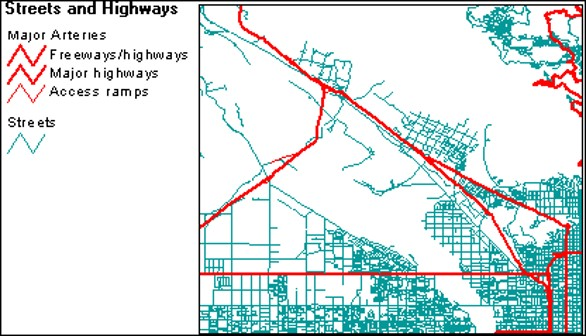
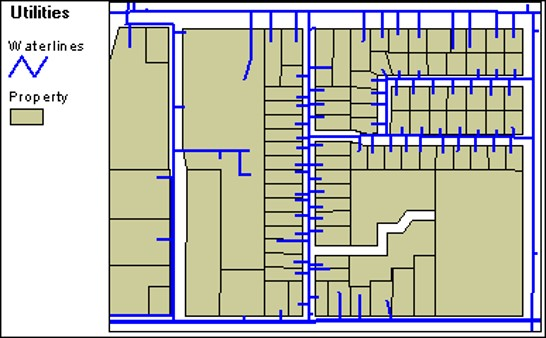
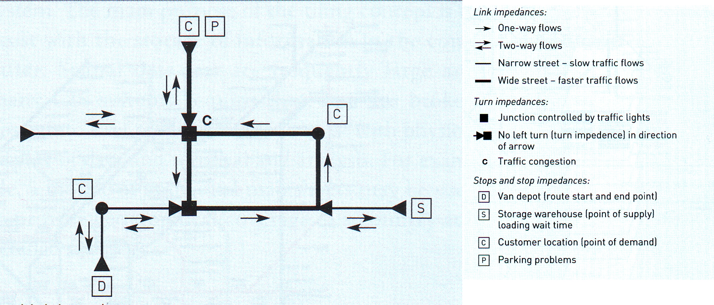
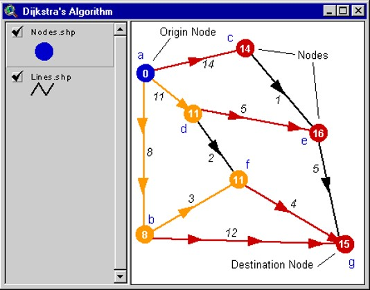
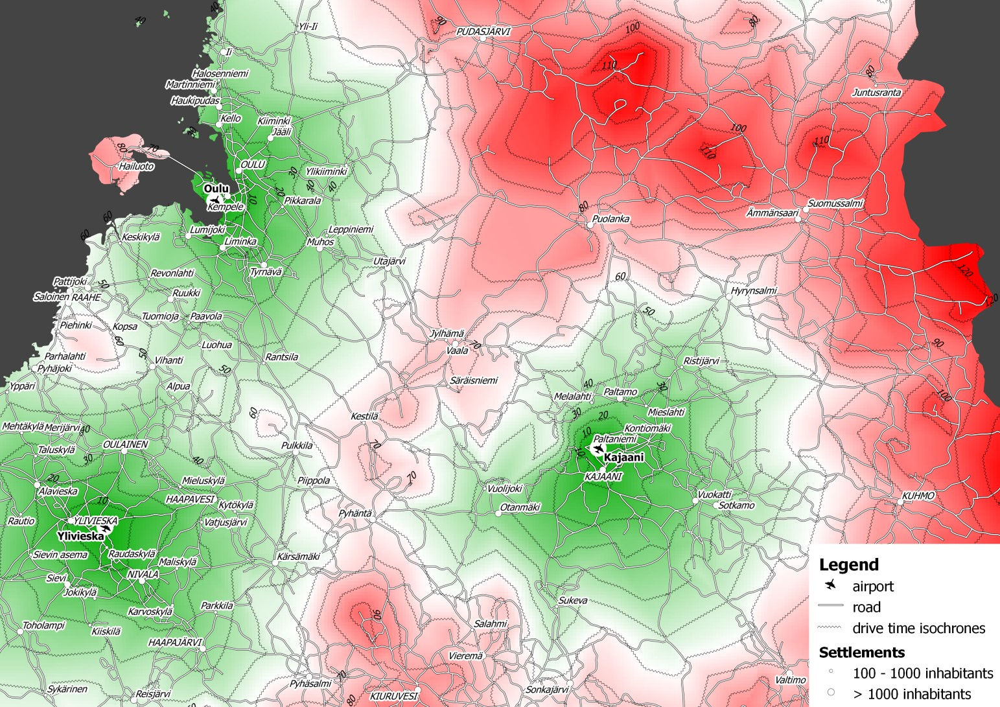

```{r setup, include=FALSE}
options(htmltools.dir.version = FALSE)
knitr::opts_chunk$set(fig.retina=3,
                      cache = FALSE,
                      echo = TRUE,
                      message = FALSE, 
                      warning = FALSE)
```


```{r xaringan-themer, include=FALSE, warning=FALSE}
library(xaringanthemer)
style_duo_accent(
  primary_color = "#1381B0",
  secondary_color = "#FF961C",
  inverse_header_color = "#FFFFFF"
)
```

# Content

.vlarge[
+ Why analyse with network?
+ Network model
+ Real world network system
+ Complexity of urban road network
+ Shortest path analysis algorithm
+ Network analysis methods 
]


---
## Location question

.large[
+ How to assign the eldercare centres to the closest polyclinic?]

.center[

]

---
## GIS answer

.large[
+ Using buffer analysis
]

.center[

]

---
## GIS answer

.large[
+ Using desire line analysis (mmqgis plugin is needed).
]

.center[

]

---
## Limitation of the GIS answers

.large[
+ Failed to consider the actual road network.
]

.center[

]

---
# A Network Model

.large[
+ A **link** refers to a linear segment defined by two end points.  Also called **edges**.
+ A **node** refers to an end point of a link.
]

.center[

]

---
## Two types of networks 

.pull-left[
.large[
+ Geometric 
  + Directed flow, away from sources and toward sinks
  + Resources make no travel decisions

+ Topologic
  + Undirected flow
  + Resources make their own travel decisions

]]

.pull-right[

]

---
## A Transportation Network

.large[
This network theme represents city streets and highways. Several theme attributes, such as speed limits, the number of lanes a street has, or which streets are one-way or two-way, can affect the flow of goods and services through a network.
]

.center[

]

---
## An Utility Network

.large[
Utilities can also be network themes. In this example, the diameter of the waterlines, the system's water pressure, and the location of control valves can affect the flow of the water through the network.]

.center[

]

---
## A River Network

.large[
River systems can be represented as a network or a series of networks. Some systems may not connect while other systems may connect naturally or may be connected by canals. The location of locks, river width, river depth, and current can affect the analysis.
]

.center[

]

---
## A simple transport network model 

.large[

]


.center[

]

---
## Complexity of Urban Network Topology

.large[Beyond nodes and edges, there are more…..]

.center[

]

---
### Multilane Expressway

.center[

]

---
### Multilane Major Road

.center[

]

---
### Two-way Road

.center[

]

---
### One-way Road

.center[

]

---
### Tunnel

.center[

]

---
### A Tale of Two Roads

.center[

]

---
### Road facilities slow down traffic

.large[Road sign and traffic light inform about restrictions and rules.]

.center[

]

---
### Road facilities slow down traffic

.center[

]

---
### Road conditions are dynamic

.center[

]

---
## Poor man network data source

.large[Bulk extract at [Geofabrik](https://download.geofabrik.de/) free download server.]

.center[

]

---
## Shortest Path Analysis

.center[

]

---
### Dijkstra’s Shortest Path Algorithm

.pull-left[
.large[
+ The path that will be calculated depends on which other nodes must be visited and in what order.]]

.pull-right[

]

---
### Dijkstra’s Shortest Path Algorithm

.pull-left[
.large[
+ A network consisting of seven nodes and 10 lines.
]]

.pull-right[

]

---
### Dijkstra’s Shortest Path Algorithm

.pull-left[
.large[
+ Nodes adjacent to the origin node are in red.]]

.pull-right[

]

---
### Dijkstra’s Shortest Path Algorithm

.pull-left[
.large[
+ Because the line between nodes a and b has the lowest cost (8), node b becomes a reached node. ]]

.pull-right[

]

---
### Dijkstra’s Shortest Path Algorithm

.pull-left[
.large[
+ After calculating a reached node, the algorithm continues to scan adjacent nodes.]]

.pull-right[

]

---
### Dijkstra’s Shortest Path Algorithm

.pull-left[
.large[
+ The least cost path now travels from node a to node b to node f.]]

.pull-right[

]

---
### Dijkstra’s Shortest Path Algorithm

.pull-left[
.large[
+ The cost of going from node a to node c to node e is 15, while the cost of going from node a to node d to node e is 16. The algorithm will choose the former, least cost, path.]]

.pull-right[

]

---
### Dijkstra’s Shortest Path Algorithm

.pull-left[
.large[
+ All nodes have now been reached.]]

.pull-right[

]

---
### Dijkstra’s Shortest Path Algorithm

.pull-left[
.large[
+ The least cost path from node a to node g.]]

.pull-right[

]

---
## Fastest Path

.pull-left[
.large[
+ Fastest paths are based on time and you can use any measure of time you choose (seconds, minutes, hours, etc.).]]

.pull-right[

]

---
## Travelling salesman problem

.pull-left[
.large[
+ A route can visit many stops in a network. The origin can also be the destination, as the warehouse is in this example delivery route.]]

.pull-right[

]

---
## Beyond network model

.large[
+ Accessibility modelling.
]

.center[

]

.small[Source: https://developers.route360.net/index.html 
]

---
### Network Drive Time: Accessibility

.pull-left[
.large[
+ If you know what is near a site, you can make better decisions about how suitable the site is for your business needs.]]

.pull-right[

]

---
### Network Service Areas 

.pull-left[

]

--
.pull-right[

]

---
### Facility location – network model

.large[
+ Given a set of clients, finds the facility location that minimises that path length to travel between the facility to each of the clients.]

.center[

]

---
### Facility location – planar model

.large[
+ Given a set of clients, finds the facility location that minimises that path length to travel between the facility to each of the clients.]

.center[

]

---
## QGIS Network Analysis Support

.pull-left[
.large[
+ Build in]


]

.pull-right[
.large[
+ Plug-in]


.small[For more detail, visit this [link](https://root676.github.io/)]
]

```{r echo=FALSE, eval=FALSE}
library(pagedown)
pagedown::chrome_print("Lesson10.html")
```