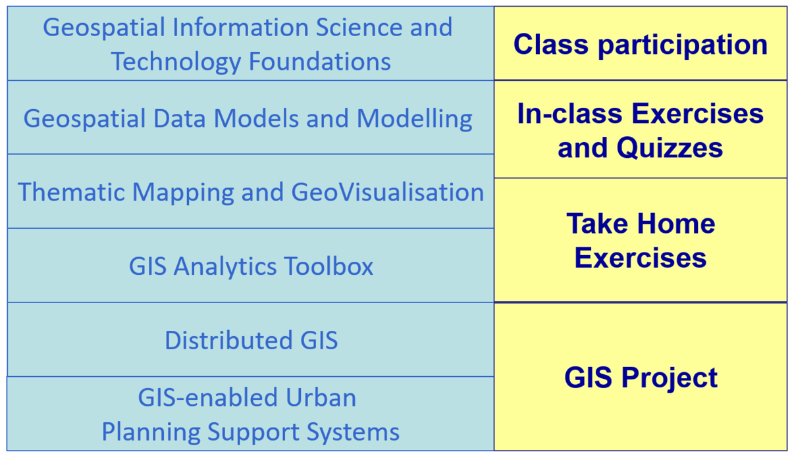

```{r setup, include=FALSE}
knitr::opts_chunk$set(echo = FALSE)
```

## Synopsis

Effective planning and management of smart cities require urban planners to integrate and share data from multiple sources to the urban users so that they can be active participants in the smart city planning process. GIS with its capability to capture, manage, display, and analyse information spatially is emerging as one of the important enabling tool in smart city planning.

This course provides students with an introduction to practical applications of GIS in smart city management and planning. Emphasis will be placed on:

- locating, acquiring and integrating multi-sources of data into GIS, 
- understand the principles and methodologies of geocoding and geo referencing , 
- become familiar with geovisualisation and GIS analysis techniques, and 
- explore the technologies and possibilities of GIS-enabled Planning Support Systems for smart city management.

## Objectives

Upon completion of the course, students will be able to:

- Understand the basic concepts and theories of GIScience and trends of GIS technologies.
- Create, integrate, manage geospatial data and build enterprise level geospatial database management systems.
- Use appropriate GIS analysis functions to visualise and analyse urban sector data.
- Model smart city processes using GIS’ advanced analytical methods.
- Design and implement cutting-edge GIS-based Planning Support Systems for smart city management.

## Course structure

### Basic Modules
This course comprises ten integrated components as shown below:

```{r}

```

## Pre-requisites 
There are no pre-requisites for the class and the class is open to all SMT students as well as non-SMT students. However, a basic understanding of the principles of urban management and planning in the context of smart city is required. Students who are new to the discipline of urban management /planning and smart cities are encouraged to do self-learning and research prior to the commencement of the course. 

## Grading Summary
The grading distribution of this course are as follows:

-----------------------------
Component            Weights   
-------------------- --------
Class Participation  5%

In-class Exercises   20%

Take Home Exercises  45%

GIS Project          30%
-----------------------------

There will be no mid-term test or final examination for this course. 


